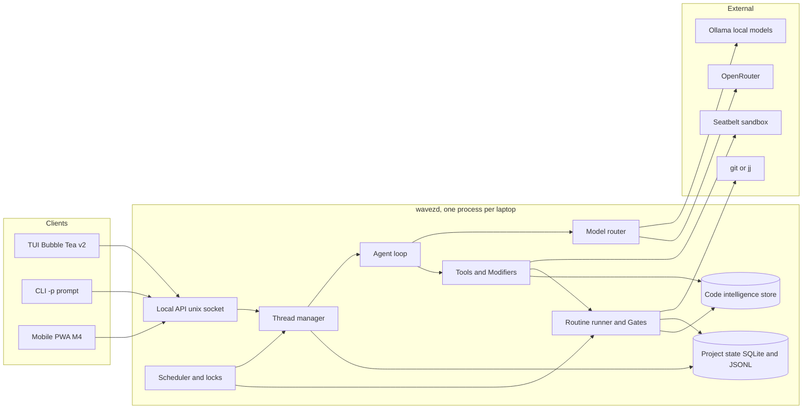
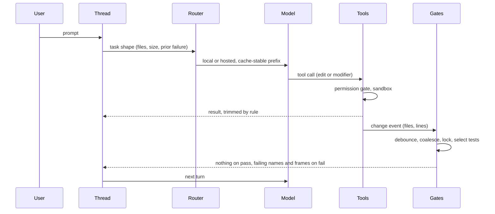

# Wavez design

High-level design: what each piece does, requirements per feature, decisions as y-statements, and milestones. Not an implementation plan. Research and prior art live in `_ai_/`, especially [`_ai_/research/2026-08-design-proposal.md`](_ai_/research/2026-08-design-proposal.md) and [`_ai_/research/2026-08-synthesis.md`](_ai_/research/2026-08-synthesis.md), which this supersedes. [`_ai_/README.md`](_ai_/README.md) is the index.

## Problem

Coding agents spend most of their tokens and wall-clock on work that does not need a model: deciding which tests to run, re-reading files that did not change, emitting whole edited files for a rename, carrying a single conversation that grows until compaction throws away what mattered. On a 16 GB M2 Pro with a local model, that waste also shows up as RAM pressure and slow tokens/sec.

The one-user constraint is the lever. There is no fleet, no policy hierarchy, no untrusted teammate. Anything whose only job is to serve more than one person or trust level gets cut, and the savings go into the deterministic layer around the model.

## Thesis

Do the predictable parts deterministically, keep the model for judgment, and keep the model's context small and cache-stable. Two subsystems carry the innovation budget:

1. Routines and Gates: change-triggered, lock-aware, coverage-selected checks with workflow-engine semantics
2. Modifiers: refactor engines exposed as tools so the model specifies shape instead of text

Everything else copies a reference implementation.

## Architecture



| Component | Responsibility |
|---|---|
| Local API | JSON over a unix socket. Every client (TUI, `-p`, phone) uses the same events and commands, which is what makes M4 mobile a client and not a rewrite |
| Thread manager | One thread per work stream: its own history, compaction state, and directory set |
| Scheduler and locks | Directory-subtree leases (from `_ai_/notes/agent-lock-coordination.md`), edit and execute phases, memory-aware admission so the local model and a test run do not fight for RAM |
| Agent loop | Streaming tool-use loop, bounded retries, loop detection, permission gate |
| Model router | Task shape decides local vs hosted. Explicit override per turn |
| Tools and Modifiers | Read, edit, shell, search, question, browser (later), plus refactor operations backed by LSP and CLIs |
| Code intelligence | One SQLite store per project: symbols, edges, FTS, vectors, coverage, contracts. Fed by tree-sitter, `codegraph`, coverage adapters, and a local embedder. One `search` tool and one `context` bundle |
| Routine runner and Gates | pkl-defined DAGs triggered by change events, coverage-selected tests, output trimming |
| Project state | Gate log, coverage map, ledger, context manifests, diff anchors, recordings. Survives sessions |

Sessions are disposable, project state is not. A new thread reads the last ledger entries and current VCS state, a few hundred tokens, and follows anchors back to old turns only on demand.

## A turn, end to end



## Screens

Wavez is a dashboard over threads, the way gh-repo-dashboard is a dashboard over repos. It is not a multiplexer: herdr owns panes, tmux owns terminals, Wavez owns structured events. Everything on screen is data the daemon already has, so peeking, answering, and switching cost nothing.

Layout: persistent multi-panel (lazygit shape). Panels keep fixed positions. `Tab` and `Shift+Tab` cycle focus, the focused panel gets a bold title and bright border, unfocused panels dim (works under `NO_COLOR`). Footer is a priority-ordered hint list that drops the lowest-priority hints first as the terminal narrows, copied from gh-repo-dashboard. `?` is help everywhere, `:` is the palette everywhere, `Esc` always goes up one level and never quits. Minimum size 80x24. Flat Bubble Tea model with per-view files.

State glyphs carry meaning without color and have ASCII fallbacks: `●` working, `◐` gate running (`*`), `▲` needs input (`!`), `○` idle or waiting on a lock, `✖` failed (`x`), `✔` done (`ok`).

### Launch and scope

Scope resolves like gh-repo-dashboard: CLI args, then config `scan_paths`, then the enclosing VCS root, then cwd. Inside a repo, Home shows that repo's threads. Above several repos, Home shows a fleet grouped by directory. `w` widens or narrows the scope without restarting, and the palette can jump to any thread in the fleet from either scope. `wavez -p "…"` skips the TUI. `wavez` with one active thread in scope opens Home with it selected, never straight into it, so the list stays the anchor.

### Home (M1 single repo, M2 fleet)

```
┌ wavez · ~/dev · 4 threads · ▲ 1 needs input · mem 9.8/16G ───────────┐
│   thread              step                       age    spend      │
│ calcipy/                                                            │
│ ● fix-lock-timeout    editing internal/lease.go   2m    $0.00       │
│ ▲ docs-pass           allow? rm -rf .testmondata  40s   $0.00       │
│ │  ▸ shell  rm -rf .testmondata      [y]es [n]o [a]lways            │
│ │  ▸ gate   tests(3) ✔   fmt ✔                                      │
│ │  ▸ agent  cleaning stale coverage data before the full run        │
│ wavez/                                                              │
│ ◐ add-jj-backend      gate test 4/7               1m    $0.12       │
│ ○ └ jj-op-log-undo    waiting lock internal/vcs   5m    $0.00       │
│ yak-shears/                                                         │
│ ✖ flaky-ci            go test ✖ 2 failed          12m   $0.31       │
└ [Enter]open [v]peek [i]nbox [n]ew [s]schedule [:]palette [?]help ────┘
```

- One row per thread: glyph, name, current step in words (what it is doing or waiting on), age since last event, spend. Sub-threads indent under their parent with `└`
- `v` expands the row inline (gh-repo-dashboard's expand) with the last three events. If the thread needs input, the prompt row is live and `y`, `n`, `a`, or typed text answers it without opening the thread
- Header badges aggregate the fleet: thread count, how many need input, memory headroom. A thread flipping to `▲` raises a footer toast and, on mobile, a push
- Sort defaults to needs-input first, then most recent. `/` filters by name or directory
- `n` opens a new-thread form: prompt, directory set (defaults to the scope), model override, parent thread (optional)

### Thread view (M1)

```
┌ calcipy · fix-lock-timeout · gemma4-12b 3.1k/32k · $0.00 · ▲1 ───────┐
│ ledger  TTL made configurable in lease.go, gates green, 2 turns     │
│ ▸ user   make the lease TTL configurable                             │
│ ▸ modify rename lease.DefaultTTL → lease.TTL (3 files)               │
│ ▸ edit   internal/lease/lease.go  +6 −2                             │
│ ▸ gate   tests(3 selected) ✔ 1.2s   fmt ✔   lint ✔                  │
│ ▸ shell  rm -rf .testmondata        allow? [y]es [n]o [a]lways      │
├ diff ───────────────────────────────────────────────────────────────┤
│ internal/lease/lease.go                                             │
│ -const DefaultTTL = 30 * time.Minute                                │
│ +func TTL(cfg Config) time.Duration { … }                          │
├─────────────────────────────────────────────────────────────────────┤
│ > _                                                                 │
└ [Enter]send [Tab]panel [a]sk-line [f]ork []]next [?]help ───────────┘
```

- Header: directory, thread, active model with context used against its window, spend, and a badge for other threads needing input (`i` jumps to the inbox)
- The ledger row sits above the transcript: one line of what this thread has done, derived from the gate log and change set. Compacted history is folded under it, `H` unfolds
- Transcript rows are typed (user, agent, tool, modifier, gate, permission), collapsible with `Enter`. A permission row takes focus and answers with `y`, `n`, or `a`
- `[` and `]` move to the previous or next thread in scope without going through Home. `Esc` returns to Home with this thread selected
- `f` on a transcript row forks a new thread that inherits the compacted history up to that row, for trying a second approach without losing the first
- Diff pane shows the thread's change set. `d` jumps to it, `a` on a diff line opens Ask-a-line scoped to the anchor, hunk, and enclosing symbol
- `/` searches the transcript, `n`/`N` step matches, hits highlight in reverse video. Below 100 columns the diff pane stacks under the transcript

### Inbox (M1)

```
┌ inbox · 2 waiting ──────────────────────────────────────────────────┐
│ ▲ calcipy/docs-pass     shell   rm -rf .testmondata   [y] [n] [a]   │
│ ▲ wavez/add-jj-backend  ask     colocate or pure jj?  > _           │
└ [Enter]answer [o]pen thread [Esc]back ──────────────────────────────┘
```

- Every permission prompt and question across the fleet, oldest first. Answering here is the same as answering in the thread
- Sits behind `i` from any screen and is the default landing view for the mobile client

### Schedule (M2)

```
┌ schedule · phase: edit · mem 9.8/16G · local model loaded ──────────┐
│ fix-lock-timeout  ████████░░░░░░░░ edit                              │
│ add-jj-backend    ████░░◐◐◐◐░░░░░ gate 4/7                          │
│ jj-op-log-undo    ○○○○○○○○○○○○○○○ lock internal/vcs ← add-jj-backend│
│ docs-pass         ██▲▲▲▲▲▲▲▲▲▲▲▲▲ input 40s                          │
├ routine · gate/test · add-jj-backend ───────────────────────────────┤
│ changed(2) → select(7) → run ◐ 4/7 → trim                           │
│            → fmt ✔      → lint ✔                                    │
└ [Enter]drill [p]ause [k]ill [l]ocks [Esc]back ──────────────────────┘
```

- One lane per thread, recent history left to right, glyph runs show what each spent its time on. A lock wait names the holder
- The selected thread's active routine renders one line per branch. A DAG with more branches than rows drills in with `Enter` to a tree view (one node per line, `├──` guides)
- Lease list behind `l`: subtree, holder, state (active, committed, expired)

### Diagnostics (M1 strip, M2 panel)

Wavez is a dashboard over agents, and a dashboard shows the machine, not just the transcript. A one-line strip is always in the header (model, context used, spend, memory headroom). `D` opens the full panel from any screen.

```
┌ diagnostics ────────────────────────────────────────────────────────┐
│ mem   9.8/16G  ▂▃▅▆▆▅▅▆  model 5.9G resident  headroom 3.1G          │
│ cpu   41%      ▁▂▄▆█▆▄▂  daemon 3%  tui 1%  gates 37%                │
│ local qwen3:8b loaded  ctx 3.1k/8k  18.2 tok/s  prefix hit 96%       │
│ hosted $0.43 today  12 calls  cache read 71%  p50 4.1s  last 26s     │
│ gates queue 2  running test(calcipy) 4.1s  p50 1.9s  fail 1/38       │
│ leases 3 held  1 waiting (jj-op-log-undo on internal/vcs)            │
│ tools  142 calls  4 malformed (2.8%)  1 escalation                   │
│ events 97/s  transcript 41k rows  compaction 3 runs  saved 12.4k tok │
└ [Tab]section [Enter]drill [r]eset window [Esc]back ─────────────────┘
```

- Rows: memory (system, model resident, headroom against the admission threshold), CPU by process group, local model (loaded, context used against served window, current tok/s, prefix cache hit ratio), hosted (spend today, calls, cache read share, latency p50 and last), gates (queue depth, running, p50, failure ratio), leases (held, waiting, on what), tools (calls, malformed ratio, escalations), events and compaction (throughput, transcript rows, tokens saved)
- Sparklines carry the last few minutes. `Enter` on a row drills into per-thread numbers. `r` resets the window
- Every number is one the daemon already has for its own decisions (admission, router, scheduler), so the panel is a view, not new instrumentation. The same numbers back the benchmark harness

### Controls

Vim-shaped, layered so the floor is discoverable and the ceiling is fast, in the shape gh-repo-dashboard already uses.

- L0, always in the footer: arrows, `Enter`, `Esc`, `q` at Home only, `?`
- L1, vim motions everywhere a list or text is on screen: `j`/`k`, `h`/`l` (collapse and expand rows, or move between panels), `gg`/`G`, `Ctrl-d`/`Ctrl-u`, `/` with `n`/`N`, `:` for the palette
- L2, single-key verbs per screen shown in the footer by priority (Home: `v` peek, `n` new, `i` inbox, `s` schedule, `D` diagnostics; Thread: `a` ask-line, `d` diff, `f` fork, `[`/`]` threads; Schedule: `p` pause, `k` kill, `l` leases)
- L3, palette verbs and counts (`3]` jumps three threads, `:kill flaky-ci`, `:scope ..`)
- Footer hints drop lowest priority first as the terminal narrows, and every screen keeps `?` for the full map. Mouse works for click and scroll, never required. `Shift`-click leaves selection to the terminal

### Routines and Recordings panels (M2)

- Routines: from `.wavez.pkl`, with triggers, last run, duration sparkline. `r` runs, `e` edits in `$EDITOR`, `h` history
- Recordings: per thread. `p` replays and diffs, `t` promotes to a test, `x` discards

### Palette (`:`)

- Fuzzy over threads, directories, pending prompts, routines, and verbs (`new`, `pause`, `kill`, `fork`, `scope`). Scoped to the current repo by default, `:` twice for the fleet

## Features

### Chat loop (M1)

- Streaming tool-use loop with typed tools: read, edit, shell, grep, symbol lookup, question, and modifiers
- Bounded retries. A malformed tool call is a failure, not a retry: 2026 measurements on tool-call recovery find malformed calls mostly unrecoverable, since an early wrong step compounds instead of correcting
- An identical repeated call is evidence the tier is stuck rather than grounds to end the thread. It fails that call, hands the model a short critique of why, and escalates to the next tier, which is the same rule the router already applies after one local failure. A repeat after escalating ends the thread
- A run that ends on a bound still gates whatever it changed. Changed files with no verification is the worst outcome available
- Permission gate before anything destructive, defaulting to ask. Sandbox behind it
- Read-once cache keyed by content hash. Unchanged files are not re-read into context
- `-p "…"` runs one prompt headless and prints the result

### Edits (M1)

Decode speed is the local bottleneck (qwen3:8b at ~18 tok/s), so the edit path that emits the fewest output tokens wins on latency, and the model's training exposure decides which format it gets right.

- M1 ships `str_replace` (old and new string, exact match with a fuzzy fallback on whitespace and indentation, uniqueness enforced) as the general edit tool for local and hosted models alike. Measured in a real tool loop on qwen3:8b (`_ai_/demos/edit-loop`, 5 tasks, 20 runs): `str_replace` succeeded 2/10 by strict spec reading, hashline 1/10, at a third of the tokens (190 vs 605) and wall time (12.5 s vs 37.7 s). Every hashline failure was the model failing the `N#hh` anchor syntax, so its hash rejection never had a stale edit to catch. It stays a candidate for a stronger local model, not the default
- Two `str_replace` failure modes shape the tool: hallucinated indentation in `old_string` after a read (the fuzzy fallback normalizes leading whitespace and offers the closest match), and non-unique matches when the task is itself about a repeated expression (the error returns line numbers of each match so the model can widen the anchor)
- Both formats are weak on an 8B model (2/10 and 1/10), so M1 keeps local edits small, always re-verifies with a gate rather than trusting `done`, escalates to hosted after one failed edit, and pushes as much as possible to Modifiers and intent edits where the model emits a name or an intent instead of text
- Hosted models use their native format through the same tool surface: `apply_patch` (V4A) for GPT-family, `str_replace` for Claude-family
- Runtime, not tool: n-gram prompt-lookup speculation in llama.cpp for edit-shaped output where most tokens copy the prompt (measured in `_ai_/demos/local-runtime`)
- Not built: a hosted fast-apply model (Morph, Replace). Extra latency and a paid dependency, and no open-weight small apply model exists to run locally

### Intent edits (exploration, target M3 after Modifiers)

The direction past line ops and named refactors: the model (or a human) states an intent in a few tokens and a resolver produces the code. The resolver is mostly deterministic and store-driven, with a small local model filling only the holes that structure cannot decide. The same resolver is a completion source for Neovim, so it doubles as tab completion over the whole repo.

The bet: most of a change is not the interesting part. Placement, imports, signatures, plumbing, registrations, tests, and formatting follow from the repo, and the store already knows the repo.

**Resolution layers.** Each layer runs only if the one above could not decide.

1. Deterministic from tools: placement after related symbols, import add and order (`goimports`, `ruff`, tsserver), format, stubs from a signature or interface (`impl`, `gopls` fill struct and switch), tags, exports and barrel files, `__all__`
2. Heuristic from the store: naming that matches sibling symbols, the error-handling shape used by neighbours (return, wrap, log), the fixture pattern the package's tests use, which registration table a new route or command joins, where a config field is read and documented, the contract counterpart across the stack (route to client method to type)
3. Small local model, fill-in-the-middle under a grammar constraint, for the one hole that remains (a body, a condition, a message). Prefix and suffix come from the resolved skeleton, so the model writes 5-30 tokens, not a function
4. Escalate to a hosted model when the hole is larger than a body or the intent is ambiguous

**Intent grammar.** A small typed schema, not prose, so a local model cannot emit a malformed intent and a human can type it in a picker:

```
add fn parseTTL(cfg Config) time.Duration in internal/lease near TTL default=30m
add field Config.TTL time.Duration from=env:LEASE_TTL doc="lease lifetime"
add route GET /leases/{id} -> handler getLease client=yes test=yes
add test for parseTTL like=TestTTL
like Foo: add Bar            # mirror an existing symbol's shape
```

`like` is the strongest primitive: mirror the structure of a named sibling (its imports, error style, test, registration) with names substituted. It reuses the similarity signals from the store in reverse.

**What the resolver can take off the model, by kind of change.**

- Add a function or method: placement, imports, doc line in repo style, test stub with the package's fixture pattern, callers if the intent names them
- Add a field or option: struct field, constructor or options function, env or config read, default, validation, docs, the test table row
- Add a route or command: handler stub, registration in the router or CLI table, generated client method and type on the frontend, contract node in the store, E2E test stub
- Change a signature: every caller updated (LSP rename plus argument insertion), tests updated, wrappers regenerated
- Add a type: constructor, `String`, JSON tags, mock or fake if an interface, exhaustive switch cases filled where a new enum member appears
- Delete: dead-code check through the graph before removal, imports pruned, docs and registrations dropped
- Cross-file consistency after any edit: the "what else must change" list from the graph (callers, tests, contract counterparts, docs), offered as a next-edit queue instead of predicted by a model

**Extreme tab completion for humans.** In Neovim the same resolver drives a completion source: typing `func parseTTL(` offers the resolved skeleton with imports and a test, `:Wavez add …` accepts an intent line, and after any manual edit the next-edit queue lists what the graph says now needs attention. Where a ranking is needed among candidates, a 1.5B next-edit model (Sweep's open model or Continue's Instinct, both local) can order them. The location comes from the graph, not the model, which is the reverse of Copilot NES's location-then-generation split.

**Where it stops.** Naming when no sibling sets the convention, whether a default is a rule or a magic number, error-handling shape when neighbours disagree, and anything with business meaning. Those become explicit slots in the intent (with repo-derived defaults) or a hole for the model. The resolver never guesses semantics silently. A wrong resolution must be visible in the diff and cheap to reject.

**Token arithmetic.** An intent is 10-30 output tokens. A hole fill is 5-30. Everything else is generated at CPU speed and verified by gates. Against 50-200 lines emitted as text at 18 tok/s locally, that is the difference between seconds and minutes per change, and it composes: Modifiers cover named refactors, intents cover additions and plumbing, line ops cover the residue.

**Prior art.** Zed's Zeta2 and Cursor's Tab feed diff history and LSP context to a model, Copilot NES splits location and generation, Aider's architect mode has a strong model describe and a weak one edit (30-50% cheaper reported), Serena inserts after symbols instead of round-tripping files, ast-grep and Comby rewrite with metavariables, Hazel and program sketching separate skeleton from holes, llama.cpp grammars and FIM tokens constrain what a small model may write. Nothing found combines a repo graph, deterministic resolvers, and grammar-constrained hole filling into one edit tool.

**Measured (`_ai_/demos/intent-edits`).** Twenty commits from gh-repo-dashboard and calcipy, added lines sorted by hand: 31% deterministic, 24% convention (right from siblings), 24% hole, 20% judgment. Resolver alone covers 55%, resolver plus a hole fill 80%. Intent cost averaged 68 tokens for 123 added lines, so the compression is real but linear in the number of additions, not the number of lines. The corpus demanded five grammar extensions: a `change`/`rename` verb (6 of 20 commits), a `like` chain that mirrors a cluster of symbols, hole-sizing fields (`wraps=`, `env=`, `returns=`, `enum=`) that bound what the model writes, a `fix: <diagnosis>` verb, and non-code verbs (`add const`, `add hook`, `bump dep`). A Go prototype (`intentgo`, ~1k lines on `go/ast` and `x/tools/imports`) reproduced placement, signature, doc style, and imports exactly on real commits in 60-110 ms with the body as one hole line. Field placement defaults to end of struct where humans group mid-struct, and `like` needs its own signature slot or it silently carries the sibling's parameters. Nothing it writes fails `gofmt`. The timing demo (three Go tasks, small to large) set the bar: Sonnet through `claude -p` averaged 25.8 s per edit writing whole files (2-5k output tokens), qwen3:8b writing whole files averaged 161 s and was mostly wrong, and intent line plus hole fill on qwen3:8b averaged 6.7 s (8-20 tokens of intent, 17-109 of body). Speed bar cleared by 3.9x. Equivalence bar not cleared with the 8B model in one shot: the hole was right for a 3-line loop and wrong for URL edge cases and an enum idiom. The fix is not batching (the failures were reasoning inside one small generation, batching saves ~20-30% of wall time from repeated prompt overhead) but a verify-and-retry loop on the hole (compile, vet, covering tests, cheap because the hole is tens of tokens) and escalation of judgment-sized holes to a hosted model, which still writes 50-200 tokens instead of 5k, so a resolver plus hosted hole should land near 5-8 s and correct. A FIM-tuned local model (`qwen2.5-coder`) is the other lever, since qwen3:8b has no infill support.

The bet holds on the numbers: the resolver removes most of the tokens and most of the time. What is left is choosing the model per hole and retrying against gates.

### Structural rules (M1 gate, M2 routine, M3 mining)

Rules over syntax trees are the deterministic half of "code quality" and a second engine for editing. Two tools, two roles, both shelled out (neither has a Go binding).

- `ast-grep` is the embedded structural engine: MIT, tree-sitter, YAML rules with `rule`, `constraints`, `fix`, an LSP with quick fixes, fast enough to gate on every edit. Project convention rules live as YAML files in the repo and `.wavez.pkl` points at them by glob. Examples: no `fmt.Println`, use the project logger, wrap errors with `%w`, no raw SQL outside `db/`
- Semgrep Community Edition is an optional routine, not a gate: LGPL engine, single-file taint, `--baseline-commit` for diff-aware findings, `fix:` autofix, JSON and SARIF. Its registry rules carry a non-commercial license, so only own rules ship by default. Pro (cross-file taint) is the user's call per project
- Layering per language, in gate order: formatter (`gofmt`/`gofumpt`, `ruff format`, Biome), native linter with autofix (`golangci-lint --fix --new-from-rev`, `ruff --fix`, Biome or Oxlint), `ast-grep` convention rules, then the type checker. Only the first three fit a sub-2 s per-edit gate. Semgrep and full type checks run on the commit routine

Roles beyond linting:

- Capability-delta risk: `semgrep --baseline-commit` or a diff of `ast-grep` matches flags new subprocess, eval, network, raw SQL, or auth changes in the change set. Feeds the deferred risk score and the permission gate
- Codemods: `ast-grep` rewrite with metavariables is the engine behind the intent grammar's `change` and `rename` verbs and behind Modifiers that are not LSP operations
- Rule violation becomes a Modifier call: an autofix from `ast-grep` or `fix:` is applied through the Modifier path (reviewable, revertible), and only rule id, message, `file:line`, and the fix hunk reach the model
- Conventions replace prose: a rule the agent must obey is written once as YAML and enforced, instead of stated in an instructions file the model may or may not follow
- Matches land in the code-intelligence store as annotations keyed to symbol ids, so gates and the risk score ask "does this symbol touch a flagged pattern" without rescanning
- Convention mining (M3, exploration): derive a rule from a corrected diff or from what sibling code does, propose it, the user accepts. No tool does this today

### Gates (M1)

- Triggered by change events from the edit tool and from a file watcher, never by the model deciding to test
- Changed-file detection stores its own last-known-good marker (SHA or op ID), not a session ID
- Test selection reads the code-intelligence store (see that section): symbols, edges, coverage. Adapters feed it, gates query it, and every other consumer reads the same store
- Coverage adapters (`codegraph` and tree-sitter feed symbols and edges, see Code intelligence): coverage.py `--cov-context=test` for Python line-to-test (+8% over plain coverage, works under xdist), a per-test `go test -run` coverprofile loop for Go. `vitest --changed` or `testpick` for JS later. Demos: `_ai_/demos/code-store-go`, `_ai_/demos/code-store-python`
- Selection order: line-to-test where the map covers the changed lines, transitive importers of changed files otherwise, whole package as the last fallback. Measured on gh-repo-dashboard: line-level cuts a 522-test suite to 3-5 tests for a one-function change, importer-level returns 383 for a widely imported file, so the coverage map ships in M1
- The coverage map is built once per clone (249 s for 522 Go tests with 8 workers, 27x a plain run) and updated incrementally: only tests whose covered files changed by content hash re-run
- Full run on a cadence: after N selective passes, after a time threshold, or when the map flags an untracked file
- Debounce and coalesce edits into one run. Gates sharing a resource serialize, others run in parallel
- On pass: a boolean and timestamp in the gate log, nothing to the model. On fail: failing test names and frames that touch changed files, parsed from `go test -json`, JUnit XML, or pytest's machine output
- Formatter, native linter autofix, and `ast-grep` convention rules run as pre-passes before the model sees the diff (see Structural rules). LSP diagnostics after the edit are a gate too
- Config discovered from `package.json`, `Makefile`, `pyproject.toml`, `mise.toml`, with a one-time prompt to confirm

### Routines (M2)

- Defined in `.wavez.pkl` per project, amending a Wavez schema. Gates are shipped as built-in routines the user can override or disable there
- `hk.pkl` can `import ".wavez.pkl"` so a git hook runs the same routine the agent does (verified in `_ai_/demos/pkl-routines`, needs `HK_PKL_BACKEND=pkl` until hk's `pklr` backend fixes list indexing across imports). Wavez does not depend on hk
- Semantics borrowed from Hatchet: DAG steps with parents, concurrency keys with `cancel-in-progress` and `round-robin`, triggers (change event, manual, schedule, thread lifecycle). Rate limits, durable sleep, and sticky assignment are dropped
- Steps invoke CLIs in any language through an action registry (name, params, validator, handler) rather than shell strings
- Locks: directory-subtree leases keyed on the write target, advisory with TTL, commit downgrades to rebase-risk
- Run history and trimmed outputs stored per routine. Failure output uses the same trimming as gates
- Compiled DAG is a disposable artifact keyed by the pkl content hash. Drift means recompile, not patch

### Modifiers (M3)

- Tools the model calls with a symbol and a target: rename, move, extract, inline, add import, organize imports, stub from signature or interface, fill struct, add struct tag, structural rewrite by pattern
- Backends: `gopls` CLI and LSP for Go, `ts-morph` and tsserver for TypeScript, `rope` and `ty` LSP for Python, `ast-grep` for cross-language pattern rewrites. One generic LSP client (`go.lsp.dev/protocol`) covers rename and code actions
- Result returned to the model is the file list and line counts, not the diff, unless a gate fails
- Each modifier is one deterministic operation. A modifier that partially applies rolls back
- `apply-fix` applies an `ast-grep` or Semgrep autofix as a modifier, and `rewrite` runs an `ast-grep` pattern with metavariables for structural changes LSP does not offer
- Serena's symbol tools are the reference for the token argument

### Threads and scheduling (M2)

- A thread is a directory set plus a history plus a compaction state. Threads across directories are the norm, worktrees optional
- Event log per thread with a retention policy from day one: a ring buffer in memory and overflow to disk on both daemon and client. The spike (`_ai_/demos/daemon-tui`) held 105k events fine at 30 MB daemon RSS but showed the client's heap-driven CPU creep and the daemon's unbounded slice growth. Fan-out to subscribers blocks on backlog replay and sheds only on live streams, and per-connection channels are never closed by a producer
- Scheduler phases: edit (threads write, gates queue) and execute (gates and routines run, edits pause for the touched subtrees)
- Memory-aware admission: the local model and a large test run do not overlap when headroom is below a threshold (with qwen3:8b loaded ~31% is free, enough for a Go suite, while gemma4:12b leaves 14-18% and is not). Long-running services (compose stacks) stop when idle
- Contention rules come from leases plus a dependency map, so two threads planning changes to the same feature serialize
- Threads can spawn sub-threads (one level) and fork from a transcript row, inheriting the compacted history up to that point
- The schedule view shows one lane per thread with the active routine's DAG inline

### Compaction (M3, minimal version in M1)

- Deterministic first: truncate stdout by rule (first and last lines, frames touching changed files), drop tool results older than N turns, downscale images, replace repeated file reads with a hash reference
- Append-only. Earlier turns are never mutated, so the prompt-cache prefix survives. Trimming happens by writing shorter replacements forward. Measured: a mid-context edit costs 5-7x an append on the local runtime (`_ai_/demos/local-runtime`)
- Model summarization only for the residue, using the small local model, with the user able to edit the summary
- Session ledger: one line per thread end, structural facts extracted from logs, a model handoff note only where structure cannot capture it
- Context manifest tags every item entering a prompt with source, id, and reason so "why did it write this" is a lookup, not a question

### Model routing (M1)

- Local first. Measured on this laptop (`_ai_/demos/local-models`): qwen3:8b decodes at 18 tok/s, made 3/3 well-formed and correct tool calls, and leaves ~5 GB free. gemma4:12b decodes at 14 tok/s, hallucinated a tool name once, and thrashes to 2 tok/s under memory pressure. qwen3:8b is the M1 local model for edits, compaction, and line questions
- Runtime: `llama-server` (llama.cpp) through its OpenAI-compatible endpoint, with `--spec-type ngram-simple`, `--cache-reuse`, `--jinja`, and `json_schema` constrained output. Ollama stays for pulling and listing models only. Measured in `_ai_/demos/local-runtime` on the same GGUF: load and decode are identical (Ollama runs llama-server underneath), n-gram speculation gives 4.3x decode on a copy-heavy edit (85 vs 20 tok/s, 88% draft acceptance, no draft model, no extra memory), and Ollama exposes neither flag
- Prefix cache reuse is real on both: appending a suffix to a cached 3k-token prefix costs ~0.2 s of prompt eval, editing the middle costs 5-7x more. That is the measured reason compaction appends and never mutates. Served context is a tuned number (8k in the spike), since raising it multiplies KV memory on 16 GB
- Only one model fits at a time. Two servers on the same 6 GB model OOM'd Metal, which is the concrete case for the scheduler's memory-aware admission
- Escalate to OpenRouter on task shape (multi-file, over the local context budget) or after one local failure. Never retry local past one failure
- Holes from intent edits route by size: bodies under a few lines local with retry against gates, judgment-sized holes hosted. Either way the hosted model writes tens of tokens, not files
- Explicit override per turn. Cost and token counters per thread in the header
- The hosted key comes from a command in `.wavez.pkl` whose stdout is the key, after a git credential helper, so it never enters the environment, the repo, or the process table. `OPENROUTER_API_KEY` stays as a fallback. The default hosted model is `openai/gpt-5-mini` ($0.25 in, $2.00 out per M), so a typical escalation of 4k in and 400 out costs $0.0018. The first choice was `qwen/qwen3-coder-30b-a3b-instruct`, ten times cheaper and the coder model the risk list rules out locally at 19 GB, and it does not call tools reliably enough to escalate to. Measured through OpenRouter in August 2026, holding wavez's own request fixed and varying only the model, ten samples each: the 30B A3B emitted a native tool call 3 times and wrote the call into the message body as `<function=…>` the rest, while `qwen/qwen3-coder`, `z-ai/glm-4.6`, `moonshotai/kimi-k2-0905`, and `openai/gpt-5-mini` each managed 10 of 10. Upstream tracks the same failure as a chat-template weakness ([QwenLM/Qwen3-Coder#475](https://github.com/QwenLM/Qwen3-Coder/issues/475)), worst when a call follows prose. Any of the four is a valid override; the escalation tier is where correctness matters most, and a model that renders calls as prose escalates to nothing
- Anthropic caching through OpenRouter requires the native Anthropic wire format and a pinned provider. The harness keeps a stable prefix (system, tools, ledger) and appends after it

### Local model management (M2)

Ollama already pulls and lists models, and `llama-server` already serves them, so this is a view and a set of deliberate actions over what is on disk rather than a package manager of its own.

- One screen listing every model Ollama has: name, tag, quant, size on disk, and what it leaves free against the 16 GB ceiling, so the cost of loading one is visible before the scheduler has to refuse it
- Update check per model against the registry, reported as "a newer tag exists", never applied on its own
- Install and uninstall on request, with the disk delta shown first. Wavez never removes a model it thinks is unused. Ollama serves other tools on this machine and Wavez cannot see their usage, so a prune would delete someone else's working set
- Runtime settings per model ship tuned for this laptop (served context, `--spec-type ngram-simple`, `--cache-reuse`, thread and batch counts from `_ai_/demos/local-runtime`). Each is editable, and each edit shows the shipped default beside it with one key to restore it
- Total disk used by models sits in the diagnostics panel next to memory headroom, since both bound what the router may choose

### Safety (M1)

- macOS Seatbelt profile per project (`_ai_/demos/sandbox`, 9 probes pass on macOS 26): writes scoped to the project root and a session temp dir, reads of `~/.ssh`, `~/.aws`, `~/.config/gh`, `~/Library/Keychains`, and `~/.claude` denied, `GOCACHE`, `GOMODCACHE`, and `GOTMPDIR` redirected into the session dir, `/dev/null` and `/dev/tty` allowed explicitly, every path realpath'd before it enters the profile (`/tmp` and `/var` are symlinks and `subpath` is a literal prefix match). Network is loopback-only in the profile, and a host allowlist lives in a local proxy on a loopback port because Seatbelt filters by IP and port, never hostname. `sandbox-exec` is deprecated but runs clean, and Claude Code and Codex depend on it too
- Destructive-command guard in front of shell, modeled on `dcg`, deterministic and fail-closed
- Permission prompt only for what escapes both. `y`, `n`, `a` for the thread
- Model output never becomes a policy input. Approval comes from the deterministic checker or the user

### VCS (M1 for checkpointing, M4 for the rest)

- One jj implementation, shelled out. No backend abstraction, because there is one backend
- Checkpoint and undo come free: jj snapshots the working copy on every command, so a turn's starting point is an operation id, and undoing a thread is `jj op restore` to that id. Wavez writes no snapshots of its own
- A run whose gates fail offers the restore rather than leaving broken files on disk, since a thread that ends red and edits anyway is the worst outcome available
- Agent-facing primitives: changed files since an operation id, diff for a set of files, a new change with a message derived from the thread's task, and restore to an operation id
- Colocated, so `.git` stays on disk for `gh`, CI, and git hooks. Every command wavez runs is a jj command
- Commit messages and PR bodies are produced by Wavez logic (like `ai-gh-pr.py`), not by the model composing a shell command
- Merge-forward stacking and review state that survives force-pushes are candidates, not commitments

### Mobile (M4)

The bar is Claude Code Mobile: open the phone, see what the agent needs, answer, and see the result. The gap is that Wavez runs on a laptop that has to be reachable and awake.

- Transport: Tailscale. `tailscale serve` fronts `wavezd`'s API and injects `Tailscale-User-Login`, so identity is the tailnet's. Funnel only if reachability off-tailnet is needed
- Client: PWA installed to the home screen. Views: threads list, one thread's transcript, approvals queue, diff with Ask-a-line, and a new-thread form. Same API and events as the TUI
- Push: ntfy.sh (or Web Push once the PWA is installed) for gate failures needing a decision, permission prompts, and thread completion. Batched, never per event
- Dispatch: starting a thread from the phone reuses `_ai_/notes/ai-dispatch-plan.md`'s signed-envelope design (HMAC, timestamp window, nonce set, kill-switch file)
- Limits to state up front: the Mac must stay awake (`caffeinate` while threads run), no offline mode, no terminal streaming (structured events only), and the phone cannot open the sandbox wider than the thread already had
- Alternatives considered: native SwiftUI app (later, if push action buttons prove insufficient), SSH via Wish (rejected on the 2026 CVEs), a hosted relay (rejected, one user does not need infrastructure)

### Recordings (M2 PTY, M5 browser)

- Every PTY session and browser step the agent drives is logged as an action, selector or command, and result
- Replay runs the same steps and diffs the observed result. Steps carry confirm and falsify expectations from `_ai_/notes/code-in-the-loop-adrs.md` ADR 0006 rather than raw sleeps
- Promotion writes a test file from a per-language template. Discard is the default after the routine that produced it succeeds
- One `browser.Session` interface (click, read accessibility tree, screenshot, record) with two backends. Default is `go-rod` on a fresh profile, so an injected page finds no ambient credentials and deny-by-default mutation and the egress allowlist live in Wavez's process. `browser-control` (extension plus local WebSocket relay on the real profile) is a per-thread opt-in for tasks that need a logged-in session, never the default. Kitesurf runs only inside Workers and is out
- Vision calls only for visual judgments. Chrome 136+ refuses `--remote-debugging-port` on the default profile, so those two backends are the only routes

### Neovim (M3)

Minimal on purpose. The daily loop is send, open, review, jump. Nothing else until those four are worn in.

- `wavez.nvim` talks to `wavezd` over the same unix-socket JSON API as the TUI. No PTY scraping, no ACP until Neovim has native ACP support (an ACP server mode is a thin adapter over the same API when that day comes)
- Send: visual selection or buffer plus cursor position into the current thread, or a new thread scoped to the file's repo
- Open: the thread view in a floating terminal, using the launcher pattern already in `~/.config/nvim/lua/kyleking/deps/terminal-integration.lua`
- Review: the thread's change set as nvim diff mode per file, touched files as a quickfix list, hunk accept or reject writes back through the API
- Ask-a-line from a hunk in diff mode is the same call the TUI makes
- Existing plugins (sidekick, codecompanion, avante, claudecode.nvim) mostly wrap a CLI in a terminal buffer, so the socket-backed shape is already the smaller design

### Code intelligence (M1 core, M2 semantic, M3 cross-stack)

One store per project, several indexes, one query surface. Every subsystem that needs to know the code reads it: gates (test selection), Modifiers (symbol lookup), intent edits (siblings and conventions), similarity notes, context collection, the scheduler (contention by dependency), risk scoring, and the Neovim pickers.

**Store.** One SQLite file: `files` (path, content hash), `symbols` (kind, name, file, range, signature, doc), `edges` (calls, references, imports, contains, implements, plus `bridge` for contracts, each with a confidence), `fts` (FTS5 trigram over symbol names, paths, and file text), `vectors` (sqlite-vec, per symbol), `coverage` (file, range, test), `contracts` (routes, operations, tables), and later `history` (churn per symbol). One file to back up, one transaction domain, readable from Go without a server.

**Indexers, all incremental by content hash.**

- Symbols and text: tree-sitter through the Go bindings, reparse only changed files, FTS rows per symbol and file
- Graph edges: `codegraph` as an adapter in M1 (763 ms to index a 10k LOC Go repo, call and reference edges across 20 languages, rows copied into `edges`), because writing a resolver per language is the expensive part. Its cross-language linking is by name only (its issue #765), so bridge edges come from the cross-stack detectors, not from it. An own resolver on tree-sitter (import table plus local scope) replaces it per language only where its edges prove wrong. SCIP indexers are the escalation for compiler-grade resolution if ever needed
- Coverage: the per-test loop and coverage.py contexts from the Gates section
- Vectors (M2): `qwen3-embedding:0.6b` through Ollama (639 MB, fits beside the 8B generator), one chunk per tree-sitter symbol so signature, doc, and body stay together, re-embed only symbols whose hash changed. Brute force is fine into the tens of thousands of vectors, sqlite-vec after that

**Query surface.** One `search` tool with a `mode` (fuzzy, semantic, graph, hybrid) and one `context` call that returns a ranked bundle for the model's first turn: a repo map (PageRank over the symbol graph, Aider style, under 1k tokens by default), the touched symbols with their callers and callees one hop out, and the tests that cover them. A small model plans better against one tool with a mode than four tools it has to choose between, and it cannot afford five search turns to recover from a bad first retrieval.

**Roles by index.** Fuzzy and graph are primary retrieval, since agentic grep-and-read plus graph traversal is competitive with embedding RAG in 2026 measurements and cheaper on a small context. Semantic search is for what lexical cannot do: "find code like this", near-miss duplicates, docs and comments, and natural-language questions from Neovim. A local cross-encoder reranker is deferred until hybrid results are measurably worse than they should be.

**Similarity ("squinting", M2).** pylint and jscpd catch type-1 and type-2 clones. Wavez looks for near misses with signals the store already has and surfaces "possibly similar to `pkg.Foo`" only when two independent signals agree: normalized token fingerprint (identifiers and literals abstracted, winnowed or MinHashed, after MOSS and SourcererCC), structural vector per function (node-type counts, depth, branches, after Deckard), callee-set overlap from the call edges (catches zero-token-overlap duplicates), nesting-depth sequence, embedding neighbours, and coverage overlap as corroboration. Advisory to the model and a row in the thread, never an auto-refactor. `dupl` (Go) and jscpd stay as exact-clone gates.

**Neovim.** [codanna.nvim](https://github.com/KyleKing/codanna.nvim) already gives semantic search, symbols, callers, and impact pickers against Codanna's index. `wavez.nvim` reuses that picker layer (Telescope, mini.pick, snacks) pointed at the Wavez store, so one set of keymaps works whether the index is Codanna's or Wavez's. Codanna itself stays a reference and an alternative indexer, not a dependency.

**Not chosen.** Zoekt (Go trigram search) unless regex and boolean queries over a large repo become the need, since FTS5 trigram covers a 10k-500k LOC repo. universal-ctags (GPL-2.0, symbols only). Standing language servers as the store (Serena's shape) because N servers are too heavy for an always-on daemon on 16 GB, though LSP stays the Modifiers' execution engine. Sliding-window chunking, since AST chunks keep a symbol whole. A vector database process of any kind.

### Cross-stack graph (M3)

The store has to cut across a polyglot monorepo, so a change to a Python or Go route selects the TypeScript code and tests that depend on it and back. Nothing off the shelf does this reliably: `codegraph` links across languages by name only (its issue #765), SCIP crosses only through generated code, Nx and Bazel stop at the package.

- Contract nodes as first-class rows: HTTP route (method plus normalized path template), GraphQL operation and type, gRPC service and message, DB table and migration, env var, feature flag
- `bridge` edges distinct from `calls` and `references`, each with a confidence tier: generated-client call (`operationId`, protobuf symbol, tRPC procedure) is exact, framework detector (FastAPI and Django decorators, Go `chi`/`gin`/`net/http` registration, Express and Hono routes) is high, normalized string match on a `fetch`/`axios`/`ky` call site is low
- Path templates normalize to one param AST before matching, so `/users/{id}`, `/users/${id}`, and `/users/:id` are one route
- Detectors ship in the order of the user's stack: FastAPI and Django, Go routers, TS `fetch` and generated OpenAPI clients (`openapi-typescript`, `orval`, `oapi-codegen`), then GraphQL and protobuf
- Route-to-test edges from E2E: run Playwright with network logging (HAR) and record which routes each test hit, the same shape as line-to-test coverage. That is the only ground-truth crossing of the seam
- Selection across the seam uses bridge edges above a confidence threshold, then falls back to package level. Whole-program cross-language type resolution (Kythe, Glean) is out of scope

### Table stakes (M1 unless noted)

Features nobody praises and everybody misses. Copied from Claude Code, Codex, OpenCode, Crush, and Aider, in the milestone they are needed.

- Resume and continue a thread, `@file` and `@symbol` mentions, `-p` with JSON output
- Checkpoint and undo of file changes per turn, from `jj op log` rather than snapshots wavez writes itself
- LSP diagnostics fed back after an edit as a gate, the way Crush wires LSP into its loop
- Two hooks, pre-tool-use and post-tool-use, as external commands
- Model switch and thinking toggle mid-thread, cost and token counters in the header
- Image and screenshot input (M2), notifications on needs-input and done (M2)
- Repo map from the store as cheap default context, after Aider (M2)
- MCP client, connected per thread on demand from an allowlist in `.wavez.pkl`, never all up front (M3)
- Plan mode is a thread whose tools are read-only, not a separate mode

### Project instructions

Wavez does not auto-load `AGENTS.md`, `CLAUDE.md`, `.agents/`, or `.claude/`. Most of what those files carry (test commands, lint rules, style) is what gates and routines do deterministically, and the rest is repo text the model reads on every turn.

- `.wavez.pkl` has an explicit `context` list of files or headed sections (`AGENTS.md#architecture`) that enter the stable prefix
- `wavez import agents-md` lifts recognizable command blocks out of an existing file into routines once, so that section can be dropped from `context`
- `--with AGENTS.md` on one thread covers the one-off case without changing the persisted config
- Skills in `~/.claude/skills` are not inherited. The user maps what they want into `context` or routines

### Web search (M3)

- One search tool, one fetch tool. Results and pages pre-trimmed to text before the model sees them
- Version pinning: queries carry the detected package version so results match the software in use
- Dash docsets as a local first hop where they exist

### Benchmark (harness M3, comparison M5)

The thesis is "fewer tokens, faster, same or better code", so it needs a harness early enough to measure M3 against M1, and a comparison against Claude Code and OpenCode once the agent is whole. opencode-bench is the reference shape (a task set, per-agent adapters, a scoring rubric). Harbor and Terminal-Bench are the reference for sandboxed task execution and scoring.

- Tasks come from real commits in the user's repos, replayed from the parent tree with the commit message as the prompt and the real diff plus the repo's own tests as the oracle, the same method as `_ai_/demos/intent-edits/corpus`. Twenty to thirty tasks stratified by size and kind (add, change, fix, refactor, cross-file). Public tasks (Terminal-Bench, SWE-bench-style) come later for external comparison
- Metrics per run: pass rate against tests, output tokens, input tokens, cache hit share, wall time, hosted cost, turns, tool calls, malformed calls, gate failures, and the share of the final diff produced by resolvers and Modifiers versus model text. The last one is the number that proves or refutes the design
- Adapters: Wavez through `-p` with JSON output, Claude Code through `-p --output-format json`, OpenCode through its server API. Same task text, same sandbox, three runs each. The `_ai_/demos/intent-edits/timing` scripts are the seed
- Two lanes: local-only (qwen3:8b, no network) and hosted-allowed. Reported separately, since the local lane is where the deterministic layer has to carry the most
- Output is one table per model lane plus a per-task drill-down, written to `_ai_/bench/` with the run's SHAs, and rerunnable from one command in a routine
- What Wavez adds that the reference tools do not capture: turn count, gate failures, resolver share, and per-thread spend from the ledger
- Extreme-ends performance set, run on a cadence and before each version: index a 500k LOC monorepo cold and after a one-file change, twenty threads streaming with three gates running, a 100k-row transcript opened and searched, an 8k-token prompt against the local model's served window with compaction on, memory ceiling with the model loaded plus a Go test suite plus a compose stack, `.wavez.pkl` reload under a burst of file events, and the TUI at 80x24 and 200x60 with all panels. Each has a budget (index time, p95 frame time, RSS, event lag) recorded in the diagnostics numbers, and a regression fails the release routine

## Decisions

Y-statement form: in the context of, facing, we decided, to achieve, accepting.

- In the context of a single-binary low-RAM agent, facing Go vs Rust vs TypeScript, we chose Go with Bubble Tea v2, to reuse Crush's proven patterns and the user's Go tooling, accepting that jcode (Rust) will stay leaner
- In the context of Crush's FSL-1.1-MIT license and its `internal/` layout, facing fork vs copy, we copy its tool loop and TUI patterns into our own code, to keep the surface small and avoid the FSL window, accepting slower start than a fork
- In the context of per-project config, facing pkl vs CUE vs TOML, we chose pkl through `pkl-go` with one long-lived evaluator, to get typed schemas with `amends` and share the mental model with hk, accepting a `pkl server` subprocess (~30 MB RSS) and a pre-1.0 Go binding. Measured in `_ai_/demos/pkl-routines`: ~130 µs warm, 10-14 ms cold, so no cache layer is needed
- In the context of code intelligence, facing one external index (codegraph, Codanna, Serena) vs an own store, we own the SQLite schema and the tree-sitter, FTS, vector, and coverage indexers in Go and take `codegraph` as an edge adapter, to keep the central store under Wavez's control and let every subsystem query one file, accepting that call-edge resolution depends on an external binary until an own resolver replaces it per language
- In the context of retrieval for a small local model, facing embedding RAG vs graph and lexical first, we make fuzzy plus graph the primary path with a repo map and one-hop neighbourhood on the first turn and semantic search a secondary mode, to fit a 4-32k window in one or two turns, accepting weaker recall on natural-language questions until the semantic mode is measured
- In the context of workflow semantics, facing embedding a Go workflow library vs writing a scheduler, we write a small in-process DAG runner, to keep it single-process and testable, accepting that we own it
- In the context of the local runtime, facing Ollama vs llama-server on the same engine, we serve through `llama-server` and keep Ollama for model management, to get n-gram speculation, tunable prefix reuse, and grammar-constrained output, accepting that Wavez manages the server process and GGUF path itself
- In the context of a 16 GB M2 Pro, facing local-only vs hosted-only vs router, we run local first with escalation to OpenRouter after one failure or on task shape, to keep routine edits offline and cheap, accepting that multi-file work will mostly go hosted
- In the context of picking the hosted model, facing the cheapest coder model vs a reliably tool-calling one, we rank native tool-call reliability above price and default to `openai/gpt-5-mini`, to make the escalation tier actually able to act, accepting roughly 4x the input price of the cheapest option and a closed-weight default. A turn that writes its tool call as prose is caught and failed rather than reported complete, since a model that changes nothing must never look like one that succeeded
- In the context of coordination between threads, facing worktrees vs directories, we key locks and identity on directory subtrees, to match how agents actually write (6.8% of writes leave the cwd), accepting that isolation of dependencies is the project's job
- In the context of safety, facing prompts-only vs sandbox, we run Seatbelt plus a deterministic destructive-command guard with prompts for the remainder, to make catastrophic actions unreachable rather than discouraged, accepting some setup per project
- In the context of VCS, facing git-only vs jj-only vs both, we chose jj alone in a colocated repo and pulled it forward from M4, to get per-turn checkpointing and undo from the operation log instead of writing our own snapshots, accepting that every machine running wavez needs jj installed. jj snapshots the working copy on every command, so an agent's checkpoint is a side effect of working rather than a feature. Colocated is what jj's own GitHub guidance recommends and is required here anyway, since hk installs its hooks through git config
- In the context of remote access, facing native app vs PWA vs SSH, we chose Tailscale plus a PWA plus push, to ship in days with no App Store or server, accepting that the laptop must stay awake
- In the context of extensibility, facing plugins vs built-in tools, we ship no plugin system, to keep the tool surface auditable and small, accepting that new tools mean code changes
- In the context of edits on a slow local decoder, facing search-and-replace, unified diff, whole-file, or hashed line ops, we ship `str_replace` with a fuzzy fallback and escalate after one failed edit, to use the format the model already knows and keep output tokens low, accepting weak local edit success until Modifiers and intent edits carry most changes (hashline measured worse on qwen3:8b)
- In the context of a polyglot monorepo, facing name-matched cross-language edges vs contract nodes, we add contract nodes and confidence-tiered bridge edges with generated clients and E2E network logs as ground truth, to select tests across the frontend and backend seam, accepting that hand-written fetch calls stay low-confidence
- In the context of structural rules, facing Semgrep vs `ast-grep` vs native linters only, we embed `ast-grep` for gates, codemods, and convention rules and keep Semgrep CE as an opt-in routine for taint and diff-aware risk, to get a fast MIT engine on every edit and avoid the registry license, accepting that cross-file taint needs Semgrep Pro
- In the context of project instructions, facing auto-loading `AGENTS.md` and `CLAUDE.md` vs explicit opt-in, we list context files and sections in `.wavez.pkl`, to keep token cost and prompt-injection surface fixed and to avoid re-stating what gates already do, accepting a one-time mapping step for repos with a mature `CLAUDE.md`
- In the context of editor integration, facing ACP vs the daemon's own socket API, we ship a small `wavez.nvim` over the socket API first, to keep one API for every client, accepting an ACP adapter later if Neovim gains native support
- In the context of shipping a binary, facing pure-Go portability vs tree-sitter's cgo bindings, we build darwin-only with cgo enabled, to keep tree-sitter and take the Seatbelt sandbox that is macOS-only anyway, accepting that a Windows or Linux port needs a second sandbox and a pure-Go parser behind the same interfaces
- In the context of compaction, facing client-side rewriting vs append-only trimming, we trim append-only and summarize residue with a local model, to keep prompt caches valid, accepting more tokens per turn than aggressive rewriting

## Milestones

Milestones, not version numbers: the released binary's version tracks whatever
has shipped, and tying it to this table made the two disagree. Each milestone is
done when its condition holds, and nothing here promises a release number.

| Milestone | Done when | Ships |
|---|---|---|
| M1 Loop | A single-thread edit on wavez or gh-repo-dashboard runs local, gates fire on the change, and the sandbox blocks a write outside the project | Home (single repo), thread view, inbox, palette, diagnostics strip, vim-layer controls, loop, `str_replace` edit tool with fuzzy fallback, `ast-grep` convention gate, code-intelligence store (symbols, FTS, edges via codegraph, coverage) with `search` and `context`, gates for Go (Python if the selection primitive is settled), Seatbelt + guard, router with OpenRouter escalation, `llama-server` runtime with n-gram speculation, `-p`, minimal compaction, ledger |
| M2 Fleet | Three threads across two directories run concurrently with leases and a visible schedule | pkl routines, DAG runner, locks, fleet Home, schedule view, diagnostics panel, sub-threads and fork, routines panel, PTY recordings, memory-aware admission, semantic index and similarity notes, repo map, Semgrep routine with capability delta, local model management |
| M3 Cheaper | The same task costs measurably fewer tokens than M1 on the benchmark harness, and the daily loop runs from Neovim | Benchmark harness on 20-30 replayed commits plus the extreme-ends performance set, Modifiers for Go, Python, TypeScript, intent-edit resolver (Go first, `like` and `add fn`), deterministic compaction, cross-stack contract nodes, own edge resolver where codegraph falls short, `wavez.nvim`, MCP on demand, web search, context manifest and Ask-a-line |
| M4 Away | Approve a permission prompt and read a diff from a phone, and undo an agent change through the op log | VCS layer with git and jj, PWA, push, dispatch |
| M5 Proof | A benchmark table against Claude Code and OpenCode on the same tasks in both lanes | Browser recordings, benchmark adapters for Claude Code and OpenCode, public task set |

## Considered and deferred

Grouped by rough priority. Each stays out until the milestone that would use it, with the reason recorded so it is not re-argued.

Likely later:

- Risk scoring for a diff from deterministic signals (capability delta via `semgrep --baseline-commit` or `ast-grep`, blast radius from the import graph, signature change from tree-sitter). Argued in `_ai_/notes/is-it-risky-deterministically.md`. Belongs in Gates once the code-intelligence store exists (M3). Built once and removed: scoring a pending action against the whole run's change set put the answer on the wrong surface. A permission prompt asks about one command, so only the guard's verdict and the paths that command touches belong on it, while capability delta, file count, and blast radius describe the diff and answer a different question at a different time. The regex capability list was the other half of the problem: a `net/http` import in a Go repo reads as "network capability introduced", so the score sat at its top band permanently and the band decided nothing. Whatever replaces it renders per surface, and any capability signal parses rather than greps
- Churn and bug-correlation per file or function. code-maat (Clojure CLI, CSV hotspots and coupling) and PyDriller (Python library for commit mining and SZZ pipelines) exist today, no maintained bare CLI for defect prediction does. Feeds the same risk score once the code-intelligence store exists
- Merge-then-monitor: join merges against Sentry or health metrics after the fact to label outcomes. Separate tool, not a pre-merge gate
- Merge-forward stacked PRs and review state that survives force-pushes (`_ai_/notes/merge-based-stacking.md`). Depends on the M4 VCS layer
- Ask-a-line threads persisted like review comments. Depends on diff anchors (M3)

Maybe:

- Comprehension quizzes from transcripts (`../what-did-ai-do`). Works today as its own tool against Wavez's session IR
- Dash docsets as a local first hop for web search
- Learned router heuristics from usage. Start fixed
- ACP server mode for editors other than Neovim, and semantic (embedding) search over the store
- Similarity as a gate that blocks. It starts as an advisory note
- Native SwiftUI mobile client if the PWA's push action buttons fall short

No:

- A git backend beside the jj one. jj's git interop already covers GitHub, and two backends would double the surface for no gain
- KiteSurf as the browser backend (Workers only). browser-control as the default backend (real profile, allow-by-default filter in a third-party relay), kept as an opt-in behind the same interface
- Wish/SSH for remote access (2026 CVEs)
- Plugins, MCP servers loaded up front, multi-agent hierarchies past one level of delegation

## Risks and unverified claims

- Qwen3-Coder-30B-A3B's smallest Ollama quant is 19 GB, so it is out on this laptop. A stronger local coder needs more memory or a hosted fallback
- The local bench used Ollama 0.32 (llama.cpp backend on this run). llama.cpp or MLX served directly may change the numbers, and Gemma's thinking mode needs a `num_predict` cap or disabling
- `pkl-go` evaluation latency and API stability before 1.0
- Bubble Tea v2 scroll-performance regression (bubbletea#1724)
- Charm's runway. Crush is a reference, not a dependency, so this is a research-continuity risk only
- Coverage-map adapters per language are the long tail. Importer-based selection from `codegraph` is the fallback, and on this repo it is close to running everything
- `codegraph`'s SQLite schema is its own and may change. Wavez copies rows into its store rather than querying theirs
- Bubble Tea v2 broke imports and APIs in February 2026 (`charm.land/...` paths, `View() tea.View`, `tea.KeyPressMsg`, FPS-capped cell-diff renderer), so Crush-era snippets need translation. The spike found no scroll stall at 100 events/s and rolled its own virtualized transcript because `bubbles/v2` viewport and list do not fit a live-growing log

## Open questions

- Router heuristic: fixed rules (file count, line count, prior failure) or learned from usage
- Intent edits: hole-fill correctness with retry-against-gates and hosted escalation, and whether `qwen2.5-coder` infill beats chat-style fill on qwen3:8b
- Monorepo per-package test commands in M1 or later
- How the scheduler surfaces a deep DAG without a graph widget (current answer: one row per thread, drill in)
- Whether Ask-a-line threads persist across sessions as review comments do
- Web search API and version-pinning strategy
