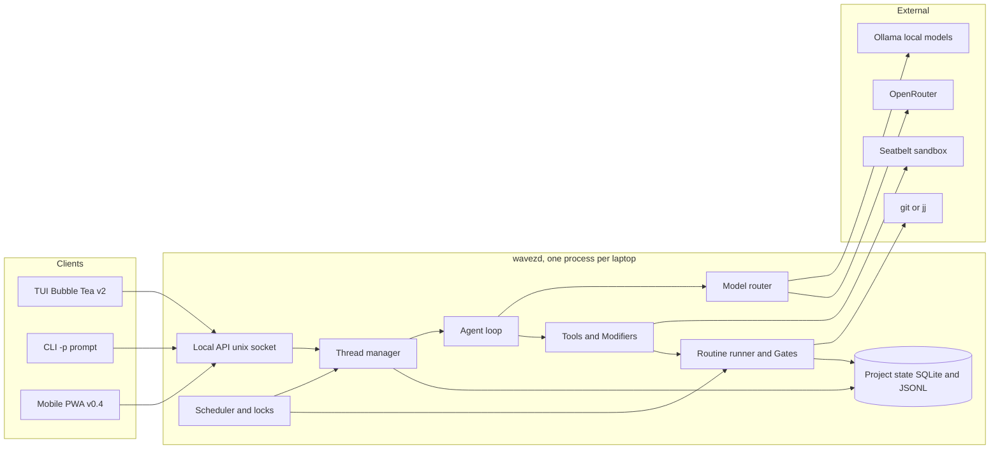
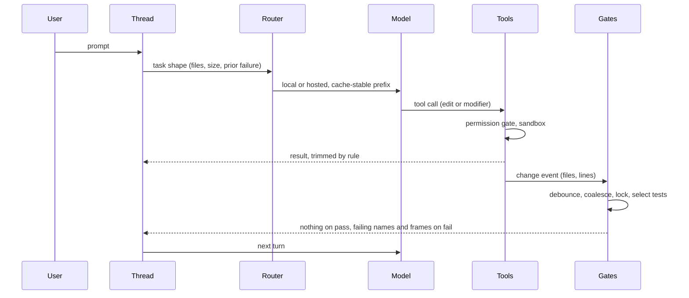

# Wavez design

High-level design: what each piece does, requirements per feature, decisions as y-statements, and phases. Not an implementation plan. Research and prior art live in `_ai_/`, especially [`_ai_/my-pi/docs/DESIGN-PROPOSAL.md`](_ai_/my-pi/docs/DESIGN-PROPOSAL.md) and [`_ai_/my-pi/docs/research/SYNTHESIS.md`](_ai_/my-pi/docs/research/SYNTHESIS.md), which this supersedes.

## Problem

Coding agents spend most of their tokens and wall-clock on work that does not need a model: deciding which tests to run, re-reading files that did not change, emitting whole edited files for a rename, carrying a single conversation that grows until compaction throws away what mattered. On a 16 GB M2 Pro with a local model, that waste also shows up as RAM pressure and slow tokens/sec.

The one-user constraint is the lever. There is no fleet, no policy hierarchy, no untrusted teammate. Anything whose only job is to serve more than one person or trust level gets cut, and the savings go into the deterministic layer around the model.

## Thesis

Do the predictable parts deterministically, keep the model for judgment, and keep the model's context small and cache-stable. Two subsystems carry the innovation budget:

1. Routines and Gates: change-triggered, lock-aware, coverage-selected checks with workflow-engine semantics
2. Modifiers: refactor engines exposed as tools so the model specifies shape instead of text

Everything else copies a reference implementation.

## Architecture



| Component | Responsibility |
|---|---|
| Local API | JSON over a unix socket. Every client (TUI, `-p`, phone) uses the same events and commands, which is what makes v0.4 mobile a client and not a rewrite |
| Thread manager | One thread per work stream: its own history, compaction state, and directory set |
| Scheduler and locks | Directory-subtree leases (from `_ai_/agent-locks`), edit and execute phases, memory-aware admission so the local model and a test run do not fight for RAM |
| Agent loop | Streaming tool-use loop, bounded retries, loop detection, permission gate |
| Model router | Task shape decides local vs hosted. Explicit override per turn |
| Tools and Modifiers | Read, edit, shell, search, question, browser (later), plus refactor operations backed by LSP and CLIs |
| Routine runner and Gates | pkl-defined DAGs triggered by change events, coverage-selected tests, output trimming |
| Project state | Gate log, coverage map, ledger, context manifests, diff anchors, recordings. Survives sessions |

Sessions are disposable, project state is not. A new thread reads the last ledger entries and current VCS state, a few hundred tokens, and follows anchors back to old turns only on demand.

## A turn, end to end



## Screens

Wavez is a dashboard over threads, the way gh-repo-dashboard is a dashboard over repos. It is not a multiplexer: herdr owns panes, tmux owns terminals, Wavez owns structured events. Everything on screen is data the daemon already has, so peeking, answering, and switching cost nothing.

Layout: persistent multi-panel (lazygit shape). Panels keep fixed positions. `Tab` and `Shift+Tab` cycle focus, the focused panel gets a bold title and bright border, unfocused panels dim (works under `NO_COLOR`). Footer is a priority-ordered hint list that drops the lowest-priority hints first as the terminal narrows, copied from gh-repo-dashboard. `?` is help everywhere, `:` is the palette everywhere, `Esc` always goes up one level and never quits. Minimum size 80x24. Flat Bubble Tea model with per-view files.

State glyphs carry meaning without color and have ASCII fallbacks: `●` working, `◐` gate running (`*`), `▲` needs input (`!`), `○` idle or waiting on a lock, `✖` failed (`x`), `✔` done (`ok`).

### Launch and scope

Scope resolves like gh-repo-dashboard: CLI args, then config `scan_paths`, then the enclosing VCS root, then cwd. Inside a repo, Home shows that repo's threads. Above several repos, Home shows a fleet grouped by directory. `w` widens or narrows the scope without restarting, and the palette can jump to any thread in the fleet from either scope. `wavez -p "…"` skips the TUI. `wavez` with one active thread in scope opens Home with it selected, never straight into it, so the list stays the anchor.

### Home (v0.1 single repo, v0.2 fleet)

```
┌ wavez · ~/dev · 4 threads · ▲ 1 needs input · mem 9.8/16G ───────────┐
│   thread              step                       age    spend      │
│ calcipy/                                                            │
│ ● fix-lock-timeout    editing internal/lease.go   2m    $0.00       │
│ ▲ docs-pass           allow? rm -rf .testmondata  40s   $0.00       │
│ │  ▸ shell  rm -rf .testmondata      [y]es [n]o [a]lways            │
│ │  ▸ gate   tests(3) ✔   fmt ✔                                      │
│ │  ▸ agent  cleaning stale coverage data before the full run        │
│ wavez/                                                              │
│ ◐ add-jj-backend      gate test 4/7               1m    $0.12       │
│ ○ └ jj-op-log-undo    waiting lock internal/vcs   5m    $0.00       │
│ yak-shears/                                                         │
│ ✖ flaky-ci            go test ✖ 2 failed          12m   $0.31       │
└ [Enter]open [v]peek [i]nbox [n]ew [s]chedule [:]palette [?]help ────┘
```

- One row per thread: glyph, name, current step in words (what it is doing or waiting on), age since last event, spend. Sub-threads indent under their parent with `└`
- `v` expands the row inline (gh-repo-dashboard's expand) with the last three events. If the thread needs input, the prompt row is live and `y`, `n`, `a`, or typed text answers it without opening the thread
- Header badges aggregate the fleet: thread count, how many need input, memory headroom. A thread flipping to `▲` raises a footer toast and, on mobile, a push
- Sort defaults to needs-input first, then most recent. `/` filters by name or directory
- `n` opens a new-thread form: prompt, directory set (defaults to the scope), model override, parent thread (optional)

### Thread view (v0.1)

```
┌ calcipy · fix-lock-timeout · gemma4-12b 3.1k/32k · $0.00 · ▲1 ───────┐
│ ledger  TTL made configurable in lease.go, gates green, 2 turns     │
│ ▸ user   make the lease TTL configurable                             │
│ ▸ modify rename lease.DefaultTTL → lease.TTL (3 files)               │
│ ▸ edit   internal/lease/lease.go  +6 −2                             │
│ ▸ gate   tests(3 selected) ✔ 1.2s   fmt ✔   lint ✔                  │
│ ▸ shell  rm -rf .testmondata        allow? [y]es [n]o [a]lways      │
├ diff ───────────────────────────────────────────────────────────────┤
│ internal/lease/lease.go                                             │
│ -const DefaultTTL = 30 * time.Minute                                │
│ +func TTL(cfg Config) time.Duration { … }                          │
├─────────────────────────────────────────────────────────────────────┤
│ > _                                                                 │
└ [Enter]send [Tab]panel [a]sk-line [f]ork []]next [?]help ───────────┘
```

- Header: directory, thread, active model with context used against its window, spend, and a badge for other threads needing input (`i` jumps to the inbox)
- The ledger row sits above the transcript: one line of what this thread has done, derived from the gate log and change set. Compacted history is folded under it, `H` unfolds
- Transcript rows are typed (user, agent, tool, modifier, gate, permission), collapsible with `Enter`. A permission row takes focus and answers with `y`, `n`, or `a`
- `[` and `]` move to the previous or next thread in scope without going through Home. `Esc` returns to Home with this thread selected
- `f` on a transcript row forks a new thread that inherits the compacted history up to that row, for trying a second approach without losing the first
- Diff pane shows the thread's change set. `d` jumps to it, `a` on a diff line opens Ask-a-line scoped to the anchor, hunk, and enclosing symbol
- `/` searches the transcript, `n`/`N` step matches, hits highlight in reverse video. Below 100 columns the diff pane stacks under the transcript

### Inbox (v0.1)

```
┌ inbox · 2 waiting ──────────────────────────────────────────────────┐
│ ▲ calcipy/docs-pass     shell   rm -rf .testmondata   [y] [n] [a]   │
│ ▲ wavez/add-jj-backend  ask     colocate or pure jj?  > _           │
└ [Enter]answer [o]pen thread [Esc]back ──────────────────────────────┘
```

- Every permission prompt and question across the fleet, oldest first. Answering here is the same as answering in the thread
- Sits behind `i` from any screen and is the default landing view for the mobile client

### Schedule (v0.2)

```
┌ schedule · phase: edit · mem 9.8/16G · local model loaded ──────────┐
│ fix-lock-timeout  ████████░░░░░░░░ edit                              │
│ add-jj-backend    ████░░◐◐◐◐░░░░░ gate 4/7                          │
│ jj-op-log-undo    ○○○○○○○○○○○○○○○ lock internal/vcs ← add-jj-backend│
│ docs-pass         ██▲▲▲▲▲▲▲▲▲▲▲▲▲ input 40s                          │
├ routine · gate/test · add-jj-backend ───────────────────────────────┤
│ changed(2) → select(7) → run ◐ 4/7 → trim                           │
│            → fmt ✔      → lint ✔                                    │
└ [Enter]drill [p]ause [k]ill [l]ocks [Esc]back ──────────────────────┘
```

- One lane per thread, recent history left to right, glyph runs show what each spent its time on. A lock wait names the holder
- The selected thread's active routine renders one line per branch. A DAG with more branches than rows drills in with `Enter` to a tree view (one node per line, `├──` guides)
- Lease list behind `l`: subtree, holder, state (active, committed, expired)

### Routines and Recordings panels (v0.2)

- Routines: from `.wavez.pkl`, with triggers, last run, duration sparkline. `r` runs, `e` edits in `$EDITOR`, `h` history
- Recordings: per thread. `p` replays and diffs, `t` promotes to a test, `x` discards

### Palette (`:`)

- Fuzzy over threads, directories, pending prompts, routines, and verbs (`new`, `pause`, `kill`, `fork`, `scope`). Scoped to the current repo by default, `:` twice for the fleet

## Features

### Chat loop (v0.1)

- Streaming tool-use loop with typed tools: read, edit, shell, grep, symbol lookup, question, and modifiers
- Bounded retries. A malformed tool call or an identical repeated call is a failure, not a retry
- Permission gate before anything destructive, defaulting to ask. Sandbox behind it
- Read-once cache keyed by content hash. Unchanged files are not re-read into context
- `-p "…"` runs one prompt headless and prints the result

### Gates (v0.1)

- Triggered by change events from the edit tool and from a file watcher, never by the model deciding to test
- Changed-file detection stores its own last-known-good marker (SHA or op ID), not a session ID
- Test selection reads one code-relationship store, a SQLite file per project with three tables: import edges (file to file), symbol definitions and references, and line-to-test coverage. Adapters feed it, gates query it, and every other consumer (Modifiers, scheduler contention, risk scoring) reads the same store
- Adapters: `codegraph` for symbols and edges (calls, references, imports; 763 ms to index a 10k LOC Go repo, needs `--filter "**/*_test.go"` on Go), coverage.py `--cov-context=test` for Python line-to-test (+8% over plain coverage, works under xdist), a per-test `go test -run` coverprofile loop for Go, tree-sitter where codegraph is missing. `vitest --changed` or `testpick` for JS later. Demos: `_ai_/demos/code-store-go`, `_ai_/demos/code-store-python`
- Selection order: line-to-test where the map covers the changed lines, transitive importers of changed files otherwise, whole package as the last fallback. Measured on gh-repo-dashboard: line-level cuts a 522-test suite to 3-5 tests for a one-function change, importer-level returns 383 for a widely imported file, so the coverage map ships in v0.1
- The coverage map is built once per clone (249 s for 522 Go tests with 8 workers, 27x a plain run) and updated incrementally: only tests whose covered files changed by content hash re-run
- Full run on a cadence: after N selective passes, after a time threshold, or when the map flags an untracked file
- Debounce and coalesce edits into one run. Gates sharing a resource serialize, others run in parallel
- On pass: a boolean and timestamp in the gate log, nothing to the model. On fail: failing test names and frames that touch changed files, parsed from `go test -json`, JUnit XML, or pytest's machine output
- Formatter and auto-fixable lint run as pre-passes before the model sees the diff
- Config discovered from `package.json`, `Makefile`, `pyproject.toml`, `mise.toml`, with a one-time prompt to confirm

### Routines (v0.2)

- Defined in `.wavez.pkl` per project, amending a Wavez schema. Gates are shipped as built-in routines the user can override or disable there
- `hk.pkl` can `import ".wavez.pkl"` so a git hook runs the same routine the agent does (verified in `_ai_/demos/pkl-routines`, needs `HK_PKL_BACKEND=pkl` until hk's `pklr` backend fixes list indexing across imports). Wavez does not depend on hk
- Semantics borrowed from Hatchet: DAG steps with parents, concurrency keys with `cancel-in-progress` and `round-robin`, triggers (change event, manual, schedule, thread lifecycle). Rate limits, durable sleep, and sticky assignment are dropped
- Steps invoke CLIs in any language through an action registry (name, params, validator, handler) rather than shell strings
- Locks: directory-subtree leases keyed on the write target, advisory with TTL, commit downgrades to rebase-risk
- Run history and trimmed outputs stored per routine. Failure output uses the same trimming as gates
- Compiled DAG is a disposable artifact keyed by the pkl content hash. Drift means recompile, not patch

### Modifiers (v0.3)

- Tools the model calls with a symbol and a target: rename, move, extract, inline, add import, organize imports, stub from signature or interface, fill struct, add struct tag, structural rewrite by pattern
- Backends: `gopls` CLI and LSP for Go, `ts-morph` and tsserver for TypeScript, `rope` and `ty` LSP for Python, `ast-grep` for cross-language pattern rewrites. One generic LSP client (`go.lsp.dev/protocol`) covers rename and code actions
- Result returned to the model is the file list and line counts, not the diff, unless a gate fails
- Each modifier is one deterministic operation. A modifier that partially applies rolls back
- Serena's symbol tools are the reference for the token argument

### Threads and scheduling (v0.2)

- A thread is a directory set plus a history plus a compaction state. Threads across directories are the norm, worktrees optional
- Scheduler phases: edit (threads write, gates queue) and execute (gates and routines run, edits pause for the touched subtrees)
- Memory-aware admission: the local model and a large test run do not overlap when headroom is below a threshold (with qwen3:8b loaded ~31% is free, enough for a Go suite; gemma4:12b leaves 14-18% and is not). Long-running services (compose stacks) stop when idle
- Contention rules come from leases plus a dependency map, so two threads planning changes to the same feature serialize
- Threads can spawn sub-threads (one level) and fork from a transcript row, inheriting the compacted history up to that point
- The schedule view shows one lane per thread with the active routine's DAG inline

### Compaction (v0.3, minimal version in v0.1)

- Deterministic first: truncate stdout by rule (first and last lines, frames touching changed files), drop tool results older than N turns, downscale images, replace repeated file reads with a hash reference
- Append-only. Earlier turns are never mutated, so the prompt-cache prefix survives. Trimming happens by writing shorter replacements forward
- Model summarization only for the residue, using the small local model, with the user able to edit the summary
- Session ledger: one line per thread end, structural facts extracted from logs, a model handoff note only where structure cannot capture it
- Context manifest tags every item entering a prompt with source, id, and reason so "why did it write this" is a lookup, not a question

### Model routing (v0.1)

- Local first. Measured on this laptop (`_ai_/demos/local-models`): qwen3:8b decodes at 18 tok/s, made 3/3 well-formed and correct tool calls, and leaves ~5 GB free. gemma4:12b decodes at 14 tok/s, hallucinated a tool name once, and thrashes to 2 tok/s under memory pressure. qwen3:8b is the v0.1 local model for edits, compaction, and line questions
- Prefix cache reuse through Ollama is real (2k-token prefix re-eval 9.4 s to 47 ms), so the stable-prefix rule pays off locally as well as hosted. Ollama serves 4096 context by default. Raising it multiplies KV memory, so the router's local context budget is a tuned number, not the model's trained max
- Escalate to OpenRouter on task shape (multi-file, over the local context budget) or after one local failure. Never retry local past one failure
- Explicit override per turn. Cost and token counters per thread in the header
- Anthropic caching through OpenRouter requires the native Anthropic wire format and a pinned provider. The harness keeps a stable prefix (system, tools, ledger) and appends after it

### Safety (v0.1)

- macOS Seatbelt profile per project: writes scoped to the project root and a session temp dir, secrets and `~/.ssh` denied, network through an allowlist proxy
- Destructive-command guard in front of shell, modeled on `dcg`, deterministic and fail-closed
- Permission prompt only for what escapes both. `y`, `n`, `a` for the thread
- Model output never becomes a policy input. Approval comes from the deterministic checker or the user

### VCS (v0.4)

- One `Operations` interface with `git` and `jj` backends shelled out, factory by detection, copied from `../gh-repo-dashboard/internal/vcs`
- Agent-facing primitives: changed files since marker, diff for a set of files, commit or new change with a message derived from the thread's task, undo through `jj op log` where available
- Commit messages and PR bodies are produced by Wavez logic (like `ai-gh-pr.py`), not by the model composing a shell command
- Merge-forward stacking and review state that survives force-pushes are candidates, not commitments

### Mobile (v0.4)

The bar is Claude Code Mobile: open the phone, see what the agent needs, answer, and see the result. The gap is that Wavez runs on a laptop that has to be reachable and awake.

- Transport: Tailscale. `tailscale serve` fronts `wavezd`'s API and injects `Tailscale-User-Login`, so identity is the tailnet's. Funnel only if reachability off-tailnet is needed
- Client: PWA installed to the home screen. Views: threads list, one thread's transcript, approvals queue, diff with Ask-a-line, and a new-thread form. Same API and events as the TUI
- Push: ntfy.sh (or Web Push once the PWA is installed) for gate failures needing a decision, permission prompts, and thread completion. Batched, never per event
- Dispatch: starting a thread from the phone reuses `_ai_/ai-dispatch`'s signed-envelope design (HMAC, timestamp window, nonce set, kill-switch file)
- Limits to state up front: the Mac must stay awake (`caffeinate` while threads run), no offline mode, no terminal streaming (structured events only), and the phone cannot open the sandbox wider than the thread already had
- Alternatives considered: native SwiftUI app (later, if push action buttons prove insufficient), SSH via Wish (rejected on the 2026 CVEs), a hosted relay (rejected, one user does not need infrastructure)

### Recordings (v0.2 PTY, v0.5 browser)

- Every PTY session and browser step the agent drives is logged as an action, selector or command, and result
- Replay runs the same steps and diffs the observed result. Steps carry confirm and falsify expectations from `_ai_/code-in-the-loop` ADR 0006 rather than raw sleeps
- Promotion writes a test file from a per-language template. Discard is the default after the routine that produced it succeeds
- One `browser.Session` interface (click, read accessibility tree, screenshot, record) with two backends. Default is `go-rod` on a fresh profile, so an injected page finds no ambient credentials and deny-by-default mutation and the egress allowlist live in Wavez's process. `browser-control` (extension plus local WebSocket relay on the real profile) is a per-thread opt-in for tasks that need a logged-in session, never the default. Kitesurf runs only inside Workers and is out
- Vision calls only for visual judgments. Chrome 136+ refuses `--remote-debugging-port` on the default profile, so those two backends are the only routes

### Web search (v0.3)

- One search tool, one fetch tool. Results and pages pre-trimmed to text before the model sees them
- Version pinning: queries carry the detected package version so results match the software in use
- Dash docsets as a local first hop where they exist

### Benchmark (v0.5)

- Check out a codebase at a commit, run a prepared prompt set, compare tokens, wall-clock, and pass rate against Claude Code and OpenCode. Reuse Harbor for scoring, add turn count and gate failures from the ledger

## Decisions

Y-statement form: in the context of, facing, we decided, to achieve, accepting.

- In the context of a single-binary low-RAM agent, facing Go vs Rust vs TypeScript, we chose Go with Bubble Tea v2, to reuse Crush's proven patterns and the user's Go tooling, accepting that jcode (Rust) will stay leaner
- In the context of Crush's FSL-1.1-MIT license and its `internal/` layout, facing fork vs copy, we copy its tool loop and TUI patterns into our own code, to keep the surface small and avoid the FSL window, accepting slower start than a fork
- In the context of per-project config, facing pkl vs CUE vs TOML, we chose pkl through `pkl-go` with one long-lived evaluator, to get typed schemas with `amends` and share the mental model with hk, accepting a `pkl server` subprocess (~30 MB RSS) and a pre-1.0 Go binding. Measured in `_ai_/demos/pkl-routines`: ~130 µs warm, 10-14 ms cold, so no cache layer is needed
- In the context of test selection, facing `pytest-testmon` per language vs one store, we keep one SQLite line-to-test and import-graph schema fed by per-language adapters (coverage.py contexts, Go coverprofile loops, `codegraph`), to let gates, modifiers, and the scheduler share one model of the code, accepting that we own the selection logic
- In the context of workflow semantics, facing embedding a Go workflow library vs writing a scheduler, we write a small in-process DAG runner, to keep it single-process and testable, accepting that we own it
- In the context of a 16 GB M2 Pro, facing local-only vs hosted-only vs router, we run local first with escalation to OpenRouter after one failure or on task shape, to keep routine edits offline and cheap, accepting that multi-file work will mostly go hosted
- In the context of coordination between threads, facing worktrees vs directories, we key locks and identity on directory subtrees, to match how agents actually write (6.8% of writes leave the cwd), accepting that isolation of dependencies is the project's job
- In the context of safety, facing prompts-only vs sandbox, we run Seatbelt plus a deterministic destructive-command guard with prompts for the remainder, to make catastrophic actions unreachable rather than discouraged, accepting some setup per project
- In the context of VCS, facing git-only vs jj-only vs both, we build the abstraction in v0.4 with git and jj backends and colocated repos as the norm, to get change IDs and op-log undo without losing GitHub tooling, accepting the extra backend
- In the context of remote access, facing native app vs PWA vs SSH, we chose Tailscale plus a PWA plus push, to ship in days with no App Store or server, accepting that the laptop must stay awake
- In the context of extensibility, facing plugins vs built-in tools, we ship no plugin system, to keep the tool surface auditable and small, accepting that new tools mean code changes
- In the context of compaction, facing client-side rewriting vs append-only trimming, we trim append-only and summarize residue with a local model, to keep prompt caches valid, accepting more tokens per turn than aggressive rewriting

## Phases

| Version | Done when | Ships |
|---|---|---|
| v0.1 | A single-thread edit on wavez or gh-repo-dashboard runs local, gates fire on the change, and the sandbox blocks a write outside the project | Home (single repo), thread view, inbox, palette, loop, tools, gates for Go (Python if the selection primitive is settled), Seatbelt + guard, router with OpenRouter escalation, `-p`, minimal compaction, ledger |
| v0.2 | Three threads across two directories run concurrently with leases and a visible schedule | pkl routines, DAG runner, locks, fleet Home, schedule view, sub-threads and fork, routines panel, PTY recordings, memory-aware admission |
| v0.3 | The same task costs measurably fewer tokens than v0.1 | Modifiers for Go, Python, TypeScript, deterministic compaction, symbol index, coverage map store, web search, context manifest and Ask-a-line |
| v0.4 | Approve a permission prompt and read a diff from a phone, and undo an agent change through the op log | VCS layer with git and jj, PWA, push, dispatch |
| v0.5 | A benchmark table against Claude Code on 20 tasks | Browser recordings, benchmark harness |

## Considered and deferred

Grouped by rough priority. Each stays out until the phase that would use it, with the reason recorded so it is not re-argued.

Likely later:

- Risk scoring for a diff from deterministic signals (capability delta via `semgrep --baseline-commit` or `ast-grep`, blast radius from the import graph, signature change from tree-sitter). Argued in `_ai_/is-it-risky-determinitically.md`. Belongs in Gates once the code-relationship store exists (v0.3)
- Churn and bug-correlation per file or function. code-maat (Clojure CLI, CSV hotspots and coupling) and PyDriller (Python library for commit mining and SZZ pipelines) exist today, no maintained bare CLI for defect prediction does. Feeds the same risk score once the code-relationship store exists
- Merge-then-monitor: join merges against Sentry or health metrics after the fact to label outcomes. Separate tool, not a pre-merge gate
- Merge-forward stacked PRs and review state that survives force-pushes (`_ai_/merge-based-stacking`). Depends on the v0.4 VCS layer
- Ask-a-line threads persisted like review comments. Depends on diff anchors (v0.3)

Maybe:

- Comprehension quizzes from transcripts (`_ai_/what-did-ai-do`). Works today as its own tool against Wavez's session IR
- Dash docsets as a local first hop for web search
- Learned router heuristics from usage. Start fixed
- Native SwiftUI mobile client if the PWA's push action buttons fall short

No:

- jj-only. Colocated repos keep git for GitHub tooling
- KiteSurf as the browser backend (Workers only). browser-control as the default backend (real profile, allow-by-default filter in a third-party relay), kept as an opt-in behind the same interface
- Wish/SSH for remote access (2026 CVEs)
- Plugins, MCP servers loaded up front, multi-agent hierarchies past one level of delegation

## Risks and unverified claims

- Qwen3-Coder-30B-A3B's smallest Ollama quant is 19 GB, so it is out on this laptop. A stronger local coder needs more memory or a hosted fallback
- The local bench used Ollama 0.32 (llama.cpp backend on this run). llama.cpp or MLX served directly may change the numbers, and Gemma's thinking mode needs a `num_predict` cap or disabling
- `pkl-go` evaluation latency and API stability before 1.0
- Bubble Tea v2 scroll-performance regression (bubbletea#1724)
- Charm's runway. Crush is a reference, not a dependency, so this is a research-continuity risk only
- Coverage-map adapters per language are the long tail. Importer-based selection from `codegraph` is the fallback, and on this repo it is close to running everything
- `codegraph`'s SQLite schema is its own and may change. Wavez copies rows into its store rather than querying theirs
- Bubble Tea v2 broke imports and APIs in February 2026, so Crush-era snippets need translation

## Open questions

- Router heuristic: fixed rules (file count, line count, prior failure) or learned from usage
- Monorepo per-package test commands in v0.1 or later
- How the scheduler surfaces a deep DAG without a graph widget (current answer: one row per thread, drill in)
- Whether Ask-a-line threads persist across sessions as review comments do
- Web search API and version-pinning strategy
