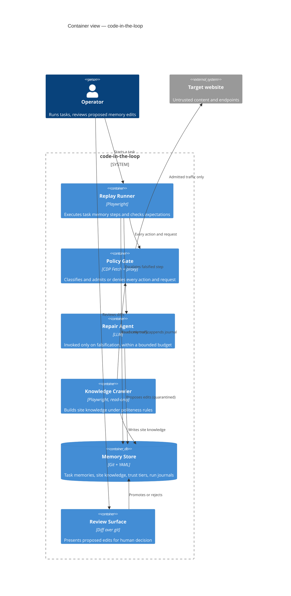
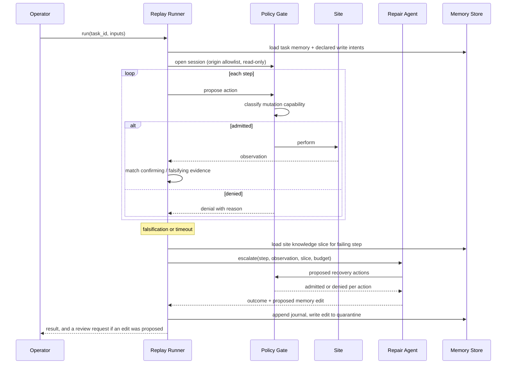

# Architecture

## The core bet

A browser task that a person repeats is mostly deterministic. The pages change slowly, the
sequence of interactions is stable, and the only genuinely variable parts are the input data
and the occasional site redesign. Running such a task through a language model on every
execution pays a large, recurring cost to rediscover something that was already known.

So the model is absent from a successful run. A task memory is executable, the harness
replays it directly through Playwright, and each step carries explicit expectations that a
parser can check. The agent is a repair mechanism invoked on falsification, given a bounded
budget and a single failing step to fix.

Two consequences follow, and they are the reason to build it this way rather than as a
better agent loop.

Cost and latency collapse on the common path. A replayed task costs the wall-clock time of
the browser actions and nothing else. The budget-constrained study of web agents found that
skill and memory modules frequently fail to earn their token cost when they are retrieved
into a prompt. Memory that is *executed* has no such problem.

The injection surface collapses too. On a clean run no page content ever enters a model
context, so hostile text on the page has nothing to talk to. Injection risk becomes
proportional to the escalation rate rather than to the number of tasks run, and a stable
site drives it toward zero.

## Containers

| Container | Responsibility | Trust of its inputs |
| --- | --- | --- |
| Replay Runner | Deterministic execution of a task memory, expectation evaluation, timeout enforcement, journal emission | Task memory is trusted code; page state is untrusted data |
| Policy Gate | The only path to the network and the only path to a DOM mutation, classifies mutation capability, enforces write leases | Assumes everything passing through is hostile |
| Repair Agent | Diagnoses a falsified step, attempts recovery within budget, proposes memory edits | Everything it sees is untrusted, everything it emits is untrusted |
| Knowledge Crawler | Builds and refreshes site knowledge, permanently read-only, never authenticated by default | Site content and declared policy |
| Memory Store | Versioned, human-diffable persistence with per-entry trust tier and provenance | Trusted only at the trusted tier |
| Review Surface | Human promotion, rejection, and manual editing | Human decisions are authoritative |

The Policy Gate is deliberately not a library the runner calls politely. It is a chokepoint,
and both the runner and the crawler reach the network only through it. A control the caller
can decline to invoke is not a control.

## Run lifecycle

The ordering carries two claims worth stating outright. Site knowledge is loaded *after*
falsification rather than before, because loading it up front would pay the token cost the
design exists to avoid. And the Repair Agent's actions pass through the same gate as the
runner's, with no elevation. An agent that is recovering from a failure is exactly when the
system is least sure what is going on, which is the wrong moment to widen its authority.

## The two memories, and why they are separate

Task memory is narrow, ordered, and about intent. It answers "what sequence of interactions
accomplishes this specific outcome, and how do I know each one worked."

Site knowledge is broad, unordered, and about the site. It answers "what is here, what does
it look like, which endpoints exist, which of them mutate, what breaks."

Keeping them separate buys several things. A site redesign invalidates site knowledge and
should not automatically invalidate every task memory that touches the origin, because most
steps survive most redesigns. A hundred task memories against one origin share one copy of
the element catalog rather than a hundred stale copies. The crawler can maintain site
knowledge continuously without ever executing a task. And the escalation prompt can carry a
targeted slice of broad knowledge alongside the narrow failing step, which is the specific
combination that makes repair tractable, since the agent needs to know both what was
supposed to happen and what else exists on this page that might now be the right target.

The lifecycle survey's finding that flat retrieval degrades at moderate library sizes and
that focused libraries beat comprehensive ones argues for the same partition. Retrieval
here is exact lookup by origin and task identity, never similarity search over one global
pool.

## Layering, from outside in

The system is four layers, and each one is allowed to say no to the one above it.

**Intent layer.** A task memory declares up front which origins it touches and which write
operations it expects to perform, with counts. This is a contract written before execution
and reviewable by a human, and it is what makes the write-lease mechanism possible.

**Action layer.** Every Playwright action is proposed rather than performed. The gate
inspects the resolved target element and the action kind, so a click on a control that the
site's own semantics mark as destructive is caught before any request is generated.

**Network layer.** CDP `Fetch.requestPaused` interception classifies mutation capability
from method, URL, headers, and parsed body, including per-operation classification of
batched envelopes. Nothing leaves the browser without a verdict.

**Egress layer.** An out-of-process proxy enforces the origin allowlist independently, on
the assumption that the CDP layer will eventually be bypassed by some channel nobody
enumerated. Anthropic's own exfiltration incident through an allowlisted domain is the
argument for not stopping at the third layer.

Details in [security guardrails](03-security-guardrails.md).

## What the agent may and may not change

The agent may propose edits to task memories and site knowledge. It may not change harness
code, policy rules, origin allowlists, write-intent declarations, or trust tiers.

This is the explicit rejection of the Browser Harness philosophy, where the agent edits the
harness in real time to add missing capability. That approach makes the reviewable surface
unbounded and puts the enforcement code inside the blast radius of an injection. Here the
code is fixed and reviewed like code, the data is versioned and reviewed like data, and
raising the system's authority is always a human action.

## Failure modes this design accepts

Being honest about the costs rather than only the benefits:

A first run of a novel task has no memory to replay, so it is a full agent session at full
token cost with the full injection surface. The system is an amortization strategy, and it
is worth nothing for one-shot tasks.

A site under active redesign escalates constantly, and the fast path degrades to something
slower than a plain agent because every run pays replay plus failure plus repair. Detecting
sustained escalation and retiring the memory outright is cheaper than healing it forever.

Expectations can be wrong in the permissive direction. A step whose confirming evidence is
too weak passes while the task silently goes off the rails, which is the exact failure
FCPAgent's hierarchical falsifying evidence exists to catch, and it is only as good as the
evidence authored into the memory.

The mutation-capability classifier will produce false denials, and a task that legitimately
needs an operation the classifier cannot resolve will stall until a human intervenes. That
is the deliberate trade recorded in [ADR-0004](../adr/0004-mutation-capability-deny-by-default.md).
