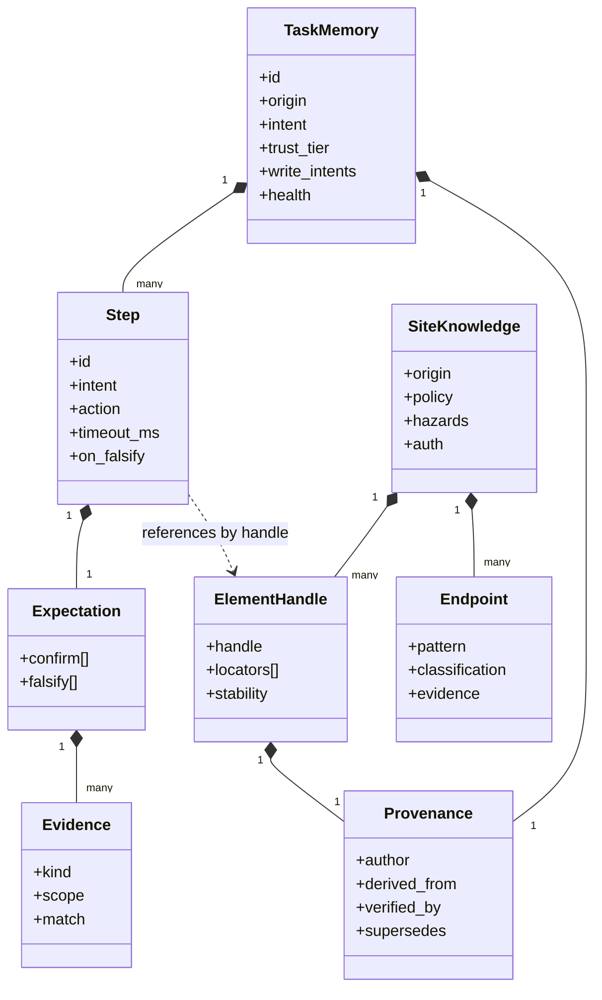

# Data structures

Both structures are YAML on disk in a git repository. YAML because the review surface is a
diff a person reads, and a format that produces line-oriented diffs with stable ordering is
worth more here than anything a binary store offers. Ordering rules are enforced on write
(keys in schema order, lists in the order given by the schema's sort key) so that a
semantically identical rewrite produces an empty diff.

## Layout

```
memories/
  acme.example/
    site.yaml                     # site knowledge, one per origin
    elements.yaml                 # element catalog, split out because it churns
    endpoints.yaml                # network endpoint catalog and classifications
    tasks/
      submit-expense-report.yaml  # task memory
      export-q3-invoices.yaml
  journals/
    2026-08-02T14-31-07Z-submit-expense-report.jsonl
quarantine/
  acme.example/tasks/submit-expense-report.yaml   # proposed edit awaiting review
```

Splitting `elements.yaml` and `endpoints.yaml` out of `site.yaml` is a review ergonomics
decision. The element catalog changes on every crawl as stability statistics update, and
burying a meaningful policy change in a diff full of counter increments is how review
becomes a rubber stamp.

## Model



The one structural rule worth calling out: a step references an element by *handle*, never
by locator. Locators live in exactly one place, the site knowledge element catalog. Healing
a locator therefore fixes every task memory that targets it at once, and it makes the
distinction between "this site changed" and "this task changed" mechanically visible in the
diff rather than a matter of interpretation.

## Task memory

```yaml
schema: taskmemory/v1
id: submit-expense-report
origin: https://acme.example
intent: >
  Submit a completed expense report for the current period and confirm it reached
  the approver queue.

trust_tier: trusted          # proposed | probationary | trusted
version: 7

inputs:
  - name: period
    type: string
    pattern: '^\d{4}-Q[1-4]$'
  - name: receipts
    type: file[]

write_intents:
  - origin: https://acme.example
    operation_class: expense.create
    max_count: 1
  - origin: https://acme.example
    operation_class: expense.attach
    max_count: 20

preconditions:
  - kind: auth_state
    match: {session: authenticated, role: employee}
  - kind: url
    match: {equals: 'https://acme.example/expenses'}

steps:
  - id: open-new-report
    intent: Open the new expense report form
    action:
      kind: click
      element: expenses.new-report-button
    expect:
      confirm:
        - {kind: url, scope: page, match: {matches: '^https://acme\.example/expenses/new'}}
        - {kind: element_visible, scope: page, match: {element: expenses.form-root}}
      falsify:
        - {kind: element_visible, scope: page, match: {element: common.session-expired-modal}, attribute: precondition}
        - {kind: element_visible, scope: page, match: {element: common.error-banner}, attribute: execution}
        - {kind: url, scope: page, match: {matches: '/login'}, attribute: precondition}
    timeout_ms: 8000
    on_falsify: escalate

  - id: fill-period
    intent: Set the reporting period
    action:
      kind: fill
      element: expenses.period-input
      value: '{{ inputs.period }}'
    expect:
      confirm:
        - {kind: element_value, scope: page, match: {element: expenses.period-input, equals: '{{ inputs.period }}'}}
      falsify:
        - {kind: element_visible, scope: page, match: {element: expenses.period-validation-error}, attribute: execution}
    timeout_ms: 3000
    on_falsify: retry_then_escalate

  - id: submit
    intent: Submit the report to the approver queue
    action:
      kind: click
      element: expenses.submit-button
    writes:
      operation_class: expense.create
      expected_endpoints: [acme.expenses.create]
    expect:
      confirm:
        - {kind: element_visible, scope: page, match: {element: expenses.submitted-confirmation}}
        - {kind: network, scope: session, match: {endpoint: acme.expenses.create, status: 201}}
      falsify:
        - {kind: network, scope: session, match: {endpoint: acme.expenses.create, status_gte: 400}, attribute: execution}
        - {kind: element_visible, scope: page, match: {element: common.error-banner}, attribute: execution}
    timeout_ms: 15000
    on_falsify: halt          # never retry a write blind

postconditions:
  - kind: element_text
    match: {element: expenses.status-chip, equals: 'Submitted'}

health:
  runs: 214
  successes: 209
  escalations: 12
  contribution: 0.94
  last_success: 2026-08-01T09:14:22Z
  consecutive_failures: 0

provenance:
  author: agent:repair@2026-06-14T11:02:19Z
  derived_from: journals/2026-06-14T10-58-01Z-submit-expense-report.jsonl
  verified_by: human:kyleking@2026-06-14T16:40:00Z
  supersedes: 6
```

### Field notes

`write_intents` is the contract that makes the security model work. It is declared ahead of
time, reviewed by a human as part of the memory, and consumed by the Policy Gate to issue
write leases. A step that attempts a write not covered by a declared intent is denied even
though the memory is trusted, because the intent block is the reviewed artifact and the step
body is not independently authoritative.

`expect.confirm` and `expect.falsify` come straight from FCPAgent's Falsifiable Commitment
Units. The `attribute` field on falsifying evidence carries the diagnostic scope
(`precondition`, `execution`, `skill`, or `planning`) which the repair path uses to size its
response. Execution drift means retry or re-locate. Skill mismatch means this step is wrong
and the memory needs an edit. Planning failure means the whole approach is stale and the
memory should be retired rather than healed. Attributing before repairing is what stops a
healer from patching a selector when the actual problem is that the feature was removed.

`on_falsify: halt` on the submitting step is deliberate. A write whose confirmation did not
arrive is ambiguous rather than failed, since the request may have succeeded with a lost
response. Retrying is how a system creates duplicates. Halting and asking a human is the only
correct behavior without an idempotency key, and where the site supports one it belongs in
the `writes` block.

`health` supplies the Library Drift diagnostics. `contribution` is
`(successes − failures) / runs`. Retirement thresholds and the evidence floor before they
apply are in [human-in-the-loop](04-human-in-the-loop.md).

`provenance` implements the lineage relation from the lifecycle survey. Both an authoring
event and a verifying event are recorded, because the distinction between "an agent wrote
this" and "a human accepted it" is the entire basis of the trust tier.

## Site knowledge

```yaml
schema: siteknowledge/v1
origin: https://acme.example
last_crawl: 2026-07-30T02:11:00Z

policy:
  robots_fetched: 2026-07-30T02:10:41Z
  crawl_delay_s: 2
  disallow_prefixes: ['/admin', '/api/internal']
  ai_preferences: {train: false, search: true, agent: allow}
  webmcp:
    available: true
    discovered: 2026-07-14T02:10:00Z
    tools: [search_expenses, create_expense, list_approvers]

auth:
  scheme: session_cookie
  login_route: /login
  authenticated_marker: common.account-menu
  session_expired_marker: common.session-expired-modal
  csrf:
    mechanism: double_submit
    header: X-CSRF-Token
    cookie: csrf_token

routes:
  - pattern: '/expenses'
    role: index
    requires_auth: true
    observed_titles: ['Expenses']
  - pattern: '/expenses/{id}'
    role: detail
    requires_auth: true
  - pattern: '/expenses/new'
    role: form
    requires_auth: true
    mutating: true

flows:
  - id: login
    steps_ref: flows/login.yaml
  - id: pagination
    kind: cursor
    control: common.next-page-button
    terminator: common.next-page-button[disabled]

hazards:
  - kind: infinite_scroll
    routes: ['/expenses']
    note: List virtualizes, off-screen rows are not in the DOM
  - kind: rate_limit
    detection: {status: 429, header: Retry-After}
  - kind: interstitial
    element: common.cookie-consent
    routes: ['*']
    dismiss: common.cookie-accept-button
  - kind: untrusted_content
    routes: ['/expenses/{id}']
    note: Comment field renders user-supplied text, treat as injection source
```

The `hazards` list is what the escalation prompt actually needs. Half of browser agent
failures are a modal, a consent banner, or a virtualized list, and an agent told about them
up front resolves in one turn what would otherwise take five.

`untrusted_content` hazards mark regions of the site where third parties can place text.
They drive the content-provenance labeling described in the
[threat model](../research/threat-model.md), and marking them is much cheaper than trying to
detect injection after the fact.

### Element catalog

```yaml
schema: elements/v1
origin: https://acme.example
elements:
  - handle: expenses.submit-button
    role: button
    accessible_name: 'Submit report'
    locators:
      - {strategy: role, value: 'button[name="Submit report"]', health: {hits: 402, misses: 3}}
      - {strategy: testid, value: 'expense-submit', health: {hits: 12, misses: 0}}
      - {strategy: css, value: 'form#expense .actions > button.primary', health: {hits: 4, misses: 61}}
    semantics:
      destructive: false
      submits_form: true
      operation_class: expense.create
    stability: 0.99
    first_seen: 2026-03-02T00:00:00Z
    last_confirmed: 2026-08-01T09:14:20Z
    provenance:
      author: crawler@2026-03-02T00:00:00Z
      verified_by: execution:submit-expense-report
```

Locators are an ordered list with hit and miss counters, and the runner tries them in order
of observed reliability. This handles the ordinary case of a redesign that changes CSS class
names without touching accessible names, and it means healing frequently amounts to
reordering a list rather than inventing a new selector.

The `semantics` block is what the Policy Gate consults at the action layer. `destructive`
and `operation_class` let a click be classified before it generates a request, which matters
because some destructive controls act entirely client-side until a later flush.

### Endpoint catalog

```yaml
schema: endpoints/v1
origin: https://acme.example
endpoints:
  - id: acme.expenses.list
    pattern: 'GET /api/expenses'
    classification: read
    evidence: {source: observed, samples: 140, idempotent_observed: true}
    confidence: 0.97

  - id: acme.expenses.create
    pattern: 'POST /api/expenses'
    classification: mutate
    operation_class: expense.create
    evidence: {source: observed, samples: 8}
    confidence: 1.0

  - id: acme.graphql
    pattern: 'POST /graphql'
    classification: envelope
    envelope: {kind: graphql, batching: array_and_alias, persisted_queries: true}
    note: Classification must be per-operation, persisted queries resolve to unknown

  - id: acme.session.logout
    pattern: 'GET /logout'
    classification: mutate
    operation_class: session.destroy
    evidence: {source: heuristic, rule: safe_method_action_path}
    confidence: 0.85
```

The endpoint catalog is the single highest-value artifact the crawler produces, because it
converts the generic mutation heuristic into per-site fact. `GET /logout` is the canonical
case: no generic method check catches it, and one crawl observation plus a path heuristic
does. Classifications are cached with confidence and evidence source so that a human
reviewing a denial can see whether it rested on observation or on a guess.

`classification: envelope` marks endpoints where a single request may carry many operations,
which forces the per-operation path in the gate rather than a URL-level verdict.

## Journal

Every run appends a JSONL journal: each step's resolved locator, the observation, the
expectation verdict, every gate decision with its reason, and any escalation with the
agent's full input and output. The journal is the evidence base for the diagnostics, the
input to memory induction, and the audit trail for a security review. It is also the only
place raw page content is persisted, so journals are treated as untrusted data and are never
concatenated into a prompt without provenance labeling.
