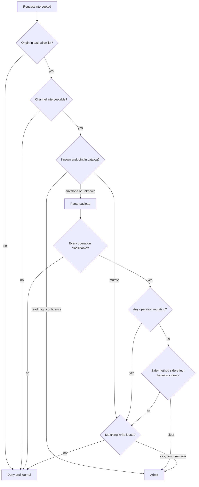

# Security guardrails

The controls here are deliberately dumb. Every conclusion from the 2026 injection literature
points the same way: defenses evaluated by a model get argued with, and defenses evaluated
by a parser do not. The "Attacker Moves Second" result, where twelve published defenses were
bypassed at over 90% success by adaptive attacks despite reporting low residual rates against
static ones, is the reason nothing load-bearing in this design is a classifier.

The organizing rule is Meta's Rule of Two: an agent may hold at most two of processing
untrusted input, accessing sensitive systems, and changing external state. A browser agent
on a logged-in site wants all three. The write-lease mechanism below is how the third one is
handed out in slices small enough to review, and revoked the moment the step that needed it
completes.

## Default posture

The session is read-only. Read-only is not a suggestion the runner honors, it is the state
of the gate, and leaving it requires an active lease.

A **write lease** is issued by the Policy Gate when a step whose `writes` block matches a
declared `write_intent` in the task memory begins. It carries an origin, an operation class,
a remaining count, and a TTL measured in seconds. It is consumed by the first admitted
mutating operation matching it and expires at the end of the step regardless. Requests
arriving outside any lease are denied.

This gives the property the brief asked for: during periods when write operations are not
expected, mutation is blocked at the wire rather than merely discouraged in a prompt. It
also bounds a successful injection. An attacker who fully controls the agent's reasoning
during a step that holds a lease for `expense.create` with count 1 can create one expense,
not drain an account.

Leases are never issued to the Repair Agent on its own authority. When repair needs a write
to make progress, it stops and asks a human. An agent recovering from a falsified expectation
is the moment the system understands the situation least.

## Classifying mutation capability

A request is admitted only when it can be shown to be incapable of mutating state. The burden
of proof runs toward denial, and anything unresolvable is denied.

| Node | Rule |
| --- | --- |
| Origin allowlist | Per-task list from the memory, plus subresource origins recorded in site knowledge. No wildcards below the registrable domain |
| Channel interceptable | Anything the gate cannot see (service worker fetch, WebSocket frame, WebRTC data channel, background sync) is denied by disabling the channel outright |
| Endpoint catalog | Per-site classification learned by the crawler, used only above a confidence floor, and only when the pattern match is exact |
| Payload parse | Per-operation classification of batched envelopes, detailed below |
| Safe-method heuristics | Method-safe requests that nonetheless mutate, detailed below |
| Write lease | Origin, operation class, remaining count, and TTL, all consumed atomically |

### Why method is not enough

`GET` is nominally safe and routinely is not. The heuristics that flag a method-safe request
as mutation-capable:

- action-shaped path segments (`/logout`, `/delete`, `/confirm`, `/approve`, `/unsubscribe`, `/activate`, `/revoke`, `/cancel`, `/reset`)
- method-override parameters and headers (`?_method=DELETE`, `X-HTTP-Method-Override`, `?action=`, `?op=`)
- a single-use token in the query string, which is the signature of a one-click action link
- a request body present on a nominally bodiless method
- a `Sec-Fetch-Mode: navigate` to a URL carrying a CSRF token, since a token is only there because the server expects the request to change something
- a URL matching an endpoint the catalog classified as `mutate` regardless of the method used to reach it

None of these are individually conclusive, and none need to be. A hit routes the request into
the write-lease check rather than denying it, so a legitimate task that declared the intent
proceeds and an undeclared one stops.

The converse case matters too. `POST` is not automatically mutating, since search endpoints
and telemetry commonly use it. That is what the endpoint catalog is for, and until the
crawler has observed one, the conservative answer stands.

### Batched and enveloped requests

This is where a per-request check fails outright. One HTTP request can carry hundreds of
operations through GraphQL aliasing or array batching, so any control counting requests sees
one thing while the server does five hundred.

The rule: **classify every operation in the envelope, and the verdict for the request is the
maximum severity across all of them.** There is no partial admission, because rewriting a
payload to strip the offending operation would change semantics the page depends on.

| Envelope | How to classify | Failure mode to watch |
| --- | --- | --- |
| GraphQL, single document | Parse, take the operation type, and enumerate top-level selection fields. Only top-level fields of a `mutation` may have side effects per spec | Operation name is not the operation type, a query named `updateThing` is still a query |
| GraphQL, array batch | Each array element is an independent operation, classify all | A single mutation anywhere in the array taints the request |
| GraphQL, alias fan-out | Count aliases within the operation, each alias is a distinct top-level field | Aliases multiply a single mutation into many, so the lease count must be decremented per alias |
| GraphQL, persisted query | Only a hash is present, the document text is absent | Unresolvable, therefore denied, unless the hash is in a site-knowledge allowlist built during crawl |
| JSON-RPC batch | Array of calls, classify each `method` against the catalog | An unknown method makes the whole batch unknown |
| tRPC batch link | `?batch=1` with comma-joined procedure paths | Mixed queries and mutations in one URL |
| OData `$batch` | Multipart body containing full requests, recurse into each | Nested change sets carry their own transaction semantics |
| Firestore / Firebase commit | A commit carries a write array | Looks like an opaque RPC unless the schema is known |
| `sendBeacon`, `fetch keepalive` | Fire-and-forget, often unloading | Frequently escapes interception, so the channel is disabled rather than filtered |

The GraphQL persisted-query case is worth dwelling on, because it is common on exactly the
kind of large commercial site a user most wants automated, and it is genuinely
unresolvable at the gate. Two options exist and both should be built. During crawl the
harness can capture the hash-to-document mapping the site itself publishes or emits, and
store classifications per hash in the endpoint catalog. Where that fails, the operator makes
an explicit, reviewed decision to allowlist a hash, which is a human accepting a specific
risk rather than the system silently degrading.

### Unknown means deny

Every branch above resolves to admit, deny, or unknown, and unknown is denied. That is the
deliberate cost recorded in
[ADR-0004](../adr/0004-mutation-capability-deny-by-default.md). It produces false denials,
those denials stall tasks, and the mitigation is that a denial is a first-class reviewable
event carrying the request, the classification path taken, and the reason. A human resolving
one writes a classification into the endpoint catalog, so the same denial does not recur.
False denials are self-liquidating in a way false admissions are not.

## Enforcement layers

Four independent layers, in order of how easily each is bypassed.

**Action layer, in-process.** Every Playwright action is proposed to the gate before
execution. The gate resolves the target element, consults `semantics` in the element catalog,
and denies clicks on controls marked destructive without a lease. This catches client-side
state changes that never produce a request until a later flush, and it produces a much better
error message than a network denial does.

**Network layer, CDP.** `Fetch.requestPaused` with patterns covering all resource types
pauses every request. The gate then calls `continueRequest` or `failRequest`. This is the
main gate, and it is also the layer with the most edge cases, since the Chromium tracker
carries known gaps around document requests after the first navigation and around
`resourceType: Fetch` patterns. Those gaps are why the layer below exists.

**Channel reduction, browser flags and CDP.** Rather than filtering channels that are hard
to intercept, remove them. Service workers are disabled for the session, WebRTC is disabled,
background sync and periodic sync are off, and `Network.setBlockedURLs` carries a static deny
list as a belt on top of the interception. A channel that does not exist cannot be
misclassified.

**Egress layer, out of process.** An HTTP proxy the browser is configured to use enforces the
origin allowlist independently of anything happening inside the browser. This exists on the
assumption that the CDP layer will eventually be bypassed by something nobody enumerated.
Anthropic's own incident, where exfiltration ran through an allowlisted domain using
attacker-supplied credentials, is the argument for the proxy also inspecting credentials on
allowed origins rather than treating an allowlisted host as safe.

## Credential and session scoping

The confused-deputy problem is structural. The browser attaches ambient authority to any
request for an origin regardless of what initiated it, so the server cannot distinguish an
agent following a hostile instruction from the user acting deliberately.

The mitigations are all about narrowing what authority is ambient at any moment:

- a dedicated browser profile per task family, never the operator's daily profile
- cookies loaded only for origins in the task's allowlist, and unloaded at task end
- no password manager, no autofill, no stored payment methods in the profile
- credentials for a step injected at step scope and cleared after, rather than resident for the session
- separate profiles for crawling and for task execution, with the crawler never authenticated by default

The crawler being unauthenticated by default is a significant restriction, since a lot of
interesting site structure is behind login. It is the right default anyway, because an
authenticated crawler is an unattended agent with ambient authority wandering a site it does
not understand. Authenticated crawling should be an explicit per-origin opt-in with the
read-only gate at its strictest and a human-reviewed route allowlist.

## Handling untrusted content

Page content never reaches a model context unlabeled. When the Repair Agent is invoked, its
input is assembled by the harness with explicit provenance separation: the task memory and
site knowledge are marked trusted, the observation and any extracted page text are marked
untrusted, and regions matching an `untrusted_content` hazard from site knowledge are marked
hostile-by-default.

Spotlighting with randomized delimiters is applied to the untrusted blocks. This is a real
but limited control, and it is layered rather than relied upon, exactly because the evidence
says structural prompting alone loses to adaptive attacks.

The controls that actually bound the damage are the ones the model cannot influence. The
Repair Agent cannot issue itself a write lease, cannot widen the origin allowlist, cannot
edit policy or harness code, and cannot promote its own proposals out of quarantine. An
injection that fully succeeds in redirecting the agent's reasoning still faces a gate that
never read the page.

## What this does not defend against

A site the operator has legitimately authorized for writes, acting maliciously within the
scope of a granted lease. The lease bounds the operation class and count, and it does not
verify the operation was the one the user wanted.

An attacker who compromises the memory store, since a trusted task memory is executed
directly. The store is code from the harness's perspective, and it needs the same protection
as code: signed commits, branch protection, and review on the trusted branch.

Slow-drift poisoning, where an attacker influences many small proposed edits that each look
reasonable and together move a memory somewhere harmful. Provenance chains and the
requirement that a human approves promotion make this expensive, and the Zombie Agents work
on self-reinforcing injections in self-evolving agents suggests it should be assumed rather
than dismissed. Periodic full re-review of a memory's diff against its original human-authored
version is the countermeasure, and it is manual.

Timing and content side channels through allowed read traffic. A read-only session that can
reach an attacker-influenced origin can still exfiltrate through URL structure, and the origin
allowlist is the only thing standing in the way.
