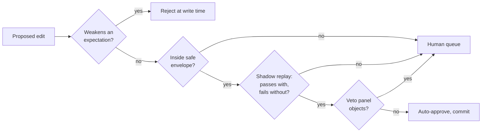

# Auto review

## The target and why the obvious approach fails

Getting human approvals down to a small fraction of edits is necessary, since a system that
asks a person about every locator change gets ignored, and the observed 93% approval rate
under per-action prompting shows what "asks a lot" converges to.

The obvious approach is a smart reviewing model that approves the safe edits and escalates the
rest. It fails for the reason every model-in-the-loop control fails. The reviewer reads
attacker-influenced content, which gives the attacker a second attempt at the same payload
against a component whose job is to say yes.

So the volume reduction cannot come from a better reviewer. It has to come from making most
edits fall inside an envelope that a **checker** can verify, where the reviewer's judgment is
not consulted at all.

## The asymmetry

Two rules, and everything else follows.

**Models may veto. Models may never approve.** A model reviewer's only output is a rejection
with a reason. An injected reviewer can therefore cause a false rejection, which stalls a
proposal and is safe, and can never cause a false approval.

**Approval comes from a checker or from a human.** The checker is deterministic code plus
execution-grounded verification. It has no natural-language input.

The lifecycle survey's finding supports this: execution-grounded verification (tests,
rollouts, environment rewards) outperforms judge-based verification, and verifier quality is
often the decisive factor in whether a skill library helps or hurts.

## The safe envelope

An edit is auto-approvable only if it falls entirely within this set. Anything touching
anything else goes to a human, whatever the reviewing model thinks.

| Edit | Why it is safe | How it is verified |
| --- | --- | --- |
| Reorder a locator list | Ordering is a preference, every entry already existed | Replay confirms the new head resolves |
| Add a locator strategy for an existing handle | The handle's identity is unchanged | New locator must resolve to the *same element* the old one did, in the same page state |
| Update hit/miss counters, contribution scores | Observations, not decisions | Arithmetic |
| Mark an element missing | Strictly informational, loses no capability | Replay confirms no strategy resolves |
| Add a hazard | Only ever adds caution | None needed |
| Make an endpoint classification stricter (read → mutate, → unknown) | Monotonically toward denial | None needed |
| Add a new element discovered by crawl | Additive, unreferenced until a plan uses it | Schema validation |
| Recompile a plan whose steps differ only in resolved handles | The goal file is unchanged, the contract is unchanged | Shadow replay |

Everything below requires a human, unconditionally:

- any change to a goal file, above all `write_intents` and `acceptance`
- any change to an origin allowlist
- any expectation change in the loosening direction (removing evidence, extending a timeout), which is already rejected mechanically at write time
- any endpoint classification made looser
- any element `semantics` change (`destructive`, `operation_class`, `submits_form`)
- any new step, removed step, or reordering
- any edit to something carrying human provenance
- any trust-tier promotion beyond the automatic `probationary` → `trusted` path

The line is drawn by one question: could this edit increase what the system is permitted to
do, or reduce the chance a failure is noticed? Both answers are the same, since either way it
goes to a person.

## Shadow replay

The verification that carries the most weight, and the reason the envelope is as wide as it is.

A proposed edit is replayed against the live site in a read-only session with no write lease.
It is auto-approvable only when the run **succeeds with the edit and fails without it**. The
second half is what makes it meaningful, since an edit that changes nothing observable is not
evidence of anything and should not accumulate.

Shadow replay is bounded to read-only steps. A plan whose failing step is a write cannot be
shadow-replayed, so write-path repairs always reach a human. That is a hard ceiling on
automation and it is correct, because the write path is where mistakes are expensive.

Cost is one extra browser session per proposal, on the cheap tier, off the critical path,
batched. Compared to human attention it is nearly free.

## The pipeline

The veto panel runs last and cheapest. Small local models, several with different framings
(does this edit match its stated justification, does it introduce a new target, does the
justification reference content that looks like an instruction), each able only to raise a
hand. Any objection routes to a human. Their false-positive rate costs review load and their
false-negative rate costs nothing, because they were never the thing granting approval.

Running them locally matters beyond cost. The veto panel is the component whose input is most
attacker-influenced, and local inference keeps that content off the network entirely. Details
in [model tiering](09-model-tiering-and-concurrency.md).

## Whether this reaches the target

The arithmetic depends on the mix of proposals, and the mix is what the design shifts.

Under the recorded-steps design most proposals were step edits, and step edits are outside
the envelope by construction, so most proposals needed a human.

Under [plan compilation](06-plan-compilation.md) most site change is absorbed by the crawler
updating site knowledge and the plan recompiling, and the durable edits are locator
reorderings, new strategies, added elements, and hazards. Those are the envelope. Step-level
edits only survive when recompilation failed, which is the genuinely interesting minority.

So the path to low human involvement is the restructure, not the reviewer. The auto-review
machinery converts that structural change into fewer interruptions, and it could not have
produced it.

This is an argument rather than a measurement, and it is the second thing a prototype should
measure after escalation rate. If step-level edits turn out to dominate anyway, the envelope
does not widen, since widening it is how these systems fail.
