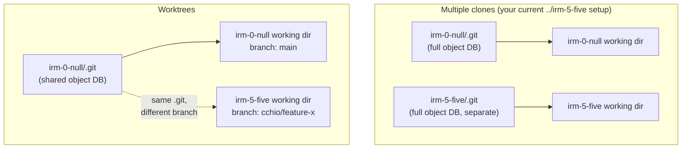
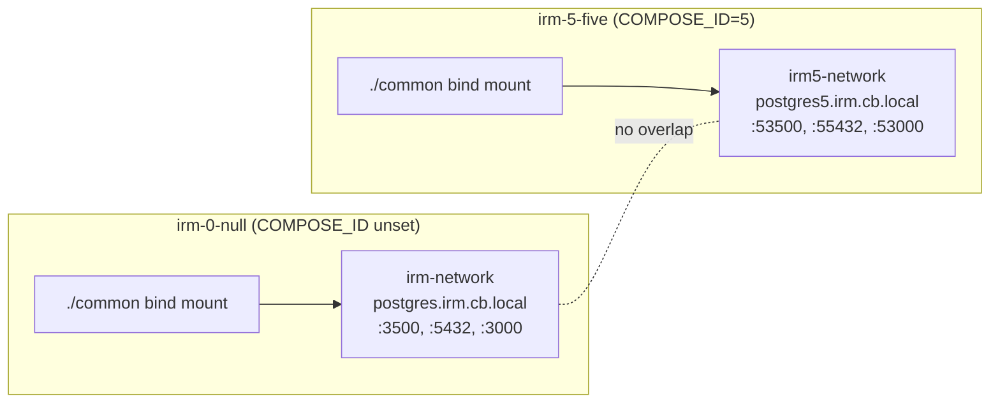

# Git worktrees vs. multiple directories, for IRM's parallel Compose stacks

## The core mechanism

A normal clone or a plain `cp -r` copy of the repo gives each directory its own `.git`
folder: its own object database, its own refs, its own everything. Nothing is shared.

A **worktree** (`git worktree add`) is different: every worktree it creates points back
at one shared `.git` (object database, refs, config), but each worktree gets its own
working directory and its own checked-out branch. Git enforces that a branch can only be
checked out in one worktree at a time, so you can't have two worktrees both on `main`,
but you can have `main` in one and `cchio/feature-x` in another.



Practically: `git fetch`, commit objects, and stashes are visible from any worktree
immediately (one `.git`, one object store). `git branch -a`, `git log --all`, and
`reflog` show everything across all worktrees. Disk usage on the `.git` side is
close to shared, since blobs aren't duplicated.

## How this interacts with IRM's Docker Compose setup

The important fact: **Compose's parallelism in this repo has nothing to do with git.**
It's driven by two things, both scoped to the working directory you run `docker compose`
from:

- `COMPOSE_ID` (an env var, set via `mise.local.toml` per directory) — prefixes every
  host port and container name (`compose.base.yml:23`, `compose.yml:180`, etc.) and the
  Docker network name (`compose.base.yml:72`, `irm${COMPOSE_ID:-}-network`).
- Bind mounts like `./common` (`compose.base.yml:61-63`) are relative to the directory
  Compose is invoked from, not to any git metadata.

So Docker Compose can't tell the difference between "a separate clone" and "a worktree
of the same repo." Both are just a directory with a working tree in it, and Compose only
cares about the directory and the env vars it finds there. This means:



Whether `irm-5-five` is a second full clone or a worktree of `irm-0-null`, as long as it
has its own `mise.local.toml` with a distinct `COMPOSE_ID`, `docker compose` in that
directory produces an isolated stack. **Worktrees would work exactly as well as your
current multiple-directories setup for this purpose.**

## What worktrees change (and what they don't)

What's shared (worktrees only):
- `.git` object database, so fetches/commits from one worktree are visible in all others
  immediately — no `git fetch` needed in each directory separately.
- Less disk for git history itself (no duplicated packfiles).

What's **not** shared, in both setups, and matters for Compose:
- `node_modules`, `.venv`/`uv` environments, Vite/pnpm caches — each directory needs its
  own install regardless of clone vs. worktree.
- Docker volumes (Postgres data, etc.) — scoped by `COMPOSE_ID`/container name, so each
  parallel stack has independent data either way.
- `mise.local.toml` itself — not tracked by git in either model, so you set `COMPOSE_ID`
  per directory the same way you do now.
- Any untracked or gitignored local config.

## Tradeoffs

| | Multiple full clones | Worktrees |
|---|---|---|
| Disk (git history) | Duplicated per clone | Shared, one copy |
| Disk (deps, volumes) | Duplicated either way | Duplicated either way |
| Branch visibility | Independent remotes/refs; must fetch in each | One shared ref namespace, always in sync |
| Same branch in two dirs at once | Allowed (two independent clones) | Not allowed (git blocks double-checkout) |
| Setup command | `git clone` (slower, full history transfer) | `git worktree add ../irm-5-five <branch>` (fast, local) |
| Teardown | `rm -rf` the directory | `git worktree remove` (or `rm -rf` + `git worktree prune`) |
| Accidental cross-talk risk | None — fully independent repos | Low but nonzero: shared config (hooks, some git config), and some tooling assumes one worktree per repo |
| Mental model | Simple, nothing shared | Slightly more to track (which branch is where) |

## When to use which

Worktrees are the better fit when the six parallel directories are mostly **short-lived,
branch-scoped work** off the same repo — e.g., you (or six agents) are each iterating on
a different feature branch and want to fetch/push from a single shared git state without
re-cloning. You save clone time and disk on the `.git` side, and you never have a stale
clone that's forgotten to `git fetch origin`.

Multiple full clones are the better fit when you want the directories to be **fully
independent** — different remotes, no risk of any shared git state, or you're comfortable
with the current setup and it isn't causing friction. Given IRM's Compose parallelism
already comes entirely from `COMPOSE_ID` and directory-relative bind mounts, the git layer
underneath is orthogonal to whether Compose isolation works.

## Applying this to your `../irm-5-five` pattern

To convert your existing approach to worktrees without changing anything about how
Compose runs:

```bash
git worktree add ../irm-5-five <branch-name>
cd ../irm-5-five
printf '[env]\nCOMPOSE_ID=5\n' > mise.local.toml
make build-run-web-local   # or your usual target — same as today
```

The only behavior change from your current setup is that `../irm-5-five` and
`irm-0-null` now share one `.git`, so branches/commits are visible across both instantly,
and you can't check the same branch out in both at once. Everything Compose-related
(ports, container names, volumes, bind mounts) behaves identically either way.
