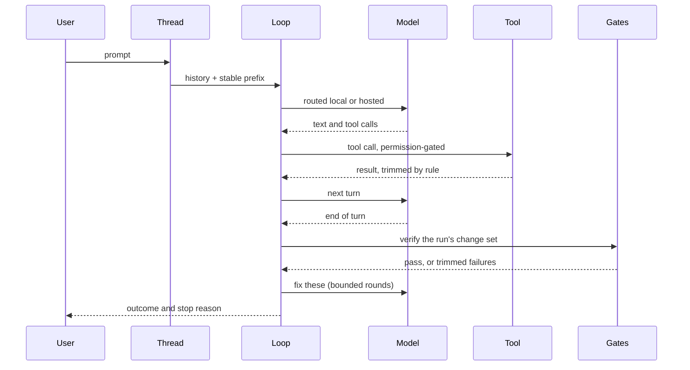
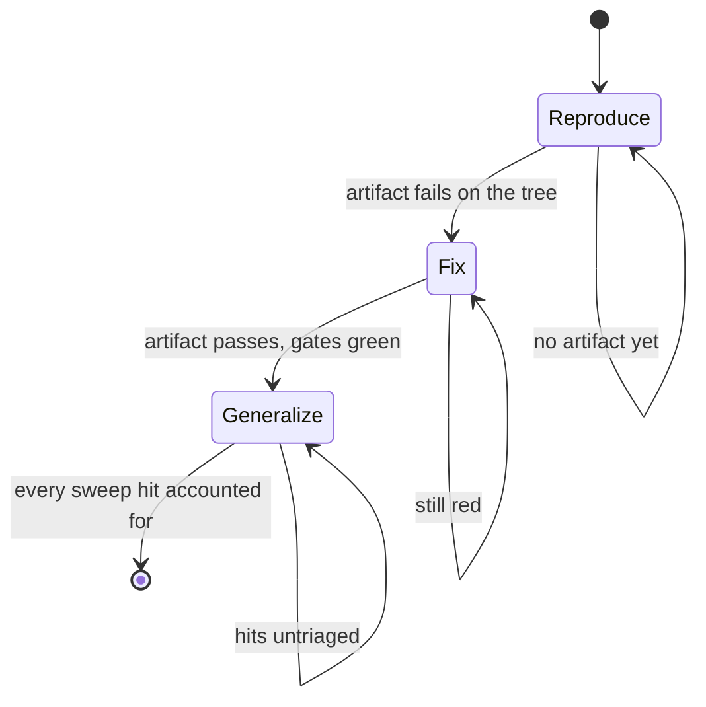
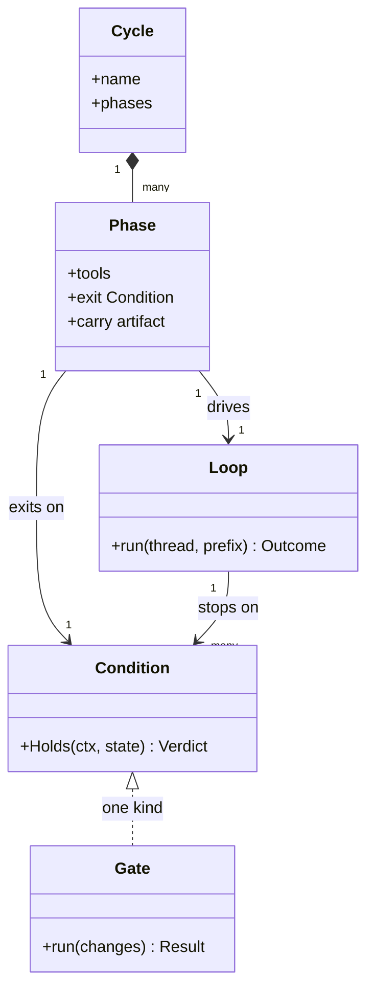

# Glossary

The vocabulary Wavez uses for itself, and how the pieces fit at runtime.
[DESIGN.md](../DESIGN.md) carries the requirements and the reasoning; this
file is the map you read first.

## Terms

| Term | What it is |
|---|---|
| Thread | One work stream: a directory set, a history, and a compaction state. Sessions are disposable, threads are the unit of work |
| Turn | One model call plus the tool calls it makes. The agent Loop drives turns |
| Loop | The streaming tool-use loop inside `internal/agent`. Runs turns until a Condition holds |
| Cycle | A named, reusable, phased way of working on a class of problem (`internal/cycle`), defined per project in `.wavez.pkl` beside the built-in fix cycle. A Cycle contains phases; a phase contains a Loop, run in a thread of its own |
| Phase | One stage of a Cycle, with its own tool set, standing goal, attempt bound, and exit Condition. What crosses to the next phase is the goal, the change set, and the hypothesis ledger, never the transcript |
| Condition | A check that decides when a Loop or a phase may stop (`internal/condition`): `Holds(ctx, state)` returns a Verdict, which is a name, a reason, and whether it holds. Evaluated by the harness, never reported by the model. A Loop's stop reason is one; a phase's exit gate is one |
| Hypothesis | One ledger row a phase records through the `hypothesis` tool: candidate cause, experiment, observation, verdict. Carried across phase boundaries and read by no Condition |
| Sweep | An `ast-grep` pattern the generalize phase records through the `sweep` tool, whose hits the harness enumerates and the model triages. Its exit Condition re-runs the pattern rather than trusting the triage |
| Gate | A deterministic check triggered by a change event: format, convention rules, build, selected tests |
| Routine | A pkl-defined DAG of Steps triggered by change, schedule, thread lifecycle, or hand, serialized per concurrency key. No model involved. Gates ship as built-in routines named `gate-<gate>` |
| Step | One node of a Routine: a named Action with typed params and the parent steps it waits on. Steps with no unfinished parent run concurrently |
| Action | A registered unit of work a Step can name (`run` for an argv, `gate.<name>` for a gate), whose validator binds the params at config load so a bad routine fails before it runs |
| Modifier | A refactor operation exposed as a tool, so the model names a shape instead of writing text |
| Ledger | One line per thread of what it has done, derived from the gate log and change set |
| Change set | The files and line ranges a run has edited, accumulated across its turns |
| Checkpoint | A jj operation id taken before a run, so the whole run can be undone with `jj op restore` |
| Store | The per-project SQLite file holding symbols, edges, FTS, coverage, and contracts |
| Mutant | One changed token in one file, used to ask whether the tests check a line or merely run it. A mutant that survives the tests is reported like a failing test |
| Run scope | The files a run has read or created. An edit to anything else is recorded, and refused under `-strict-scope` |
| Lease | An advisory TTL lock on the directory holding a write target, taken where the write happens, so two threads do not write the same place. Active while its holder writes, committed once the writes land, expired once the holder stops renewing it |
| Scheduler phase | What admission is letting run: edit while threads write and gate runs queue, execute while a gate run holds the machine. Derived from what is running, never set |

## How a turn runs

The model never decides the run is finished. Ending its turn hands control
to the gates, and only their verdict completes the run.

## How a Cycle runs

Each arrow out of a phase is a Condition the harness evaluates. A phase that
cannot satisfy its Condition does not advance, which is the whole difference
between a Cycle and a prompt that describes the same steps. A phase gets a
small attempt bound, and once it is spent the Cycle ends `condition_unmet`
carrying the last verdict's reason; `complete` is only reachable when every
phase's Condition held.

## What the pieces know about each other

`Condition` is the shared abstraction: a Loop's stop reasons and a phase's
exit gate are the same idea at different granularity, and a Gate result is
one kind of Condition.

## Decisions worth knowing before reading code

| Decision | Short form |
|---|---|
| Deterministic first | Anything a tool can decide is not a model's job. The model is for judgment |
| Gates decide done | A model saying it finished changes nothing; passing checks does |
| A check that examined nothing has not passed | Every gate records what it examined, so abstaining is visible |
| Coverage is not verification | A line that ran is not a line anything checked, so the mutation gate asks the second question |
| Append-only context | Trimming writes shorter replacements forward, so the prompt cache prefix survives |
| Re-derive over remember | Anything the code can answer is re-read, not carried, because carried summaries go stale |
| Local first | Escalate to hosted on task shape or after one local failure, never retry local twice |
| jj alone | Checkpointing comes from the operation log rather than snapshots Wavez writes |
| One store | Every subsystem that needs to know the code queries the same SQLite file |
