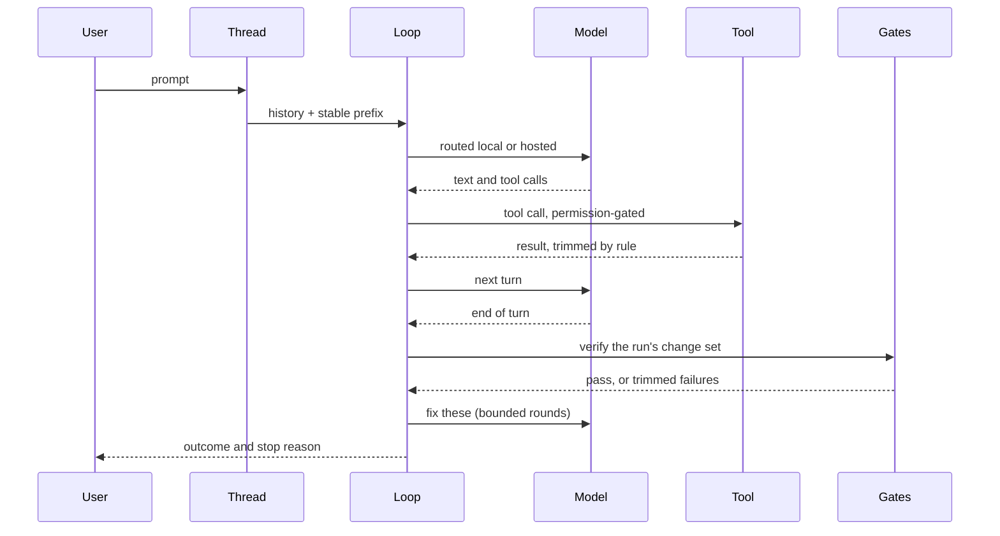
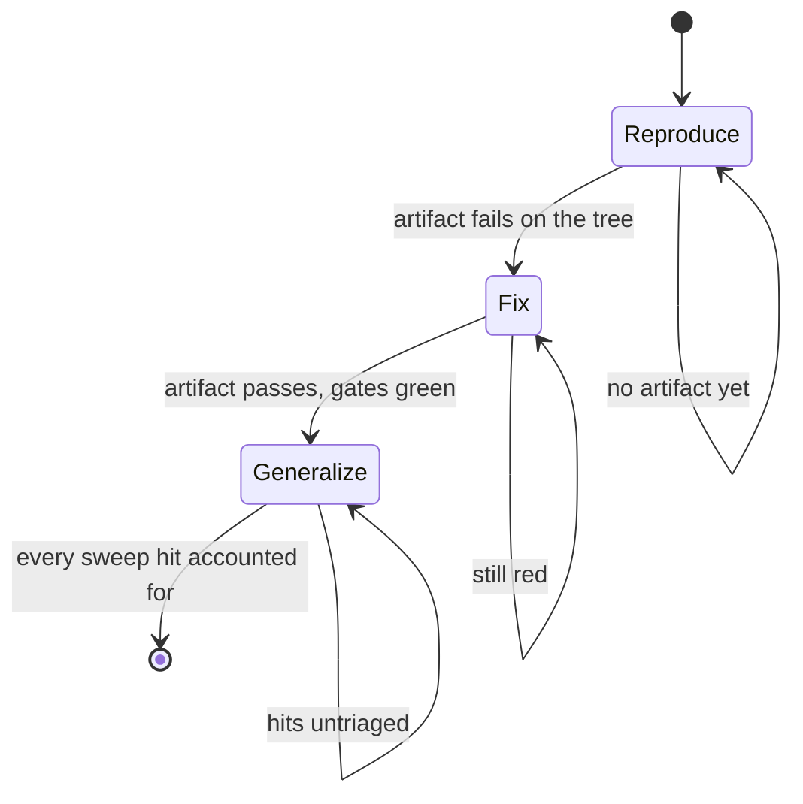
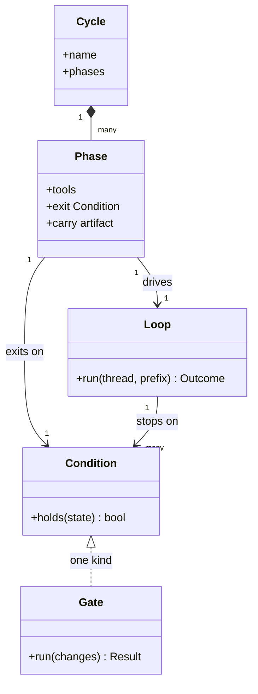

# Glossary

The vocabulary Wavez uses for itself, and how the pieces fit at runtime.
[DESIGN.md](../DESIGN.md) carries the requirements and the reasoning; this
file is the map you read first.

## Terms

| Term | What it is |
|---|---|
| Thread | One work stream: a directory set, a history, and a compaction state. Sessions are disposable, threads are the unit of work |
| Turn | One model call plus the tool calls it makes. The agent Loop drives turns |
| Loop | The streaming tool-use loop inside `internal/agent`. Runs turns until a Condition holds |
| Cycle | A named, reusable, phased way of working on a class of problem, defined per project. A Cycle contains phases; a phase contains a Loop |
| Phase | One stage of a Cycle, with its own tool set and its own exit Condition |
| Condition | A check that decides when a Loop or a phase may stop. Evaluated by the harness, never reported by the model |
| Gate | A deterministic check triggered by a change event: format, convention rules, build, selected tests |
| Routine | A pkl-defined DAG of CLI actions triggered by change, schedule, or hand. No model involved |
| Modifier | A refactor operation exposed as a tool, so the model names a shape instead of writing text |
| Ledger | One line per thread of what it has done, derived from the gate log and change set |
| Change set | The files and line ranges a run has edited, accumulated across its turns |
| Checkpoint | A jj operation id taken before a run, so the whole run can be undone with `jj op restore` |
| Store | The per-project SQLite file holding symbols, edges, FTS, coverage, and contracts |
| Mutant | One changed token in one file, used to ask whether the tests check a line or merely run it. A mutant that survives the tests is reported like a failing test |
| Run scope | The files a run has read or created. An edit to anything else is recorded, and refused under `-strict-scope` |
| Lease | An advisory TTL lock on a directory subtree, so two threads do not write the same place |

## How a turn runs

The model never decides the run is finished. Ending its turn hands control
to the gates, and only their verdict completes the run.

## How a Cycle runs

Each arrow out of a phase is a Condition the harness evaluates. A phase that
cannot satisfy its Condition does not advance, which is the whole difference
between a Cycle and a prompt that describes the same steps.

## What the pieces know about each other

`Condition` is the shared abstraction: a Loop's stop reasons and a phase's
exit gate are the same idea at different granularity, and a Gate result is
one kind of Condition.

## Decisions worth knowing before reading code

| Decision | Short form |
|---|---|
| Deterministic first | Anything a tool can decide is not a model's job. The model is for judgment |
| Gates decide done | A model saying it finished changes nothing; passing checks does |
| A check that examined nothing has not passed | Every gate records what it examined, so abstaining is visible |
| Coverage is not verification | A line that ran is not a line anything checked, so the mutation gate asks the second question |
| Append-only context | Trimming writes shorter replacements forward, so the prompt cache prefix survives |
| Re-derive over remember | Anything the code can answer is re-read, not carried, because carried summaries go stale |
| Local first | Escalate to hosted on task shape or after one local failure, never retry local twice |
| jj alone | Checkpointing comes from the operation log rather than snapshots Wavez writes |
| One store | Every subsystem that needs to know the code queries the same SQLite file |
